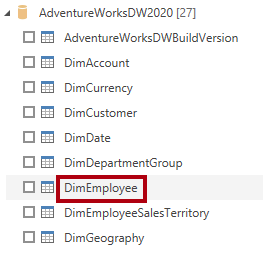
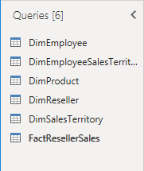
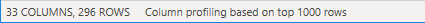
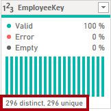

---
lab:
    title: 'Obtener datos en Power BI Desktop'
    module: 'Obtener datos en Power BI'
---

# Obtener Datos en Power BI Desktop

## **Historia del laboratorio**

Este laboratorio está diseñado para introducirte a la aplicación Power BI Desktop y cómo conectarte a datos, además de usar técnicas de vista previa para entender las características y calidad de los datos de origen. Los objetivos de aprendizaje son:

- Abrir Power BI Desktop
- Conectarse a diferentes fuentes de datos
- Previsualizar datos de origen con Power Query
- Usar funciones de perfilado de datos en Power Query

**Este laboratorio debería tomar aproximadamente 30 minutos.**

## Comenzar con Power BI Desktop

Para completar este ejercicio, primero abre un navegador web e ingresa la siguiente URL para descargar la carpeta zip:

`https://github.com/MicrosoftLearning/PL-300-Microsoft-Power-BI-Data-Analyst/raw/Main/Allfiles/Labs/01-prepare-data-with-power-query-in-power-bi-desktop/01-prepare-data.zip`

Extrae la carpeta en la ubicación: **C:\Users\Student\Downloads\01-prepare-data**.

Abre el archivo **01-Starter-Sales Analysis.pbix**.

- Este archivo inicial ha sido configurado especialmente para ayudarte a completar el laboratorio. Las siguientes configuraciones a nivel de reporte han sido deshabilitadas en el archivo inicial:
  - Data Load > Import relationships from data sources on first load
  - Data Load > Autodetect new relationships after data is loaded

## Obtener datos de SQL Server

Esta tarea te enseña cómo conectarte a una base de datos SQL Server e importar tablas, lo que crea consultas en Power Query.

1. En la pestaña **Home**, dentro del grupo **Data**, selecciona **SQL Server**.

     

1. En la ventana **SQL Server Database**, en el cuadro **Server**, ingresa **localhost** y deja **Database** en blanco, luego selecciona **OK**.

    > ***Nota**: En este laboratorio, te conectarás a la base de datos SQL Server usando **localhost** porque las fuentes de datos de gateway no pueden resolver **localhost**. Esto no es una práctica recomendada al crear tus propias soluciones.*

1. Si se te solicitan credenciales, selecciona **Windows > Use my current credentials**, y luego **Connect**.

1. Selecciona **OK** si recibes una advertencia de que no se puede establecer una conexión encriptada.

1. En el panel **Navigator**, expande la base de datos **AdventureWorksDW2020**.

    > ***Nota**: La base de datos **AdventureWorksDW2020** está basada en la base de datos de ejemplo **AdventureWorksDW2017**. Ha sido modificada para soportar los objetivos de aprendizaje de los laboratorios del curso.*

1. Selecciona la tabla **DimEmployee**, y observa la vista previa de los datos de la tabla.

     

    > ***Nota**: La vista previa de datos te permite ver las columnas y una muestra de filas.*

1. Para importar los datos de la tabla, **marca las casillas** junto a las siguientes tablas:
    - DimEmployee
    - DimEmployeeSalesTerritory
    - DimProduct
    - DimReseller
    - DimSalesTerritory
    - FactResellerSales

1. Completa esta tarea seleccionando **Transform Data**, lo que abrirá Power Query Editor - déjalo abierto para la siguiente tarea.

Ahora te has conectado a seis tablas de una base de datos SQL Server.

## **Previsualizar Datos en Power Query Editor**

Esta tarea introduce el Power Query Editor y te permite revisar y perfilar los datos. Esto te ayuda a determinar cómo limpiar y transformar los datos más adelante. También revisarás tanto tablas de dimensión prefijadas con "Dim" como tablas de hechos prefijadas con "Fact".

1. En la ventana **Power Query Editor**, a la izquierda, observa el panel **Queries**. El panel **Queries** contiene una consulta por cada tabla que marcaste.

     

1. Selecciona la primera consulta—**DimEmployee**.

    > *La tabla **DimEmployee** en la base de datos SQL Server almacena una fila por cada empleado. Un subconjunto de las filas de esta tabla representa a los vendedores, lo que será relevante para el modelo que desarrollarás.*

1. En la esquina inferior izquierda de la barra de estado, se proporcionan algunas estadísticas de la tabla—la tabla tiene 33 columnas y 296 filas.

     

1. En el panel de vista previa de datos, desplázate horizontalmente para revisar todas las columnas. Observa que las últimas cinco columnas contienen enlaces **Table** o **Value**.

    > *Estas cinco columnas representan relaciones con otras tablas en la base de datos. Pueden usarse para unir tablas. Unirás tablas en el laboratorio **Load Transformed Data in Power BI Desktop**.*

1. Para evaluar la calidad de las columnas, en la pestaña **View**, dentro del grupo **Data Preview**, marca **Column Quality**. La función de calidad de columnas te permite determinar fácilmente el porcentaje de valores válidos, con errores o vacíos en las columnas.

     

1. Observa que la columna **Position** tiene un 94% de filas vacías (null).

     

1. Para evaluar la distribución de columnas, en la pestaña **View**, dentro del grupo **Data Preview**, marca **Column Distribution**.

1. Revisa la columna **Position** nuevamente, y observa que hay cuatro valores distintos y un valor único.

1. Revisa la distribución de columnas para la columna **EmployeeKey**—hay 296 valores distintos y 296 valores únicos.

     

    > ***Nota**: Cuando los conteos distintos y únicos son iguales, significa que la columna contiene valores únicos. Al modelar, es importante que algunas tablas del modelo tengan columnas únicas. Estas columnas únicas pueden usarse para crear relaciones uno a muchos, lo que harás en el laboratorio **Model Data in Power BI Desktop**.*

1. En el panel **Queries**, selecciona la consulta **DimProduct**.

    > *La tabla **DimProduct** contiene una fila por cada producto vendido por la compañía.*

1. En el panel **Queries**, selecciona la consulta **DimReseller**.

    > *La tabla **DimReseller** contiene una fila por cada revendedor. Los revendedores venden, distribuyen o agregan valor a los productos de Adventure Works.*

1. Para ver los valores de las columnas, en la pestaña **View**, dentro del grupo **Data Preview**, marca **Column Profile**.

1. Selecciona el encabezado de la columna **BusinessType**, y observa el nuevo panel debajo del panel de vista previa de datos. Revisa las estadísticas de la columna y la distribución de valores en el panel de vista previa de datos.

    > *Observa el problema de calidad de datos: hay dos etiquetas para almacén (**Warehouse**, y el mal escrito **Ware House**).*

     

1. Coloca el cursor sobre la barra **Ware House**, y observa que hay cinco filas con este valor.

1. En el panel **Queries**, selecciona la consulta **DimSalesTerritory**.  

    > *La tabla **DimSalesTerritory** contiene una fila por región de ventas, incluyendo **Corporate HQ** (sede corporativa). Las regiones están asignadas a un país, y los países están asignados a grupos. En el laboratorio **Model Data in Power BI Desktop**, crearás una jerarquía para soportar análisis a nivel de región, país o grupo.*

1. En el panel **Queries**, selecciona la consulta **FactResellerSales**.

    > *La tabla **FactResellerSales** contiene una fila por línea de orden de venta—una orden de venta contiene uno o más ítems de línea.*

1. Revisa la calidad de la columna **TotalProductCost**, y observa que el 8% de las filas están vacías.

    > *Los valores faltantes en la columna **TotalProductCost** son un problema de calidad de datos.*

## **Obtener datos de un archivo CSV**

En esta tarea, crearás una nueva consulta basada en archivos CSV.

1. Para agregar una nueva consulta, en la ventana **Power Query Editor**, en la pestaña **Home**, dentro del grupo **New Query**, selecciona la flecha hacia abajo de **New Source**, y luego selecciona **Text/CSV**.

1. Navega al archivo **01-prepare-data > ResellerSalesTargets.csv**. Selecciona **Open**.

1. En la ventana **ResellerSalesTargets.csv**, revisa los datos de vista previa. Selecciona **OK**.

1. En el panel **Queries**, observa la adición de la consulta **ResellerSalesTargets**.

    > *El archivo CSV **ResellerSalesTargets** contiene una fila por vendedor, por año. Cada fila registra 12 objetivos de ventas mensuales (expresados en miles). El año fiscal para la compañía Adventure Works comienza el 1 de julio.*

1. Observa que ninguna columna contiene valores vacíos. Cuando no hay un objetivo de ventas mensual, se almacena un guion en su lugar.

1. Revisa los íconos en cada encabezado de columna, a la izquierda del nombre de la columna. Los íconos representan el tipo de datos de la columna. **123** es número entero, y **ABC** es texto.

     

1. Repite los pasos para crear una consulta basada en el archivo **ColorFormats.csv**.

    > *El archivo CSV **ColorFormats** contiene una fila por color de producto. Cada fila registra los códigos HEX para formatear colores de fondo y fuente.*

Ahora deberías tener dos nuevas consultas, **ResellerSalesTargets** y **ColorFormats**.

 

## Laboratorio completado
