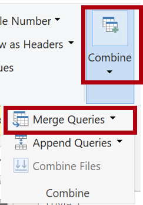

---
lab:
    title: 'Cargar datos transformados en Power BI Desktop'
    module: 'Limpiar, transformar y cargar datos en Power BI'
---

# Cargar datos transformados en Power BI Desktop

## Historia del laboratorio

En este laboratorio, usarás técnicas de limpieza y transformación de datos para comenzar a dar forma a tu modelo de datos. Luego aplicarás las consultas para cargar cada una como tabla en el modelo de datos.

En este laboratorio aprenderás a:

- Aplicar diversas transformaciones
- Cargar consultas al modelo de datos

**Este laboratorio debe tomar aproximadamente 45 minutos.**

## Empezar

Para completar este ejercicio, primero abre un navegador web e ingresa la siguiente URL para descargar la carpeta zip:

`https://github.com/MicrosoftLearning/PL-300-Microsoft-Power-BI-Data-Analyst/raw/Main/Allfiles/Labs/02-load-data-with-power-query-in-power-bi-desktop/02-load-data.zip`

Extrae la carpeta en la ruta **C:\Users\Student\Downloads\02-load-data**.

Abre el archivo **02-Starter-Sales Analysis.pbix**.

> ***Nota**: Puedes omitir el inicio de sesión seleccionando **Cancelar**. Cierra cualquier otra ventana informativa. Selecciona **Aplicar más tarde** si se te solicita aplicar cambios.*

## Configurar la consulta Salesperson

En esta tarea, usarás Power Query Editor para configurar la consulta **Salesperson**.

> ***Importante**: Cuando se indique renombrar columnas, es crucial que las renombres exactamente como se describe.*

1. Para abrir la ventana **Power Query Editor**, en la pestaña de la cinta **Home**, dentro del grupo **Queries**, selecciona el ícono **Transform Data**.

	

1. En la ventana **Power Query Editor**, en el panel **Queries**, selecciona la consulta **DimEmployee**.

	

	> **Nota:** Si recibes un mensaje de advertencia solicitando especificar cómo conectarte, selecciona **Edit Credentials**, conéctate usando las credenciales actuales y selecciona **OK** para usar una conexión no encriptada.
 
1. Para renombrar la consulta, en el panel **Query Settings** (ubicado a la derecha), en el cuadro **Name**, reemplaza el texto con **Salesperson** y presiona **Enter**. Verifica que el nombre se actualizó en el panel **Queries**.

	> *El nombre de la consulta determina el nombre de la tabla en el modelo. Se recomienda usar nombres concisos y amigables.*

1. Para ubicar una columna específica, en la pestaña **Home**, selecciona la flecha hacia abajo de **Manage Columns**, luego la flecha hacia abajo de **Choose Columns**, y finalmente selecciona **Go to Column**.

	> *Go to Column es útil cuando hay muchas columnas. Alternativamente, puedes desplazarte horizontalmente para encontrarlas.*

	

1. En la ventana **Go to Column**, para ordenar la lista por nombre de columna, selecciona el botón de orden **AZ**, luego selecciona **Name** y **SalesPersonFlag**. Haz clic en **OK**.

	

1. Ubica la columna **SalesPersonFlag**, filtra la columna para seleccionar solo vendedores (es decir, **TRUE**), y haz clic en **OK**.

1. En el panel **Query Settings**, en la lista **Applied Steps**, nota la adición del paso **Filtered Rows**.

	> *Cada transformación crea un nuevo paso lógico. Puedes editar o eliminar pasos. También puedes seleccionar un paso para previsualizar los resultados en esa etapa.*

	

1. Para eliminar columnas, en la pestaña **Home**, selecciona el grupo **Manage Columns**, luego el ícono **Choose Columns**.

1. En la ventana **Choose Columns**, para deseleccionar todas las columnas, desmarca el ítem **(Select All Columns)**.

1. Para incluir columnas, marca las siguientes seis:

	- EmployeeKey
	- EmployeeNationalIDAlternateKey
	- FirstName
	- LastName
	- Title
	- EmailAddress

1. En la lista **Applied Steps**, nota la adición de otro paso de consulta.

	

1. Para crear una columna de nombre único, primero selecciona el encabezado de la columna **FirstName**. Mantén presionada la tecla **Ctrl** y selecciona la columna **LastName**.

	

1. Haz clic derecho en cualquier encabezado seleccionado, y en el menú contextual elige **Merge Columns**.

	> *Muchas transformaciones comunes están disponibles en el menú contextual. Sin embargo, más opciones están en la cinta.*

1. En la ventana **Merge Columns**, en el menú desplegable **Separator**, selecciona **Space**.

1. En el cuadro **New Column Name**, reemplaza el texto con **Salesperson**.

1. Para renombrar la columna **EmployeeNationalIDAlternateKey**, haz doble clic en su encabezado, reemplaza el texto con **EmployeeID**, y presiona **Enter**.

1. Usa los pasos anteriores para renombrar la columna **EmailAddress** a **UPN**.

	> *UPN es un acrónimo de User Principal Name.*

**En la barra de estado inferior-izquierda, verifica que la consulta tenga 5 columnas y 18 filas.**

## **Configurar la consulta SalespersonRegion**

En esta tarea, configurarás la consulta **SalespersonRegion**.

1. En el panel **Queries**, selecciona la consulta **DimEmployeeSalesTerritory**.

1. En el panel **Query Settings**, renombra la consulta a **SalespersonRegion**.

1. Para eliminar las últimas dos columnas, primero selecciona el encabezado de la columna **DimEmployee**.

1. Mantén presionada la tecla **Ctrl** y selecciona el encabezado de la columna **DimSalesTerritory**.

1. Haz clic derecho en cualquier encabezado seleccionado y en el menú contextual elige **Remove Columns**.

**En la barra de estado, verifica que la consulta tenga 2 columnas y 39 filas.**

## Configurar la consulta Product

En esta tarea, configurarás la consulta **Product**.

> ***Importante**: Cuando las instrucciones detalladas ya se han proporcionado, los pasos serán más concisos. Para detalles, consulta tareas anteriores.*

1. Selecciona la consulta **DimProduct** y renómbrala a **Product**.

1. Ubica la columna **FinishedGoodsFlag** y filtra para obtener productos terminados (es decir, TRUE).

1. Elimina todas las columnas **excepto**:

	- ProductKey
	- EnglishProductName
	- StandardCost
	- Color
	- DimProductSubcategory

1. Nota que **DimProductSubcategory** representa una tabla relacionada (contiene enlaces **Value**).

1. En el encabezado de **DimProductSubcategory**, a la derecha, selecciona el ícono de expansión.

	

1. Observa todas las columnas, desmarca **Select All Columns**.

1. Selecciona **EnglishProductSubcategoryName** y **DimProductCategory**, desmarca **Use Original Column Name as Prefix** y haz clic en **OK**.

	> *Al seleccionar estas dos columnas, se aplicará una transformación para unirse a la tabla **DimProductSubcategory**. La columna **DimProductCategory** es otra tabla relacionada en el origen de datos.*

	> *Los nombres de columna deben ser únicos. Si se deja marcado, este checkbox agregaría prefijos (ej: **DimProductSubcategory**). Como los nombres no entran en conflicto, se desmarca.*

1. Nota que se añadieron dos columnas y se eliminó **DimProductSubcategory**.

1. Expande **DimProductCategory** e incluye solo **EnglishProductCategoryName**.

1. Renombra estas cuatro columnas:

	- **EnglishProductName** a **Product**
	- **StandardCost** a **Standard Cost** (con espacio)
	- **EnglishProductSubcategoryName** a **Subcategory**
	- **EnglishProductCategoryName** a **Category**

**En la barra de estado, verifica 6 columnas y 397 filas.**

## Configurar la consulta Reseller

En esta tarea, configurarás la consulta **Reseller**.

1. Selecciona **DimReseller** y renómbrala a **Reseller**.

1. Elimina todas las columnas **excepto**:

	- ResellerKey
	- BusinessType
	- ResellerName
	- DimGeography

1. Expande **DimGeography** incluyendo solo:

	- City
	- StateProvinceName
	- EnglishCountryRegionName

1. En el encabezado **Business Type**, selecciona la flecha y revisa los valores, nota **Warehouse** y **Ware House**.

1. Haz clic derecho en **Business Type** y selecciona **Replace Values**.

1. En la ventana **Replace Values**, configura:

	- **Value to Find**: **Ware House**
	- **Replace With**: **Warehouse**

 	

1. Renombra las siguientes cuatro columnas:

	- **BusinessType** a **Business Type** (con espacio)
	- **ResellerName** a **Reseller**
	- **StateProvinceName** a **State-Province**
	- **EnglishCountryRegionName** a **Country-Region**

    **En la barra de estado, verifica que la consulta tenga 6 columnas y 701 filas.**

## Configurar la consulta Region

En esta tarea, configurarás la consulta **Region**.

1. Selecciona la consulta **DimSalesTerritory** y renómbrala a **Region**.

1. Aplica un filtro en la columna **SalesTerritoryAlternateKey** para eliminar el valor 0 (cero).

	> *Esto eliminará una fila.*

1. Elimina todas las columnas **excepto**:

	- SalesTerritoryKey
	- SalesTerritoryRegion
	- SalesTerritoryCountry
	- SalesTerritoryGroup

1. Renombra estas tres columnas:

	- **SalesTerritoryRegion** a **Region**
	- **SalesTerritoryCountry** a **Country**
	- **SalesTerritoryGroup** a **Group**

**En la barra de estado, verifica 4 columnas y 10 filas.**

## Configurar la consulta Sales

En esta tarea, configurarás la consulta **Sales**.

1. Selecciona la consulta **FactResellerSales** y renómbrala a **Sales**.

1. Elimina todas las columnas **excepto**:

	- SalesOrderNumber
	- OrderDate
	- ProductKey
	- ResellerKey
	- EmployeeKey
	- SalesTerritoryKey
	- OrderQuantity
	- UnitPrice
	- TotalProductCost
	- SalesAmount
	- DimProduct

	> ***Nota**: En el laboratorio **Prepare Data in Power BI Desktop**, algunas filas de **FactResellerSales** tenían valores faltantes en **TotalProductCost**. La columna **DimProduct** se incluye para obtener el costo estándar del producto.*

1. Expande **DimProduct**, desmarca todas las columnas e incluye solo **StandardCost**.

1. Para crear una columna personalizada, en la pestaña **Add Column**, dentro de **General**, selecciona **Custom Column**.

	

1. En **Custom Column**, en **New Column Name**, ingresa **Cost**.

1. En **Custom Column Formula**, ingresa esta expresión y guarda:

   ` if [TotalProductCost] = null then [OrderQuantity] * [StandardCost] else [TotalProductCost] `

	> ***Nota**: Puedes copiar la expresión del archivo **Snippets.txt** en la carpeta 02-load-data.*

	> *Si **TotalProductCost** es nulo, calcula multiplicando **OrderQuantity** por **StandardCost**.*

1. Elimina estas dos columnas:

	- TotalProductCost
	- StandardCost

1. Renombra tres columnas:

	- **OrderQuantity** a **Quantity**
	- **UnitPrice** a **Unit Price** (con espacio)
	- **SalesAmount** a **Sales**

1. Para cambiar el tipo de dato, en **Quantity**, selecciona el ícono **1.2** y elige **Whole Number**.

	> *Usa tipos correctos para cálculos matemáticos.*

	

1. Cambia estos tres tipos a **Fixed Decimal Number**:

	> *Usa este tipo para valores financieros o tasas.*

	- Unit Price
	- Sales
	- Cost

**En la barra de estado, verifica 10 columnas y 999+ filas.** *Máximo 1000 filas se cargarán como vista previa.*

## Configurar la consulta Targets

En esta tarea, configurarás la consulta **Targets**.

1. Selecciona la consulta **ResellerSalesTargets** y renómbrala a **Targets**.

	> **Nota:** Si aparece una advertencia de conexión, selecciona **Edit Credentials** y usa acceso anónimo.

1. Para desagrupar las columnas mensuales (**M01**-**M12**), selecciona los encabezados **Year** y **EmployeeID**.

1. Haz clic derecho en cualquier encabezado y elige **Unpivot Other Columns**.

1. Nota que los nombres de columna ahora están en **Attribute** y los valores en **Value**.

1. Filtra **Value** para eliminar guiones (-).

	> *El guion representaba ceros en el archivo CSV original.*

1. Renombra dos columnas:

	- **Attribute** a **MonthNumber** (sin espacio)
	- **Value** a **Target**

1. Para modificar **MonthNumber**, haz clic derecho en su encabezado y selecciona **Replace Values**.

	> *Crearás una columna de fecha combinando **Year** y **MonthNumber**.*

1. En **Replace Values**, ingresa **M** en **Value To Find** y deja **Replace with** vacío.

1. Cambia el tipo de dato de **MonthNumber** a **Whole Number**.

1. En la pestaña **Add Column**, dentro de **General**, selecciona **Column From Examples**.

	

1. Nota que la primera fila es año **2017** y mes **7**.

1. En **Column1**, ingresa **7/1/2017** y presiona **Enter**.

	> ***Nota**: Configuración regional US. Otros formatos pueden requerir **07**.*

1. Observa que las celdas se actualizan con predicciones.

	> *La función detectó la combinación de **Year** y **MonthNumber**.*

1. Nota la fórmula generada sobre la cuadrícula.

	

1. Renombra la nueva columna a **TargetMonth**.

1. Elimina las columnas:

	- Year
	- MonthNumber

1. Cambia los tipos de dato:

	- **Target** a fixed decimal number
	- **TargetMonth** a date

1. Para multiplicar **Target** por 1000, selecciona la columna y en **Transform** > **Standard** elige **Multiply**.

	> *Los targets estaban en miles.*

	

1. En **Multiply**, ingresa **1000** y haz clic en **OK**.

**Verifica 3 columnas y 809 filas en la barra de estado.**

## Configurar la consulta ColorFormats

En esta tarea, configurarás **ColorFormats**.

1. Selecciona **ColorFormats**. La primera fila contiene encabezados.

1. En **Home** > **Transform**, selecciona **Use First Row as Headers**.

	

**Verifica 3 columnas y 10 filas.**

## Actualizar la consulta Product

En esta tarea, fusionarás **ColorFormats** con **Product**.

1. Selecciona la consulta **Product**.

1. Para fusionar, en **Home** > **Combine** elige **Merge Queries**.

	> *Integra datos de SQL Server y CSV.*

	

1. En **Merge**, en **Product**, selecciona la columna **Color**.

	

1. En el desplegable inferior, selecciona **ColorFormats**.

	

1. En **ColorFormats**, selecciona la columna **Color**.

1. Cuando se abra la ventana **Privacy Levels**, para cada fuente de datos, en el menú desplegable, selecciona **Organizational** y luego **Save**.

	> *Los niveles de privacidad determinan si los datos pueden compartirse entre fuentes. Configurar como **Organizational** permite compartirlos. **Private** restringe el intercambio, aunque no bloquea el acceso directo.*

	

1. En la ventana **Merge**, usa **Join Kind** predeterminado (Left Outer) y haz clic en **OK**.

1. Expande la columna **ColorFormats** para incluir:

	- Background Color Format
	- Font Color Format

**Verifica 8 columnas y 397 filas en la barra de estado.**

## Actualizar la consulta ColorFormats

En esta tarea, deshabilitarás la carga de **ColorFormats**.

1. Selecciona la consulta **ColorFormats**.

1. En el panel **Query Settings**, selecciona **All Properties**.

	

1. En **Query Properties**, desmarca **Enable Load To Report**.

	> *Esto evita que se cargue como tabla en el modelo, ya que ya se fusionó con **Product**.*

	

### Revisar el producto final

1. En Power Query Editor, verifica **8 consultas** nombradas:

	- Salesperson
	- SalespersonRegion
	- Product
	- Reseller
	- Region
	- Sales
	- Targets
	- ColorFormats (no cargada)

1. Selecciona **Close &amp; Apply** para cargar los datos y cerrar Power Query Editor.

	

1. En Power BI Desktop, observa los paneles **Filters**, **Visualizations** y **Data**. En **Data**, confirma **7 tablas**.

	

## Laboratorio completado