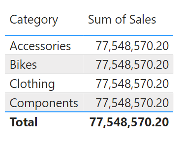
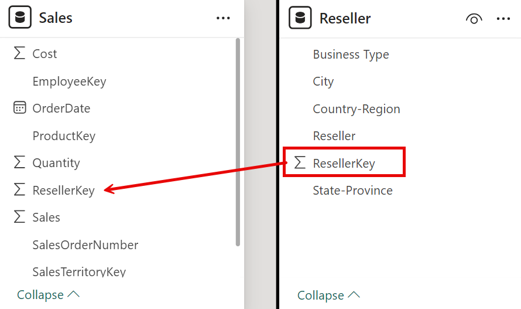
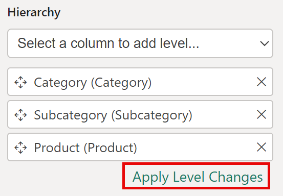
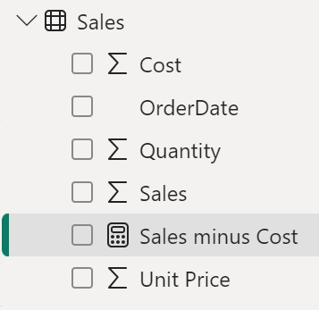
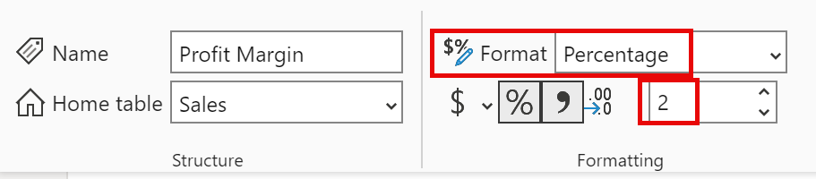
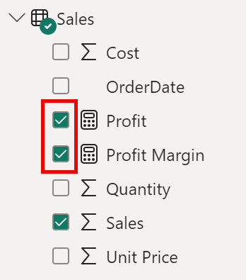

---
lab:
    title: 'Design a Data Model in Power BI'
    module: 'Design a Data Model in Power BI'
---

# Diseñar un Modelo de Datos en Power BI

## Historia del laboratorio

En este laboratorio, comenzarás a desarrollar el modelo de datos. Esto incluirá crear relaciones entre tablas, configurar propiedades de tablas y columnas para mejorar la usabilidad del modelo, crear jerarquías y medidas rápidas.

En este laboratorio aprenderás cómo:

- Crear relaciones en el modelo
- Configurar propiedades de tablas y columnas
- Crear jerarquías

**Este laboratorio debería tomar aproximadamente 45 minutos.**

## Comenzar

Para completar este ejercicio, primero abre un navegador web e ingresa la siguiente URL para descargar la carpeta comprimida:

`https://github.com/MicrosoftLearning/PL-300-Microsoft-Power-BI-Data-Analyst/raw/Main/Allfiles/Labs/03-configure-data-model-in-power-bi-desktop/03-model-data.zip`

Extrae la carpeta en la ubicación: **C:\Users\Student\Downloads\03-model-data**.

Abre el archivo **03-Starter-Sales Analysis.pbix**.

> ***Nota**: Puedes omitir el inicio de sesión seleccionando **Cancelar**. Cierra cualquier otra ventana informativa. Selecciona **Aplicar más tarde** si se te solicita aplicar cambios.*

## Crear relaciones en el modelo

En esta tarea, crearás relaciones en el modelo. El archivo fue configurado para no identificar relaciones entre tablas, lo cual no es la configuración predeterminada, pero se recomienda para evitar trabajo adicional al crear las relaciones correctas.

> **Importante**: *Los laboratorios usan una notación abreviada para referirse a un campo. Se verá así: **Product \| Category**. En este ejemplo, **Product** es el nombre de la tabla y **Category** es el nombre del campo.*

1. En Power BI Desktop, en la parte izquierda, selecciona el icono de **Vista de informe**.

     

1. Para ver todos los campos de las tablas, en el panel **Datos**, haz clic derecho en un área vacía y selecciona **Expandir todo**.

1. Para crear un visual de tabla, en el panel **Datos**, dentro de la tabla **Product**, marca el campo **Category**.

1. Para agregar otra columna a la tabla, en el panel **Datos**, marca el campo **Sales \| Sales**.

1. Observa que el visual de tabla lista cuatro categorías de productos, y que el valor de ventas es el mismo para cada una, así como para el total.

     

     > *El problema es que la tabla se basa en campos de diferentes tablas. Lo esperado es que cada categoría de producto muestre las ventas correspondientes. Sin embargo, como no hay una relación entre estas tablas, la tabla **Sales** no está filtrada. Ahora agregarás una relación para propagar filtros entre las tablas.*

1. Selecciona el icono de **Vista de modelo** en el panel de navegación izquierdo y selecciona **Administrar relaciones**.

     

1. En la ventana **Administrar relaciones**, observa que aún no hay relaciones definidas. Para crear una relación, selecciona **Nueva relación**.

1. Configura la relación desde la tabla **Product** a la tabla **Sales**. Observa que los siguientes elementos se configuraron automáticamente:

    - **Las columnas ProductKey en cada tabla están seleccionadas**. *Las columnas se seleccionaron porque comparten el mismo nombre y tipo de datos. En datos reales, es posible que necesites encontrar columnas coincidentes con nombres diferentes.*
    - **El tipo de cardinalidad es Uno a Varios (1:*)**. *La cardinalidad se detectó automáticamente porque Power BI entiende que la columna **ProductKey** de la tabla **Product** contiene valores únicos. Las relaciones uno a varios son las más comunes, y todas las relaciones que crearás en este laboratorio serán de este tipo.*
    - **La dirección de filtro cruzado es Simple**. *La dirección simple significa que los filtros se propagan del lado "uno" al lado "varios". En este caso, los filtros aplicados a la tabla **Product** se propagarán a la tabla **Sales**, pero no en la dirección opuesta.*
    - **Hacer que esta relación esté activa está marcado**. *Las relaciones activas propagan filtros. Es posible marcar una relación como inactiva para que los filtros no se propaguen. Las relaciones inactivas pueden existir cuando hay múltiples rutas de relación entre tablas. En estos casos, los cálculos del modelo pueden usar funciones especiales para activarlas.*

     

1. Selecciona **OK**, observa en la ventana **Administrar relaciones** que la nueva relación aparece en la lista, y luego selecciona **Cerrar**.

     

Observa que ahora hay un conector entre las dos tablas (*no importa si las tablas están posicionadas una al lado de la otra*).
    - Puedes interpretar la cardinalidad representada por los indicadores **1** y **(*)**.
    - La dirección del filtro está representada por la punta de la flecha.
    - Una línea sólida representa una relación activa; una línea discontinua representa una relación inactiva.
    - Pasa el cursor sobre la relación para resaltar las columnas relacionadas.

### Crear relaciones adicionales

Hay una manera más fácil de crear una relación. En el diagrama del modelo, puedes arrastrar y soltar columnas para crear una nueva relación.

1. Para crear una nueva relación usando una técnica diferente, desde la tabla **Reseller**, arrastra la columna **ResellerKey** hacia la columna **ResellerKey** de la tabla **Sales**.

    > ***Consejo**: A veces una columna no se puede arrastrar. Si esto ocurre, selecciona una columna diferente, luego selecciona nuevamente la columna que deseas arrastrar e inténtalo de nuevo. Asegúrate de que la nueva relación aparezca en el diagrama.*

     

1. Usa esta nueva técnica para crear las siguientes dos relaciones:

     - **Region \| SalesTerritoryKey** a **Sales \| SalesTerritoryKey**
     - **Salesperson \| EmployeeKey** a **Sales \| EmployeeKey**

1. En el diagrama, organiza las tablas de modo que la tabla **Sales** esté en el centro, y las tablas relacionadas estén alrededor. Coloca las tablas desconectadas a un lado.

     

1. En la vista de informe, observa que el visual de tabla se actualizó para mostrar valores diferentes para cada categoría de producto.

    > *Los filtros aplicados a la tabla **Product** ahora se propagan a la tabla **Sales**.*

     

1. **Guarda** el archivo de Power BI Desktop.

## Configurar la tabla Product

En esta tarea, configurarás la tabla **Product** con una jerarquía y una carpeta de visualización.

1. En **Vista de modelo > Panel de datos**, si es necesario, expande la tabla **Product** para revelar todos los campos.

1. Para crear una jerarquía, en el panel de datos, haz clic derecho en la columna **Category** y selecciona **Crear jerarquía**.

1. Actualiza el nombre a **Products** (haz clic derecho o doble clic para renombrar).

1. Para agregar el segundo nivel a la jerarquía, en el panel **Propiedades**, en la lista desplegable **Jerarquía**, selecciona **Subcategory** (puede que necesites desplazarte hacia abajo dentro del panel).

1. Para agregar el tercer nivel a la jerarquía, en la lista desplegable **Jerarquía**, selecciona **Product**.

1. Para completar el diseño de la jerarquía, selecciona **Aplicar cambios de nivel**.

     

1. En el panel **Datos**, observa la jerarquía **Products**. Para revelar los niveles de la jerarquía, expande la jerarquía **Products**.

     

1. Para organizar columnas en una carpeta de visualización, en el panel **Datos**, primero selecciona la columna **Background Color Format**.

1. Mientras mantienes presionada la tecla **Ctrl**, selecciona la columna **Font Color Format**.

1. En el panel **Propiedades**, en el cuadro **Carpeta de visualización**, ingresa **Formatting**.

     

1. En el panel **Datos**, observa que las dos columnas ahora están dentro de una carpeta.

   > *Las carpetas de visualización son una excelente manera de organizar tablas, especialmente para tablas con muchos campos. Son solo presentación lógica.*

     

## Configurar la tabla Region

En esta tarea, configurarás la tabla **Region** con una jerarquía y categorías actualizadas.

1. En la tabla **Region**, crea una jerarquía llamada **Regions**, con los siguientes tres niveles:

     - Group
     - Country
     - Region

1. Selecciona la columna **Country** (no el nivel de jerarquía **Country**).

1. En el panel **Propiedades**, expande la sección **Avanzado** (en la parte inferior del panel), y luego en la lista desplegable **Categoría de datos**, selecciona **Country/Region**.

    

    > *La categorización de datos puede proporcionar pistas al diseñador de informes. En este caso, categorizar la columna como país o región proporciona información más precisa a Power BI cuando renderiza un visual de mapa.*

## Configurar la tabla Reseller

En esta tarea, configurarás la tabla **Reseller** para agregar una jerarquía y actualizar categorías de datos.

1. En la tabla **Reseller**, crea una jerarquía llamada **Resellers**, con los siguientes dos niveles:

     - Business Type
     - Reseller

1. Crea una segunda jerarquía llamada **Geography**, con los siguientes cuatro niveles:

     - Country-Region
     - State-Province
     - City
     - Reseller

1. Establece la **Categoría de datos** para las siguientes columnas (no dentro de la jerarquía):

    - Country-Region a **Country/Region**
    - State-Province a **State or Province**
    - City a **City**

## Configurar la tabla Sales

En esta tarea, configurarás la tabla **Sales** con descripciones actualizadas, formato y resumen.

1. En la tabla **Sales**, selecciona la columna **Cost**.

1. En el panel **Propiedades**, en el cuadro **Descripción**, ingresa: *Basado en costo estándar*.

 > *Las descripciones se pueden aplicar a tablas, columnas, jerarquías o medidas. En el panel **Datos**, el texto de la descripción aparece en un tooltip cuando el autor del informe pasa el cursor sobre el campo.*

1. Selecciona la columna **Quantity**.

1. En el panel **Propiedades**, dentro de la sección **Formato**, desliza la propiedad **Separador de miles** a **Sí**.

1. Selecciona la columna **Unit Price**.

1. En el panel **Propiedades**, dentro de la sección **Formato**, establece la propiedad **Decimales** en **2**.

1. En el grupo **Avanzado** (puede que necesites desplazarte hacia abajo para encontrarlo), en la lista desplegable **Resumir por**, selecciona **Promedio**.

 > *Por defecto, las columnas numéricas se resumen sumando los valores. Este comportamiento predeterminado no es adecuado para una columna como **Unit Price**, que representa una tasa. Establecer el resumen predeterminado como promedio producirá un resultado significativo.*

## Actualización masiva de propiedades

En esta tarea, actualizarás múltiples columnas usando actualizaciones masivas. Usarás este enfoque para ocultar columnas y formatear valores.

1. Desde **Vista de modelo** > **Panel de datos**, selecciona la columna **Product \| ProductKey**.

1. Mientras mantienes presionada la tecla **Ctrl**, selecciona las siguientes 13 columnas (de varias tablas):

     - Region \| SalesTerritoryKey
     - Reseller \| ResellerKey
     - Sales \| EmployeeKey
     - Sales \| ProductKey
     - Sales \| ResellerKey
     - Sales \| SalesOrderNumber
     - Sales \| SalesTerritoryKey
     - Salesperson \| EmployeeID
     - Salesperson \| EmployeeKey
     - Salesperson \| UPN
     - SalespersonRegion \| EmployeeKey
     - SalespersonRegion \| SalesTerritoryKey
     - Targets \| EmployeeID

1. En el panel **Propiedades**, desliza la propiedad **Está oculto** a **Sí**.

 > *Las columnas se ocultaron porque se usan en relaciones o se usarán en configuración de seguridad a nivel de fila o lógica de cálculo.*

  *Usarás **SalesOrderNumber** en un cálculo en el laboratorio **Crear cálculos DAX en Power BI Desktop**.*

1. Selecciona las siguientes tres columnas:

     - Product \| Standard Cost
     - Sales \| Cost
     - Sales \| Sales

1. En el panel **Propiedades**, dentro de la sección **Formato**, establece la propiedad **Decimales** en **0** (cero).

## Explorar la interfaz del modelo

En esta tarea, cambiarás a la vista de informe, revisarás la interfaz del modelo de datos y configurarás el ajuste automático de fecha/hora.

1. Cambia a **Vista de informe**.

1. En el panel **Datos**, observa lo siguiente:

     - Las columnas, jerarquías y sus niveles son campos que se pueden usar para configurar visuales del informe.
     - Solo los campos relevantes para la creación de informes son visibles.
     - La tabla **SalespersonRegion** no es visible, porque todos sus campos están ocultos.
     - Los campos espaciales en las tablas **Region** y **Reseller** tienen un icono espacial.
     - Los campos con el símbolo sigma (Ʃ) se resumirán por defecto.
     - Aparece un tooltip al pasar el cursor sobre el campo **Sales \| Cost**.

1. Expande el campo **Sales \| OrderDate**, y observa que revela una **Jerarquía de fecha**. El campo **Targets \| TargetMonth** también tiene una jerarquía similar.

      

> **Importante**: *Estas jerarquías no fueron creadas por ti. Fueron creadas automáticamente por una configuración predeterminada. Sin embargo, hay un problema. El año fiscal de Adventure Works comienza el 1 de julio de cada año. Pero, en estas jerarquías de fecha creadas automáticamente, el año comienza el 1 de enero.*

1. Para desactivar el ajuste **Fecha/Hora automática**, ve a **Archivo > Opciones y configuraciones > Opciones**.

1. En la sección **Archivo actual**, navega a **Carga de datos > Inteligencia de tiempo**, y desmarca **Fecha/Hora automática**.

    

1. En el panel **Datos**, observa que las jerarquías de fecha ya no están disponibles.

## Crear medidas rápidas

En esta tarea, crearás dos medidas rápidas para calcular el beneficio y el margen de beneficio. Una medida rápida crea la fórmula de cálculo por ti. Son fáciles y rápidas de crear para cálculos simples y comunes.

1. En el panel **Datos**, haz clic derecho en la tabla **Sales**, y selecciona **Nueva medida rápida**.

     

1. En la ventana **Medidas rápidas**, en la lista desplegable **Cálculo**, dentro del grupo **Operaciones matemáticas**, selecciona **Resta**.

     

1. En el panel **Datos** de la ventana **Medidas rápidas**, expande la tabla **Sales**.

1. Arrastra el campo **Sales** al cuadro **Valor base**.

1. Arrastra el campo **Cost** al cuadro **Valor a restar**, luego selecciona **Agregar**.  

     

1. En el panel **Datos**, dentro de la tabla **Sales**, observa la nueva medida. 
    > *Las medidas se indican con el icono de calculadora.*

     

1. Para renombrar la medida, haz clic derecho en ella, selecciona **Renombrar**, y luego renómbrela como **Profit**.

    > *Consejo: Para renombrar un campo, también puedes hacer doble clic en él, o seleccionarlo y presionar **F2**.*

1. En la tabla **Sales**, agrega una segunda medida rápida, con los siguientes requisitos:

     - Usa la operación matemática **División**.
     - Establece el **Numerador** como el campo **Sales \| Profit**.
     - Establece el **Denominador** como el campo **Sales \| Sales**.
     - Renombra la medida como **Profit Margin**.

1. Asegúrate de que la medida **Profit Margin** esté seleccionada, y luego en la cinta contextual **Herramientas de medida**, establece el formato como **Porcentaje**, con dos decimales.

     

1. Para probar las dos medidas, primero selecciona el visual **Tabla**.

1. En el panel **Datos**, marca las dos medidas.

     

1. Selecciona y arrastra la guía derecha para ampliar el visual de tabla.

     

1. Verifica que las medidas produzcan resultados razonables y estén correctamente formateadas.

     

## Crear una relación de muchos a muchos

En esta tarea, crearás una relación de muchos a muchos entre la tabla **Salesperson** y la tabla **Sales**.

1. En Power BI Desktop, en la vista de informe, en el panel **Datos**, marca los siguientes dos campos para crear un nuevo visual de **tabla**:

     - Salesperson \| Salesperson
     - Sales \| Sales

     

     > *La tabla muestra las ventas realizadas por cada vendedor. Sin embargo, hay otra relación entre vendedores y ventas. Algunos vendedores pertenecen a una, dos o más regiones de ventas. Además, las regiones de ventas pueden tener múltiples vendedores asignados.*
     >
     > *Desde una perspectiva de gestión de desempeño, es necesario analizar y comparar las ventas de un vendedor (basadas en sus territorios asignados) con los objetivos. Crearás relaciones para soportar este análisis en el siguiente ejercicio.*

1. Observa que **Michael Blythe** ha vendido casi $9 millones.

1. Cambia a la vista de modelo, y luego arrastra la tabla **SalespersonRegion** para posicionarla entre las tablas **Region** y **Salesperson**.

1. Usa la técnica de arrastrar y soltar para crear las siguientes dos relaciones:

     - **Salesperson \| EmployeeKey** a **SalespersonRegion \| EmployeeKey**
     - **Region \| SalesTerritoryKey** a **SalespersonRegion \| SalesTerritoryKey**

    > *La tabla **SalespersonRegion** puede considerarse una tabla puente.*

1. Cambia a la vista de informe, y observa que el visual no se ha actualizado: el resultado de ventas para Michael Blythe no ha cambiado.

1. Vuelve a la vista de modelo, y sigue las direcciones de filtro de la relación (punta de flecha) desde la tabla **Salesperson**.

     > *Ten en cuenta que la tabla **Salesperson** filtra la tabla **Sales**. También filtra la tabla **SalespersonRegion**, pero no continúa propagando filtros a la tabla **Region** (la punta de la flecha apunta en la dirección incorrecta).*

     

1. Para editar la relación entre las tablas **Region** y **SalespersonRegion**, haz doble clic en la relación.

1. En la ventana **Editar relación**, en la lista desplegable **Dirección de filtro cruzado**, selecciona **Ambos**.

1. Marca la casilla **Aplicar filtro de seguridad en ambas direcciones**, luego selecciona OK.

     

1. Observa que la relación ahora tiene una doble punta de flecha.

     

1. Cambia a la vista de informe, y observa que los valores de ventas aún no han cambiado.

    > *El problema ahora se debe a que hay dos rutas posibles de propagación de filtros entre las tablas **Salesperson** y **Sales**. Esta ambigüedad se resuelve internamente basándose en una evaluación de "menor número de tablas". En general, no debes diseñar modelos con este tipo de ambigüedad. El problema se abordará más adelante en este laboratorio y se resolverá completamente en el laboratorio **Crear cálculos DAX en Power BI Desktop**.*

1. Cambia a la vista de modelo para forzar la propagación de filtros a través de la tabla puente. Edita (haz doble clic) la relación entre las tablas **Salesperson** y **Sales**.

1. En la ventana **Editar relación**, desmarca la casilla **Hacer que esta relación esté activa**, y selecciona **OK**.

    > *La propagación de filtros ahora seguirá la única ruta activa.*

1. En el diagrama, observa que la relación inactiva se representa con una línea discontinua.

     

1. Cambia a la vista de informe, y observa que las ventas de Michael Blythe ahora son casi $22 millones.

     

1. Observa también que las ventas de cada vendedor, si se suman, excederían el total de la tabla.

     > *Es una observación común en una relación de muchos a muchos debido al doble, triple, etc. conteo de resultados de ventas regionales. Considera a Brian Welcker, el segundo vendedor en la lista. Su monto de ventas es igual al total. Esto es correcto porque él es el Director de Ventas; sus ventas se miden por las ventas de todas las regiones.*
     >
     > *Aunque la relación de muchos a muchos ahora funciona, no es posible analizar las ventas realizadas por un vendedor (porque la relación está inactiva). Podrás reactivar la relación cuando introduzcas una tabla calculada que permita analizar las ventas en las regiones asignadas al vendedor (para análisis de desempeño) en el laboratorio **Crear cálculos DAX en Power BI Desktop**.*

1. Cambia a la vista de modelo, y en el diagrama, selecciona la tabla **Salesperson**.

1. En el panel **Propiedades**, en el cuadro **Nombre**, reemplaza el texto con **Salesperson (Performance)**.

    > *La tabla renombrada ahora refleja su propósito: se usa para informar y analizar el desempeño de los vendedores basado en las ventas de sus regiones asignadas.*

## Relacionar la tabla Targets

En esta tarea, crearás una relación con la tabla **Targets**.

1. Crea una relación desde la columna **Salesperson (Performance) \| EmployeeID** a la columna **Targets \| EmployeeID**.

1. En la vista de informe, agrega el campo **Targets \| Target** al visual de tabla.

1. Ajusta el tamaño del visual de tabla para que todas las columnas sean visibles.

     

 > *Ahora es posible visualizar ventas y objetivos, pero ten cuidado por dos razones. Primero, no hay un filtro de período de tiempo, por lo que los objetivos incluyen montos futuros. Segundo, los objetivos no son aditivos, por lo que el total no debe mostrarse. Pueden desactivarse formateando el visual o eliminarse usando lógica de cálculo.*

## Laboratorio completado
