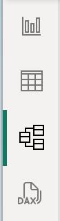
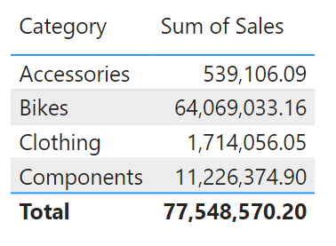
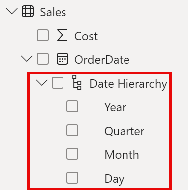
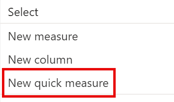
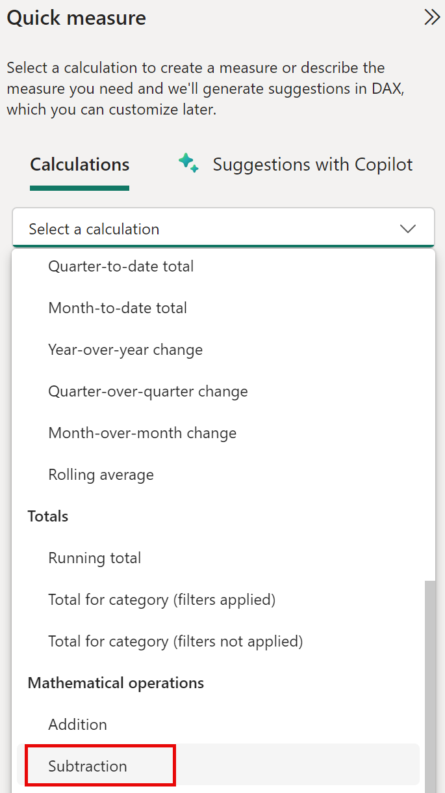
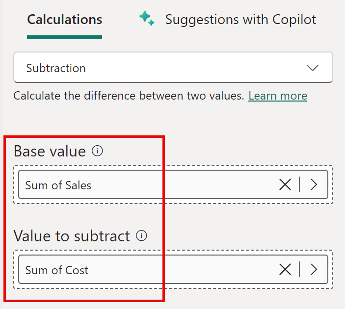
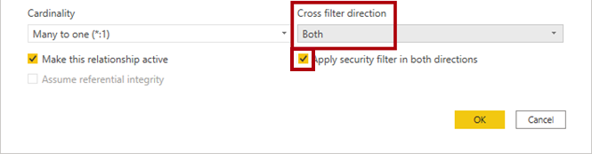

---
lab:
    title: 'Design a Data Model in Power BI'
    module: 'Design a Data Model in Power BI'
---

# Design a Data Model in Power BI

## Lab story

En este laboratorio, comenzarás a desarrollar el modelo de datos. Esto implica crear relaciones entre tablas, configurar propiedades de tablas y columnas para mejorar la usabilidad del modelo, y crear jerarquías y medidas rápidas.

En este laboratorio aprenderás a:

- Crear relaciones en el modelo
- Configurar propiedades de tablas y columnas
- Crear jerarquías

**Este laboratorio debe tomar aproximadamente 45 minutos.**

## Get started

Para completar este ejercicio, abre un navegador web e ingresa la siguiente URL para descargar la carpeta zip:

`https://github.com/MicrosoftLearning/PL-300-Microsoft-Power-BI-Data-Analyst/raw/Main/Allfiles/Labs/03-configure-data-model-in-power-bi-desktop/03-model-data.zip`

Extrae la carpeta en **C:\Users\Student\Downloads\03-model-data**.

Abre el archivo **03-Starter-Sales Analysis.pbix**.

> ***Nota**: Puedes omitir el inicio de sesión seleccionando **Cancelar**. Cierra otras ventanas informativas. Selecciona **Aplicar más tarde** si se solicita.* 

## Create model relationships

En esta tarea, crearás relaciones en el modelo. El archivo fue configurado para no detectar relaciones automáticamente, lo cual no es el valor predeterminado pero se recomienda para evitar relaciones incorrectas.

> **Importante**: *Los laboratorios usan notación abreviada: **Product \| Category** (Tabla \| Campo).*

1. En Power BI Desktop, a la izquierda, selecciona el icono **Report view**.

     

1. Para ver todos los campos, en el panel **Data**, haz clic derecho en un área vacía y selecciona **Expand All**.

1. Para crear una tabla visual, en el panel **Data**, dentro de **Product**, marca el campo **Category**.

1. Para añadir otra columna, en el panel **Data**, marca **Sales \| Sales**.

1. Observa que la tabla muestra cuatro categorías con valores idénticos de ventas.

     

     > *El problema es que la tabla está basada en campos de diferentes tablas. Se espera que cada categoría de producto muestre las ventas correspondientes. Sin embargo, al no existir una relación en el modelo entre estas tablas, la tabla **Sales** no se filtra. Ahora agregarás una relación para propagar filtros entre las tablas.*

1. Selecciona el icono **Model view** en el panel de navegación izquierdo y selecciona **Manage Relationships**.

     

1. En la ventana **Manage Relationships**, observa que aún no hay relaciones definidas. Para crear una relación, selecciona **New relationship**.

1. Configura la relación desde la tabla **Product** a la tabla **Sales**. Observa que los siguientes elementos se configuraron automáticamente:

    - **ProductKey columns in each table are selected**. *Las columnas se seleccionaron porque comparten el mismo nombre y tipo de dato. En datos reales, podrías necesitar buscar columnas equivalentes con nombres diferentes.*
    - **Cardinality type is One To Many (1:\*)**. *La cardinalidad se detectó automáticamente, ya que Power BI entiende que la columna **ProductKey** de la tabla **Product** contiene valores únicos. Las relaciones uno a muchos son las más comunes, y todas las relaciones que crees en este laboratorio serán de este tipo.*
    - **Cross Filter Direction type is Single**. *La dirección de filtro única significa que los filtros se propagan del lado "uno" al lado "muchos". En este caso, los filtros aplicados a la tabla **Product** se propagarán a la tabla **Sales**, pero no en sentido contrario.*
    - **Make This Relationship Active is checked**. *Las relaciones activas propagan filtros. Es posible marcar una relación como inactiva para que los filtros no se propaguen. Las relaciones inactivas existen cuando hay múltiples rutas de relación entre tablas. En este caso, los cálculos del modelo pueden usar funciones especiales para activarlas.*

     

1. Selecciona **OK**, observa en la ventana **Manage Relationships** que la nueva relación está listada y luego selecciona **Close**.

     

Observa que ahora hay un conector entre las dos tablas (*no importa si las tablas están posicionadas una al lado de la otra*):
    - Puedes interpretar la cardinalidad representada por los indicadores **1** y **(*)**.
    - La dirección del filtro está representada por la punta de la flecha.
    - Una línea sólida representa una relación activa; una línea discontinua representa una relación inactiva.
    - Pasa el cursor sobre la relación para resaltar las columnas relacionadas.

### Crear relaciones adicionales

Hay una forma más fácil de crear una relación. En el diagrama del modelo, puedes arrastrar y soltar columnas para crear una nueva relación.

1. Para crear una nueva relación usando una técnica diferente, desde la tabla **Reseller**, arrastra la columna **ResellerKey** sobre la columna **ResellerKey** de la tabla **Sales**.

    > ***Tip**: A veces una columna no quiere ser arrastrada. Si ocurre esto, selecciona una columna diferente, luego selecciona la columna que intentas arrastrar nuevamente y vuelve a intentarlo. Asegúrate de ver la nueva relación agregada al diagrama.*

     

1. Usa la nueva técnica para crear las siguientes dos relaciones del modelo:

     - **Region \| SalesTerritoryKey** a **Sales \| SalesTerritoryKey**
     - **Salesperson \| EmployeeKey** a **Sales \| EmployeeKey**

1. En el diagrama, organiza las tablas de modo que la tabla **Sales** esté posicionada en el centro del diagrama y las tablas relacionadas estén dispuestas alrededor. Coloca las tablas no conectadas a un lado.

     

1. En la vista de informe, observa que la tabla visual se actualizó para mostrar valores diferentes para cada categoría de producto.

    > *Los filtros aplicados a la tabla **Product** ahora se propagan a la tabla **Sales**.*

     

1. **Guarda** el archivo de Power BI Desktop.

## Configuración de la tabla Product

En esta tarea, configurarás la tabla **Product** con una jerarquía y una carpeta de visualización.

1. En **Model view > Data pane**, si es necesario, expande la tabla **Product** para mostrar todos los campos.

1. Para crear una jerarquía, en el panel **Data**, haz clic derecho en la columna **Category** y selecciona **Create Hierarchy**.

1. Actualiza el nombre a **Products** (haz clic derecho o doble clic para renombrar).

1. Para agregar el segundo nivel a la jerarquía, en el panel **Properties**, en el menú desplegable **Hierarchy**, selecciona **Subcategory** (puedes necesitar desplazarte hacia abajo dentro del panel).

1. Para agregar el tercer nivel a la jerarquía, en el menú desplegable **Hierarchy**, selecciona **Product**.

1. Para completar el diseño de la jerarquía, selecciona **Apply Level Changes**.

     

1. En el panel **Data**, observa la jerarquía **Products**. Para mostrar los niveles de la jerarquía, expande la jerarquía **Products**.

     

1. Para organizar columnas en una carpeta de visualización, en el panel **Data**, primero selecciona la columna **Background Color Format**.

1. Mientras mantienes presionada la tecla **Ctrl**, selecciona la columna **Font Color Format**.

1. En el panel **Properties**, en el cuadro **Display Folder**, ingresa **Formatting**.

     

1. En el panel **Data**, observa que las dos columnas ahora están dentro de una carpeta.

   > *Las carpetas de visualización son una excelente manera de organizar tablas, especialmente para tablas con muchos campos. Son solo presentación lógica.*

     

## Configuración de la tabla Region

En esta tarea, configurarás la tabla **Region** con una jerarquía y categorías actualizadas.

1. En la tabla **Region**, crea una jerarquía llamada **Regions** con los siguientes tres niveles:

     - Group
     - Country
     - Region

1. Selecciona la columna **Country** (no el nivel de la jerarquía **Country**).

1. En el panel **Properties**, expande la sección **Advanced** (en la parte inferior del panel), y luego en el menú desplegable **Data Category**, selecciona **Country/Region**.

    

    > *La categorización de datos puede proporcionar pistas al diseñador de informes. En este caso, categorizar la columna como país o región proporciona información más precisa a Power BI al renderizar una visualización de mapa.*

## Configuración de la tabla Reseller

En esta tarea, configurarás la tabla **Reseller** para agregar una jerarquía y actualizar categorías de datos.

1. En la tabla **Reseller**, crea una jerarquía llamada **Resellers** con los siguientes dos niveles:

     - Business Type
     - Reseller

1. Crea una segunda jerarquía llamada **Geography** con los siguientes cuatro niveles:

     - Country-Region
     - State-Province
     - City
     - Reseller

1. Establece la **Data Category** para las siguientes columnas (no dentro de la jerarquía):

    - **Country-Region** a **Country/Region**
    - **State-Province** a **State or Province**
    - **City** a **City**

## Configuración de la tabla Sales

En esta tarea, configurarás la tabla **Sales** con descripciones actualizadas, formato y resumen.

1. En la tabla **Sales**, selecciona la columna **Cost**.

1. En el panel **Properties**, en el cuadro **Description**, ingresa: *Based on standard cost*.

 > *Las descripciones se pueden aplicar a tablas, columnas, jerarquías o medidas. En el panel **Data**, el texto de descripción se muestra en un tooltip cuando un autor de informes pasa el cursor sobre el campo.*

1. Selecciona la columna **Quantity**.

1. En el panel **Properties**, dentro de la sección **Formatting**, desliza la propiedad **Thousands Separator** a **Yes**.

1. Selecciona la columna **Unit Price**.

1. En el panel **Properties**, dentro de la sección **Formatting**, establece la propiedad **Decimal Places** en **2**.

1. En el grupo **Advanced** (puedes necesitar desplazarte hacia abajo para ubicarlo), en el menú desplegable **Summarize By**, selecciona **Average**.

 > *Por defecto, las columnas numéricas se resumen sumando valores. Este comportamiento no es adecuado para una columna como **Unit Price**, que representa una tasa. Establecer el resumen predeterminado en promedio producirá un resultado significativo.*

## Actualización masiva de propiedades

En esta tarea, actualizarás múltiples columnas usando actualizaciones masivas. Usarás este enfoque para ocultar columnas y formatear valores.

1. Desde **Model view > Data pane**, selecciona la columna **Product \| ProductKey**.

1. Mantén presionada la tecla **Ctrl** y selecciona las siguientes 13 columnas (en múltiples tablas):

     - Region \| SalesTerritoryKey
     - Reseller \| ResellerKey
     - Sales \| EmployeeKey
     - Sales \| ProductKey
     - Sales \| ResellerKey
     - Sales \| SalesOrderNumber
     - Sales \| SalesTerritoryKey
     - Salesperson \| EmployeeID
     - Salesperson \| EmployeeKey
     - Salesperson \| UPN
     - SalespersonRegion \| EmployeeKey
     - SalespersonRegion \| SalesTerritoryKey
     - Targets \| EmployeeID

1. En el panel **Properties**, desliza la propiedad **Is Hidden** a **Yes**.

 > *Las columnas se ocultaron porque se usan en relaciones, configuración de seguridad a nivel de fila o lógica de cálculo.*

  *Usarás **SalesOrderNumber** en un cálculo en el laboratorio **Create DAX Calculations in Power BI Desktop**.*

1. Selecciona múltiples veces las siguientes tres columnas:

     - Product \| Standard Cost
     - Sales \| Cost
     - Sales \| Sales

1. En el panel **Properties**, dentro de la sección **Formatting**, establece la propiedad **Decimal Places** en **0** (cero).

## Explorar la interfaz del modelo

En esta tarea, cambiarás a la vista de informe, revisarás la interfaz del modelo de datos y configurarás el ajuste automático de fecha/hora.

1. Cambia a **Report view**.

1. En el panel **Data**, observa lo siguiente:

     - Las columnas, jerarquías y sus niveles son campos que pueden usarse para configurar visuales de informe
     - Solo los campos relevantes para la creación de informes son visibles
     - La tabla **SalespersonRegion** no es visible porque todos sus campos están ocultos
     - Los campos espaciales en las tablas **Region** y **Reseller** tienen un icono espacial
     - Los campos con el símbolo sigma (Ʃ) se resumirán por defecto
     - Aparece un tooltip al pasar el cursor sobre el campo **Sales \| Cost**

1. Expande el campo **Sales \| OrderDate** y observa que revela una **Date Hierarchy**. El campo **Targets \| TargetMonth** proporciona una jerarquía similar.

      

> **Importante**: *Estas jerarquías no fueron creadas por ti. Se crearon automáticamente como configuración predeterminada. Sin embargo, hay un problema: el año fiscal de Adventure Works comienza el 1 de julio de cada año. Pero, en estas jerarquías de fecha creadas automáticamente, el año de la jerarquía comienza el 1 de enero.*

1. Para desactivar la configuración **Auto date/time**, navega a **File > Options and Settings > Options**.

1. En la sección **Current File**, navega a **Data Load > Time Intelligence** y desmarca **Auto Date/Time**.

    

1. En el panel **Data**, observa que las jerarquías de fecha ya no están disponibles.

## Crear medidas rápidas

En esta tarea, crearás dos medidas rápidas para calcular ganancia y margen de ganancia. Una medida rápida crea la fórmula de cálculo por ti. Son fáciles y rápidas de crear para cálculos simples y comunes.

1. En el panel **Data**, haz clic derecho en la tabla **Sales** y selecciona **New Quick Measure**.

     

1. En la ventana **Quick Measures**, en el menú desplegable **Calculation**, dentro del grupo **Mathematical Operations**, selecciona **Subtraction**.

     

1. En el panel **Data** de la ventana **Quick Measures**, expande la tabla **Sales**.

1. Arrastra el campo **Sales** al cuadro **Base Value**.

1. Arrastra el campo **Cost** al cuadro **Value to Subtract**, luego selecciona **Add**.

     

1. En el panel **Data**, dentro de la tabla **Sales**, observa la nueva medida. 
    > *Las medidas se indican con el icono de calculadora.*

     

1. Para renombrar la medida, haz clic derecho en ella, selecciona **Rename** y cambia el nombre a **Profit**.

    > *Consejo: Para renombrar un campo, también puedes hacer doble clic en él, o seleccionarlo y presionar **F2**.*

1. En la tabla **Sales**, agrega una segunda medida rápida basada en los siguientes requisitos:

     - Usar la operación matemática **Division**
     - Establecer **Numerator** como el campo **Sales \| Profit**
     - Establecer **Denominator** como el campo **Sales \| Sales**
     - Renombrar la medida como **Profit Margin**

1. Asegúrate de que la medida **Profit Margin** esté seleccionada, y en la cinta contextual **Measure Tools**, establece el formato a **Percentage** con dos decimales.

     

1. Para probar las medidas, primero selecciona el visual **Table**.

1. En el panel **Data**, marca las dos medidas.

     

1. Selecciona y arrastra la guía derecha para ampliar la tabla visual.

     

1. Verifica que las medidas produzcan resultados razonables y formateados correctamente.

     

## Crear una relación de muchos a muchos (many-to-many)

En esta tarea, crearás una relación de muchos a muchos entre las tablas **Salesperson** y **Sales**.

1. En Power BI Desktop, en **Report view**, en el panel **Data**, marca los siguientes dos campos para crear un nuevo visual de **table**:

     - Salesperson \| Salesperson
     - Sales \| Sales

     

     > *La tabla muestra las ventas realizadas por cada vendedor. Sin embargo, existe otra relación entre vendedores y ventas. Algunos vendedores pertenecen a una, dos o más regiones de ventas. Además, las regiones de ventas pueden tener múltiples vendedores asignados.*
     >
     > *Desde una perspectiva de gestión del rendimiento, es necesario analizar las ventas de un vendedor (basadas en sus territorios asignados) y compararlas con los objetivos. Crearás relaciones para soportar este análisis en el siguiente ejercicio.*

1. Observa que **Michael Blythe** ha vendido casi $9 millones.

1. Cambia a **Model view**, luego arrastra la tabla **SalespersonRegion** para posicionarla entre las tablas **Region** y **Salesperson**.

1. Usa la técnica de arrastrar y soltar para crear las siguientes dos relaciones:

     - **Salesperson \| EmployeeKey** a **SalespersonRegion \| EmployeeKey**
     - **Region \| SalesTerritoryKey** a **SalespersonRegion \| SalesTerritoryKey**

    > *La tabla **SalespersonRegion** puede considerarse una tabla puente (bridging table).*

1. Cambia a **Report view** y nota que el visual no se ha actualizado: las ventas de Michael Blythe siguen igual.

1. Vuelve a **Model view** y sigue las direcciones de filtro de la relación (punta de flecha) desde la tabla **Salesperson**.

     > *Considera que la tabla **Salesperson** filtra la tabla **Sales**. También filtra la tabla **SalespersonRegion**, pero no continúa propagando filtros a la tabla **Region** (la punta de flecha apunta en la dirección incorrecta).*

     

1. Para editar la relación entre las tablas **Region** y **SalespersonRegion**, haz doble clic en la relación.

1. En la ventana **Edit Relationship**, en el menú desplegable **Cross Filter Direction**, selecciona **Both**.

1. Marca la casilla **Apply Security Filter in Both Directions**, luego selecciona **OK**.

     

1. Observa que la relación ahora tiene una doble punta de flecha.

     

1. Cambia a **Report view** y nota que los valores de ventas aún no han cambiado.

    > *El problema ahora se relaciona con que existen dos rutas posibles de propagación de filtros entre las tablas **Salesperson** y **Sales**. Esta ambigüedad se resuelve internamente basándose en una evaluación de "menor número de tablas". Para ser claros, no deberías diseñar modelos con este tipo de ambigüedad: el problema se abordará parcialmente más adelante en este laboratorio y al completar el laboratorio **Create DAX Calculations in Power BI Desktop**.*

1. Cambia a **Model view** para forzar la propagación de filtros a través de la tabla puente. Edita (doble clic) la relación entre las tablas **Salesperson** y **Sales**.

1. En la ventana **Edit Relationship**, desmarca la casilla **Make This Relationship Active** y selecciona **OK**.

    > *La propagación de filtros ahora seguirá la única ruta activa.*

1. En el diagrama, observa que la relación inactiva se representa con una línea discontinua.

     

1. Cambia a **Report view** y observa que las ventas de Michael Blythe ahora son casi $22 millones.

     

1. Observa también que las ventas de cada vendedor, si se suman, excederían el total de la tabla.

     > *Es una observación común en una relación de muchos a muchos debido al conteo doble, triple, etc. de resultados de ventas regionales. Considera a Brian Welcker, el segundo vendedor en la lista. Su monto de ventas equivale al total de ventas. Es el resultado correcto debido a que él es el Director de Ventas; sus ventas se miden por las ventas de todas las regiones.*
     >
     > *Aunque la relación de muchos a muchos ahora funciona, no es posible analizar las ventas realizadas por un vendedor (porque la relación está inactiva). Podrás reactivar la relación cuando introduzcas una tabla calculada que permita analizar las ventas realizadas en las regiones asignadas al vendedor (para análisis de rendimiento) en el laboratorio **Create DAX Calculations in Power BI Desktop**.*

1. Cambia a **Model view** y, en el diagrama, selecciona la tabla **Salesperson**.

1. En el panel **Properties**, en el cuadro **Name**, reemplaza el texto con **Salesperson (Performance)**.

    > *La tabla renombrada ahora refleja su propósito: se utiliza para informar y analizar el rendimiento de los vendedores basado en las ventas de sus regiones asignadas.*

## Relacionar la tabla Targets

En esta tarea, crearás una relación con la tabla **Targets**.

1. Crea una relación desde la columna **Salesperson (Performance) \| EmployeeID** y la columna **Targets \| EmployeeID**.

1. En **Report view**, agrega el campo **Targets \| Target** al visual de tabla.

1. Ajusta el tamaño del visual de tabla para que todas las columnas sean visibles.

     

 > *Ahora es posible visualizar ventas y objetivos, pero ten cuidado por dos razones. Primero, no hay un filtro de período de tiempo, por lo que los objetivos también incluyen montos futuros. Segundo, los objetivos no son aditivos, por lo que el total no debería mostrarse. Pueden deshabilitarse formateando el visual o eliminarse usando lógica de cálculo.*

## Laboratorio completado