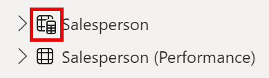
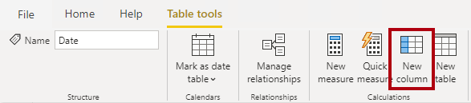
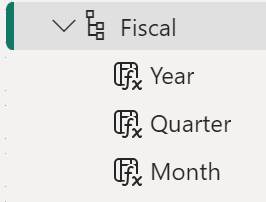
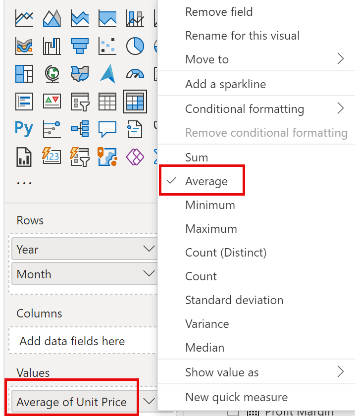
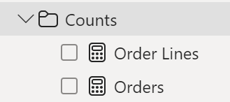
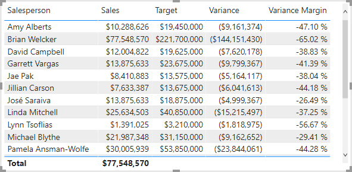

---
lab:
    title: 'Crear cálculos DAX en Power BI Desktop'
    module: 'Create Model Calculations using DAX in Power BI'
---

# Crear cálculos DAX en Power BI Desktop

## **Historia del laboratorio**

En este laboratorio, crearás tablas calculadas, columnas calculadas y medidas simples usando Data Analysis Expressions (DAX).

En este laboratorio aprenderás cómo:

- Crear tablas calculadas
- Crear columnas calculadas
- Crear medidas

**Este laboratorio debería tomar aproximadamente 45 minutos.**

## Comenzar

Para completar este ejercicio, primero abre un navegador web e ingresa la siguiente URL para descargar la carpeta comprimida:

`https://github.com/MicrosoftLearning/PL-300-Microsoft-Power-BI-Data-Analyst/raw/Main/Allfiles/Labs/04-create-dax-calculations-in-power-bi-desktop\04-intro-dax.zip`

Extrae la carpeta en la ubicación: **C:\Users\Student\Downloads\04-intro-dax**.

Abre el archivo **04-Starter-Sales Analysis.pbix**.

> ***Nota**: Puedes omitir el inicio de sesión seleccionando **Cancelar**. Cierra cualquier otra ventana informativa. Selecciona **Aplicar más tarde** si se te solicita aplicar cambios.*

## Crear la tabla calculada Salesperson

En esta tarea, crearás la tabla calculada **Salesperson** (relación directa con **Sales**).

Una tabla calculada se crea ingresando primero el nombre de la tabla, seguido del símbolo igual (=), seguido de una fórmula DAX que devuelve una tabla. El nombre de la tabla no puede existir previamente en el modelo de datos.

La barra de fórmulas admite ingresar fórmulas DAX válidas. Incluye funciones como autocompletado, Intellisense y colores, lo que te permite ingresar fórmulas de manera rápida y precisa.

1. En Power BI Desktop, en la vista de informe, en la pestaña **Modeling**, dentro del grupo **Calculations**, selecciona **New Table**.

     

2. En la barra de fórmulas (que se abre debajo de la cinta al crear o editar cálculos), escribe **Salesperson =**, presiona **Shift+Enter**, escribe **'Salesperson (Performance)'**, y luego presiona **Enter**.

	> **Nota**: *Para tu conveniencia, todas las definiciones DAX en este laboratorio pueden copiarse del archivo de snippets, ubicado en **04-intro-dax\Snippets.txt**.*

	 

	> *Esta definición de tabla crea una copia de la tabla **Salesperson (Performance)**. Solo copia los datos, pero no propiedades del modelo como visibilidad, formato, etc.*

1. En el panel **Data**, observa que el icono de la tabla tiene una calculadora adicional (denotando una tabla calculada).

	

	> ***Nota**: Las tablas calculadas se definen usando fórmulas DAX que devuelven una tabla. Es importante entender que aumentan el tamaño del modelo porque materializan y almacenan valores. Se recomputan cuando las dependencias de la fórmula se actualizan, como ocurrirá en este modelo cuando se carguen nuevos valores de fecha en las tablas.*
    >
	> *A diferencia de las tablas de Power Query, las tablas calculadas no pueden cargar datos de fuentes externas. Solo transforman datos basados en lo ya cargado en el modelo.*

1. Cambia a la vista de modelo, y observa que la tabla **Salesperson** está disponible (puede que necesites restablecer la vista para encontrarla).

1. Crea una relación desde la columna **Salesperson \| EmployeeKey** a la columna **Sales \| EmployeeKey**.

1. Haz clic derecho en la relación inactiva entre **Salesperson (Performance)** y **Sales**, y selecciona **Delete**. Cuando se te solicite confirmar, selecciona **Yes**.

1. En la tabla **Salesperson**, selecciona múltiples columnas y ocúltalas (establece la propiedad **Is Hidden** en **Yes**):

	- EmployeeID
	- EmployeeKey
	- UPN

1. En el diagrama del modelo, selecciona la tabla **Salesperson**.

1. En el panel **Properties**, en el cuadro **Description**, ingresa: **Salesperson related to Sales**
    
	> *Recuerda que las descripciones aparecen como tooltips en el panel **Data** cuando el usuario pasa el cursor sobre una tabla o campo.*

1. Para la tabla **Salesperson (Performance)**, establece la descripción en: **Salesperson related to region(s)**

*El modelo ahora ofrece dos alternativas para analizar vendedores. La tabla **Salesperson** permite analizar ventas realizadas por un vendedor, mientras que **Salesperson (Performance)** permite analizar ventas en las regiones asignadas al vendedor.*

## Crear la tabla Date

En esta tarea, crearás la tabla **Date**.

1. Cambia a la vista de tabla. En la pestaña **Home**, dentro del grupo **Calculations**, selecciona **New Table**.

	

1. En la barra de fórmulas, ingresa el siguiente DAX:

	```DAX
	Date =  
	CALENDARAUTO(6)
	```

	

	> *La función CALENDARAUTO() devuelve una tabla de una columna con valores de fecha. El comportamiento "auto" escanea todas las columnas de fecha en el modelo para determinar los valores más tempranos y más tardíos. Luego crea una fila por cada fecha en ese rango, extendiéndolo para asegurar años completos.*
    >
	> *Esta función puede tomar un argumento opcional que es el último mes del año fiscal. Si se omite, es 12 (diciembre). En este caso, se usa 6 (junio).*

1. Observa la columna de fechas formateadas según la configuración regional de EE.UU. (mm/dd/yyyy).

	

1. En la esquina inferior izquierda, en la barra de estado, observa que se generaron 1826 filas, que representan 5 años completos.

	

## Crear columnas calculadas

En esta tarea, agregarás más columnas para permitir filtrado y agrupamiento por diferentes períodos. También crearás una columna calculada para controlar el orden de otras columnas.

> **Nota**: *Para tu conveniencia, todas las definiciones DAX pueden copiarse del archivo **Snippets.txt**.*

1. En la pestaña contextual **Table Tools**, dentro del grupo **Calculations**, selecciona **New Column**.

	> *Una columna calculada se crea ingresando el nombre de la columna, seguido del símbolo igual (=), seguido de una fórmula DAX que devuelve un único valor. El nombre no puede existir previamente en la tabla.*

	

1. En la barra de fórmulas, escribe lo siguiente (o copia del archivo de snippets), y presiona **Enter**:
	> *La fórmula usa el año de la fecha pero suma 1 al año cuando el mes es posterior a junio. Así se calculan los años fiscales en Adventure Works.*

   ```DAX
   Year =
   "FY" & YEAR('Date'[Date]) + IF(MONTH('Date'[Date]) > 6, 1)
   ```

1. Usa las definiciones del archivo de snippets para crear las siguientes dos columnas calculadas en la tabla **Date**:

	- Quarter
	- Month

1. Verifica que las nuevas columnas se hayan agregado.

	

1. Para validar los cálculos, cambia a la vista de informe.

1. Para crear una nueva página de informe, selecciona el icono de más (+) junto a Page 1.

	

1. Para agregar un visual de matriz a la nueva página, en el panel **Visualizations**, selecciona el tipo de visual matriz.

	> *Consejo: Puedes pasar el cursor sobre cada icono para ver un tooltip que describe el tipo de visual.*

	

1. En el panel **Data**, dentro de la tabla **Date**, arrastra el campo **Year** al área **Rows**.

	

1. Arrastra el campo **Month** al área **Rows**, directamente debajo de **Year**.

1. En la esquina superior derecha del visual de matriz (o inferior, dependiendo de su ubicación), selecciona el icono de doble flecha (que expandirá todos los años un nivel).

	

1. Observa que los años se expanden a meses, pero los meses están ordenados alfabéticamente en lugar de cronológicamente.

	

	> *Por defecto, los valores de texto se ordenan alfabéticamente, los números de menor a mayor, y las fechas de más tempranas a más tardías.*

1. Para personalizar el orden del campo **Month**, cambia a la vista de tabla.

1. Agrega la columna **MonthKey** a la tabla **Date**.

	```DAX
	MonthKey =
	(YEAR('Date'[Date]) * 100) + MONTH('Date'[Date])
	```

	> *Esta fórmula calcula un valor numérico para cada combinación de año/mes.*

1. En la vista de tabla, verifica que la nueva columna contenga valores numéricos (por ejemplo, 201707 para julio de 2017, etc.).

	

1. Vuelve a la vista de informe. En el panel **Data**, selecciona **Month**.

1. En la pestaña contextual **Column Tools**, dentro del grupo **Sort**, selecciona **Sort by Column**, y luego selecciona **MonthKey**.

	

1. En el visual de matriz, observa que los meses ahora están ordenados cronológicamente.

	

## Completar la tabla Date

En esta tarea, completarás el diseño de la tabla **Date** ocultando una columna y creando una jerarquía. Luego crearás relaciones con las tablas **Sales** y **Targets**.

1. Cambia a la vista de modelo. En la tabla **Date**, oculta la columna **MonthKey** (establece **Is Hidden** en **Yes**).

1. En el panel **Data**, selecciona la tabla **Date**, haz clic derecho en la columna **Year**, y selecciona **Create hierarchy**.

1. Renombra la nueva jerarquía como **Fiscal** haciendo clic derecho y seleccionando **Rename**.

1. Agrega los siguientes dos campos a la jerarquía **Fiscal** seleccionándolos en el panel **Data**, haciendo clic derecho, y seleccionando **Add to hierarchy** -> **Fiscal**.

	- Quarter
	- Month

	

1. Crea las siguientes dos relaciones:

	- **Date \| Date** a **Sales \| OrderDate**
	- **Date \| Date** a **Targets \| TargetMonth**

1. Oculta las siguientes dos columnas:

	- Sales \| OrderDate
	- Targets \| TargetMonth

## Marcar la tabla Date

En esta tarea, marcarás la tabla **Date** como una tabla de fecha.

1. Cambia a la vista de informe. En el panel **Data**, selecciona la tabla **Date** (no el campo **Date**).

1. En la pestaña contextual **Table Tools**, dentro del grupo **Calendars**, selecciona **Mark as Date Table**.

1. En la ventana **Mark as a Date Table**, desliza la propiedad **Mark as a Date Table** a **Yes** y en el menú desplegable **Choose a date column**, selecciona **Date**. Selecciona **Save**.

	

1. Guarda el archivo de Power BI Desktop.

> *Power BI Desktop ahora entiende que esta tabla define fechas. Este enfoque es adecuado cuando no tienes una tabla de fecha en tu fuente de datos. Si tienes un almacén de datos, sería apropiado cargar fechas desde su tabla de dimensión de fecha en lugar de "redefinir" la lógica en tu modelo.*

## Crear medidas simples

En esta tarea, crearás medidas simples que agregan valores en una sola columna o cuentan filas de una tabla.

1. En la vista de informe, en **Page 2**, en el panel **Data**, arrastra el campo **Sales \| Unit Price** al visual de matriz.

	

1. En el panel de campos del visual (debajo del panel **Visualizations**), en el área **Values**, observa que **Unit Price** aparece como **Average of Unit Price**. Selecciona la flecha hacia abajo para **Unit Price**, y observa las opciones disponibles.

	

	> *Las columnas numéricas visibles permiten a los autores de informes decidir cómo se resumirán los valores. Esto puede llevar a informes inapropiados. Algunos modeladores prefieren ocultar estas columnas y exponer lógica de agregación definida en medidas. Es el enfoque que tomarás ahora.*

1. Para crear una medida, en el panel **Data**, haz clic derecho en la tabla **Sales**, y selecciona **New Measure**.

1. En la barra de fórmulas, agrega la siguiente definición de medida:

	```DAX
	Avg Price =  
	AVERAGE(Sales[Unit Price])
	```

1. Agrega la medida **Avg Price** al visual de matriz, y observa que produce el mismo resultado que la columna **Unit Price** (pero con diferente formato).

1. En el área **Values**, abre el menú contextual para el campo **Avg Price**, y observa que no es posible cambiar la técnica de agregación.

	

	> *No es posible modificar el comportamiento de agregación de una medida.*

1. Usa las definiciones del archivo de snippets para crear las siguientes cinco medidas en la tabla **Sales**:

	- Median Price
	- Min Price
	- Max Price
	- Orders
	- Order Lines

	> *La función DISTINCTCOUNT() usada en la medida **Orders** cuenta órdenes solo una vez (ignorando duplicados). La función COUNTROWS() usada en **Order Lines** opera sobre una tabla.*
    >
	> *En este caso, el número de órdenes se calcula contando los valores distintos de la columna **SalesOrderNumber**, mientras que el número de líneas de órdenes es simplemente el número de filas de la tabla (cada fila es una línea de una orden).*

1. Cambia a la vista de modelo, y selecciona múltiples las cuatro medidas de precio: **Avg Price**, **Max Price**, **Median Price**, y **Min Price**.

11. Para la selección múltiple de medidas, configura los siguientes requisitos:

	- Establece el formato con dos decimales

	- Asígnalas a una carpeta de visualización llamada **Pricing**

	

12. Oculta la columna **Unit Price**.

	> *La columna **Unit Price** ahora no está disponible para los autores de informes. Deben usar las medidas de precio que has agregado al modelo. Este enfoque asegura que no agreguen precios inapropiadamente, por ejemplo, sumándolos.*

13. Selecciona múltiples las medidas **Order Lines** y **Orders**, y configura los siguientes requisitos:

	- Establece el formato con separador de miles

	- Asígnalas a una carpeta de visualización llamada **Counts**

	

14. En la vista de informe, en el área **Values** del visual de matriz, para el campo **Unit Price**, selecciona **X** para eliminarlo.

15. Aumenta el tamaño del visual de matriz para llenar el ancho y alto de la página.

16. Agrega las siguientes cinco medidas al visual de matriz:

	- Median Price
	- Min Price
	- Max Price
	- Orders
	- Order Lines

17. Verifica que los resultados sean razonables y estén correctamente formateados.

	

## Crear medidas adicionales

En esta tarea, crearás más medidas que usan fórmulas más complejas.

1. En la vista de informe, selecciona **Page 1** y revisa el visual de tabla, observando el total para la columna **Target**.

	

1. Selecciona el visual de tabla, y en el panel **Visualizations**, elimina el campo **Target**.

1. Renombra la columna **Targets \| Target** como **Targets \| TargetAmount**.

	> *Consejo: Hay varias formas de renombrar la columna en la vista de informe: En el panel **Data**, puedes hacer clic derecho en la columna y seleccionar **Rename**, o hacer doble clic, o presionar **F2**.*

1. Crea la siguiente medida en la tabla **Targets**:

	```DAX
	Target =
	IF(
	HASONEVALUE('Salesperson (Performance)'[Salesperson]),
	SUM(Targets[TargetAmount])
	)
	```

	> *La función HASONEVALUE() prueba si un solo valor en la columna **Salesperson** está filtrado. Cuando es verdadero, la expresión devuelve la suma de montos objetivo (solo para ese vendedor). Cuando es falso, devuelve BLANK.*

1. Formatea la medida **Target** con cero decimales.

	> *Consejo: Puedes usar la pestaña contextual **Measure Tools**.*

1. Oculta la columna **TargetAmount**.

	> *Consejo: Puedes hacer clic derecho en la columna en el panel **Data**, y seleccionar **Hide**.*

1. Agrega la medida **Target** al visual de tabla.

1. Observa que el total de la columna **Target** ahora es BLANK.

	

1. Usa las definiciones del archivo de snippets para crear las siguientes dos medidas en la tabla **Targets**:

	- Variance
	- Variance Margin

1. Formatea la medida **Variance** con cero decimales.

1. Formatea la medida **Variance Margin** como porcentaje con dos decimales.

1. Agrega las medidas **Variance** y **Variance Margin** al visual de tabla.

1. Ajusta el tamaño del visual de tabla para que todas las columnas y filas sean visibles.

	

	> *Aunque parece que todos los vendedores no cumplen los objetivos, recuerda que el visual no está filtrado por un período específico. Producirás informes de desempeño filtrados por períodos seleccionados por el usuario en el laboratorio **Diseñar un informe en Power BI Desktop**.*

1. En la esquina superior derecha del panel **Data**, colapsa y luego expande el panel.

	> *Colapsar y reabrir el panel restablece el contenido.*

1. Observa que la tabla **Targets** ahora aparece al principio de la lista.

	

	*Las tablas que solo contienen medidas visibles se listan automáticamente al principio.*

## Laboratorio completado
