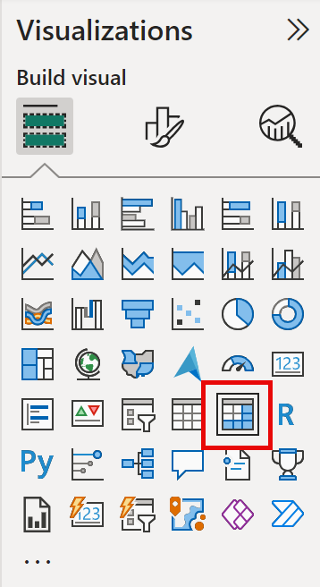
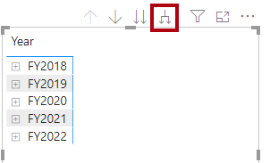
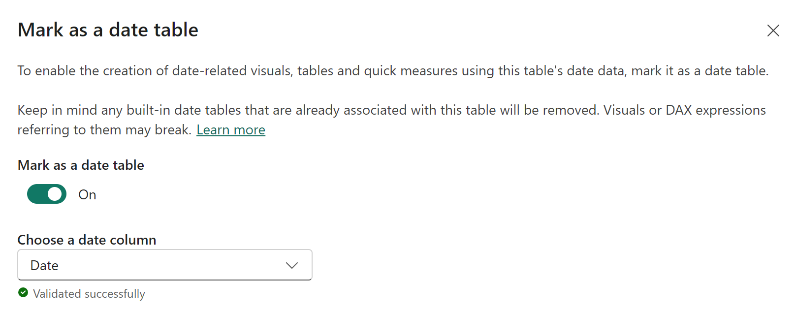
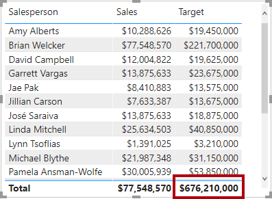
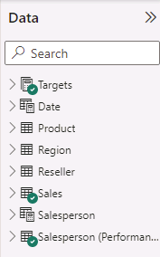

---
lab:
    title: 'Crear cálculos DAX en Power BI Desktop'
    module: 'Create Model Calculations using DAX in Power BI'
---


# Crear cálculos DAX en Power BI Desktop

## **Historia del laboratorio**

En este laboratorio crearás tablas calculadas, columnas calculadas y medidas simples usando Data Analysis Expressions (DAX).

En este laboratorio aprenderás a:

- Crear tablas calculadas
- Crear columnas calculadas
- Crear medidas

**Este laboratorio debe tomar aproximadamente 45 minutos.**

## Empezar

Para completar este ejercicio, primero abre un navegador web e ingresa la siguiente URL para descargar la carpeta zip:

`https://github.com/MicrosoftLearning/PL-300-Microsoft-Power-BI-Data-Analyst/raw/Main/Allfiles/Labs/04-create-dax-calculations-in-power-bi-desktop\04-intro-dax.zip`

Extrae la carpeta en **C:\Users\Student\Downloads\04-intro-dax**.

Abre el archivo **04-Starter-Sales Analysis.pbix**.

> ***Nota**: Puedes omitir el inicio de sesión seleccionando **Cancelar**. Cierra cualquier otra ventana informativa. Selecciona **Aplicar más tarde** si se solicita aplicar cambios.*

## Crear la tabla calculada Salesperson

En esta tarea, crearás la tabla calculada **Salesperson** (relación directa con **Sales**).

Una tabla calculada se crea ingresando primero el nombre de la tabla, seguido del símbolo igual (=), seguido de una fórmula DAX que devuelve una tabla. El nombre de la tabla no puede existir previamente en el modelo de datos.

La barra de fórmulas admite ingresar fórmulas DAX válidas. Incluye funciones como autocompletado, Intellisense y colores, permitiendo ingresar fórmulas de manera rápida y precisa.

1. En Power BI Desktop, en la vista de informe, en la pestaña **Modeling**, dentro del grupo **Calculations**, selecciona **New Table**.

     

2. En la barra de fórmulas (que se abre debajo de la cinta al crear/editar cálculos), escribe **Salesperson =**, presiona **Shift+Enter**, escribe **'Salesperson (Performance)'**, y luego presiona **Enter**.

	> **Nota**: *Para tu conveniencia, todas las definiciones DAX en este laboratorio pueden copiarse del archivo de fragmentos en **04-intro-dax\Snippets.txt**.*

	 

	> *Esta definición de tabla crea una copia de **Salesperson (Performance)**. Solo copia los datos, no propiedades del modelo como visibilidad o formato.*

1. En el panel **Data**, nota que el ícono de la tabla tiene una calculadora adicional (denotando una tabla calculada).

	

	> ***Nota**: Las tablas calculadas se definen con fórmulas DAX que devuelven tablas. Aumentan el tamaño del modelo al materializar valores. Se recomputan al actualizar dependencias._
    >
	> *_A diferencia de tablas de Power Query, no pueden cargar datos externos. Solo transforman datos existentes en el modelo.*_

1. Cambia a la vista de modelo y observa que la tabla **Salesperson** está disponible (puedes necesitar reajustar la vista).

1. Crea una relación desde **Salesperson \| EmployeeKey** a **Sales \| EmployeeKey**.

1. Haz clic derecho en la relación inactiva entre **Salesperson (Performance)** y **Sales**, y selecciona **Delete**. Confirma la eliminación.

1. En la tabla **Salesperson**, selecciona múltiples columnas y ocúltalas (**Is Hidden = Yes**):

	- EmployeeID
	- EmployeeKey
	- UPN

1. En el diagrama del modelo, selecciona la tabla **Salesperson**.

1. En el panel **Properties**, en **Description**, ingresa: **Salesperson related to Sales**
    
	> *Las descripciones aparecen como tooltips en el panel **Data** al pasar el cursor.*

1. Para **Salesperson (Performance)**, establece la descripción: **Salesperson related to region(s)**

*El modelo ahora ofrece dos alternativas para analizar vendedores: **Salesperson** para ventas directas y **Salesperson (Performance)** para ventas por regiones asignadas.*

## Crear la tabla Date

En esta tarea, crearás la tabla **Date**.

1. Cambia a Table view. En **Home** > **Calculations**, selecciona **New Table**.

	

1. En la barra de fórmulas, ingresa:

	```DAX
	Date =  
	CALENDARAUTO(6)
	```

	

    > *La función CALENDARAUTO() devuelve una tabla de una columna con valores de fecha. El comportamiento "auto" escanea todas las columnas de fecha del modelo para determinar las fechas más temprana y más reciente. Luego crea una fila por cada fecha en este rango, extendiéndolo para garantizar años completos almacenados.*
    >
    > *Esta función acepta un argumento opcional: el número del último mes del año. Si se omite, es 12 (diciembre). Aquí se usa 6, siendo junio el último mes.*

1. Observe la columna de fechas con formato regional de EE.UU. (mm/dd/aaaa).

	

1. En la barra de estado inferior izquierda, note las estadísticas: 1826 filas (5 años completos).

	

## Crear columnas calculadas

En esta tarea, agregará columnas para filtrar/agrupar por períodos y controlar ordenamientos.

> **Nota**: *Todas las definiciones DAX están en **Snippets.txt**.*

1. En **Table Tools** > **Calculations**, seleccione **New Column**.

	> *Columna calculada: nombre = fórmula DAX de un solo valor. El nombre no debe existir previamente.*

	

1. En la barra de fórmulas, ingrese (o copie) y presione **Enter**:
	> *Añade 1 al año cuando el mes > junio (año fiscal de Adventure Works).*

   ```DAX
   Year =
   "FY" & YEAR('Date'[Date]) + IF(MONTH('Date'[Date]) > 6, 1)
   ```


   1. Use las definiciones del archivo de snippets para crear las siguientes dos columnas calculadas en la tabla **Date**:

	- Quarter
	- Month

1. Verifique que se hayan agregado las nuevas columnas.

	

1. Para validar los cálculos, cambie a la vista Report.

1. Para crear una nueva página de informe, seleccione el ícono de más junto a Page 1.

	

1. Para agregar un visual de matriz a la nueva página, en el panel **Visualizations**, seleccione el tipo matrix visual.

	> *Consejo: Mantenga el cursor sobre los íconos para ver descripciones del tipo de visual.*

	

1. En el panel **Data**, desde la tabla **Date**, arrastre el campo **Year** al área **Rows**.

	

1. Arrastre el campo **Month** al área **Rows**, directamente debajo de **Year**.

1. En la esquina superior derecha del visual de matriz (o inferior según ubicación), seleccione el ícono de doble flecha bifurcada (expandirá todos los años un nivel).

	

1. Observe que los años se expanden a meses, ordenados alfabéticamente en lugar de cronológicamente.

	

	> *Por defecto: texto (orden A-Z), números (menor a mayor), fechas (antiguas a recientes).*

1. Para personalizar el orden del campo **Month**, cambie a la vista Table.

1. Agregue la columna **MonthKey** a la tabla **Date**:

	```DAX
	MonthKey =
	(YEAR('Date'[Date]) * 100) + MONTH('Date'[Date])
	```

	> *Esta fórmula calcula un valor numérico para cada combinación año/mes.*

1. En Table view, verifique valores numéricos (ej: 201707 para julio 2017).

	

1. Regrese a Report view. En el panel **Data**, seleccione **Month**.

1. En la cinta **Column Tools**, dentro de **Sort**, seleccione **Sort by Column** y luego **MonthKey**.

	

1. En el visual de matriz, los meses ahora están ordenados cronológicamente.

	

## Completar la tabla Date

En esta tarea, completará el diseño de la tabla **Date** ocultando una columna y creando una jerarquía. Luego creará relaciones con las tablas **Sales** y **Targets**.

1. Cambie a Model view. En la tabla **Date**, oculte la columna **MonthKey** (establezca **Is Hidden** en **Yes**).

1. En el panel derecho **Data**, seleccione la tabla **Date**, haga clic derecho en la columna **Year** y seleccione **Create hierarchy**.

1. Renombre la jerarquía recién creada a **Fiscal** haciendo clic derecho y seleccionando **Rename**.

1. Agregue los siguientes dos campos restantes a la jerarquía Fiscal seleccionándolos en el panel **Data**, clic derecho, **Add to hierarchy** -> **Fiscal**:

	- Quarter
	- Month

	

1. Cree las siguientes dos relaciones de modelo:

	- **Date \| Date** a **Sales \| OrderDate**
	- **Date \| Date** a **Targets \| TargetMonth**


	> *Los labs usan notación abreviada para campos: **Sales \| Unit Price**. **Sales** = nombre de tabla, **Unit Price** = nombre de campo.*

1. Oculte las siguientes dos columnas:

	- Sales \| OrderDate
	- Targets \| TargetMonth

## Marcar la tabla Date

En esta tarea, marcará la tabla **Date** como tabla de fechas.

1. Cambie a Report view. En el panel **Data**, seleccione la tabla **Date** (no el campo **Date**).

1. En la cinta contextual **Table Tools**, dentro del grupo **Calendars**, seleccione **Mark as Date Table**.

1. En la ventana **Mark as a Date Table**, deslice la propiedad **Mark as a Date Table** a **Yes** y en el dropdown **Choose a date column**, seleccione **Date**. Seleccione **Save**.

	

1. Guarde el archivo Power BI Desktop.

> *Power BI Desktop ahora entiende que esta tabla define fechas (tiempo). Este enfoque es adecuado cuando no hay tabla de fechas en el origen. Si tiene un data warehouse, conviene cargar datos desde su tabla de dimensión de fechas en lugar de "redefinir" lógica de fechas.*

## Crear medidas simples

En esta tarea, creará medidas que agregan valores en una columna o cuentan filas.

1. En Report view, en **Page 2**, arrastre el campo **Sales \| Unit Price** al visual de matriz.

	

1. En el panel de campos del visual (debajo de **Visualizations**), en el área **Values**, note que **Unit Price** aparece como **Average of Unit Price**. Seleccione la flecha de **Unit Price** y observe las opciones.

	

	> *Las columnas numéricas visibles permiten a los reportes decidir cómo resumir valores. Algunos modeladores prefieren ocultarlas y exponer lógica de agregación en medidas.*

1. Para crear una medida: panel **Data** > clic derecho en tabla **Sales** > **New Measure**.

1. En la barra de fórmulas, agregue:

	```DAX
	Avg Price =  
	AVERAGE(Sales[Unit Price])
	```

1. Agregue la medida **Avg Price** al visual. Notará el mismo resultado que la columna **Unit Price** (con formato diferente).

1. En **Values**, abra el menú contextual de **Avg Price** y note que no se puede cambiar la técnica de agregación.

	

	> *No es posible modificar el comportamiento de agregación de una medida.*

1. Use los snippets para crear estas medidas en **Sales**:

	- Median Price
	- Min Price
	- Max Price
	- Orders
	- Order Lines

	> *DISTINCTCOUNT() en **Orders** cuenta órdenes únicas. COUNTROWS() en **Order Lines** opera sobre una tabla.*
    >
	> *El número de órdenes = valores distintos de **SalesOrderNumber**. Líneas de orden = filas de tabla.*

1. Cambie a Model view y seleccione las cuatro medidas de precio: **Avg Price**, **Max Price**, **Median Price**, **Min Price**.

11. Para la selección múltiple, configure:

	- Formato a 2 decimales

	- Carpeta de visualización: **Pricing**

	

12. Oculte la columna **Unit Price**.

	> *La columna **Unit Price** ahora no está disponible para los autores de informes. Deben utilizar las medidas de precios que ha agregado al modelo. Este enfoque de diseño garantiza que los autores de informes no agreguen precios de forma inapropiada, por ejemplo, sumándolos.*

13. Seleccione múltiples las medidas **Order Lines** y **Orders**, y luego configure los siguientes requisitos:

	- Establezca el formato para usar el separador de miles

	- Asigne a una carpeta de visualización llamada **Counts**

	

14. En Report view, en el área **Values** del visual de matriz, para el campo **Unit Price**, seleccione **X** para eliminarlo.

15. Aumente el tamaño del visual de matriz para llenar el ancho y alto de la página.

16. Agregue las siguientes cinco medidas al visual de matriz:

	- Median Price
	- Min Price
	- Max Price
	- Orders
	- Order Lines

17. Verifique que los resultados sean coherentes y estén formateados correctamente.

	

## Crear medidas adicionales

En esta tarea, creará medidas con fórmulas más complejas.

1. En Report view, seleccione **Page 1** y revise el visual de tabla, observando el total de la columna **Target**.

	

1. Seleccione el visual de tabla, y en el panel **Visualizations**, elimine el campo **Target**.

1. Cambie el nombre de la columna **Targets \| Target** a **Targets \| TargetAmount**.

	> *Consejo: Para renombrar en Report view: clic derecho en la columna > **Rename**, doble clic, o presione **F2**.*

1. Cree la siguiente medida en la tabla **Targets**:

	```DAX
	Target =
	IF(
	HASONEVALUE('Salesperson (Performance)'[Salesperson]),
	SUM(Targets[TargetAmount])
	)
	```

	> *HASONEVALUE() verifica si hay un solo valor filtrado en **Salesperson**. Si es verdadero, retorna la suma de TargetAmount. Si no, retorna BLANK.*

1. Formatee la medida **Target** con cero decimales.

	> *Use la cinta **Measure Tools**.*

1. Oculte la columna **TargetAmount**.

	> *Clic derecho en la columna > **Hide**.*

1. Agregue la medida **Target** al visual de tabla.

1. Note que el total de **Target** ahora es BLANK.

	

1. Use los snippets para crear estas medidas en **Targets**:

	- Variance
	- Variance Margin

1. Formatee **Variance** con cero decimales.

1. Formatee **Variance Margin** como porcentaje con dos decimales.

1. Agregue **Variance** y **Variance Margin** al visual de tabla.

1. Redimensione el visual para ver todas las columnas y filas.

	

	> *Aunque parece que todos los vendedores no están alcanzando el objetivo, recuerde que el visual de tabla aún no está filtrado por un período de tiempo específico. Producirá informes de rendimiento de ventas que filtran por un período seleccionado por el usuario en el lab **Design a Report in Power BI Desktop**.*

1. En la esquina superior derecha del panel **Data**, colapse y expanda el panel.

	> *Esto reinicia el contenido.*

1. Observe que **Targets** ahora aparece al inicio de la lista.

	

	> *Las tablas con solo medidas visibles se listan primero.*

## Lab completado