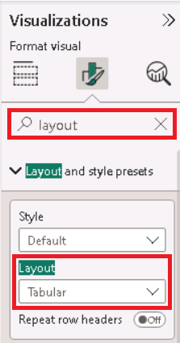

---
lab:
    title: 'Crear cálculos DAX avanzados en Power BI Desktop'
    module: 'Crear cálculos de modelo usando DAX en Power BI'
---

# Crear cálculos DAX avanzados en Power BI Desktop

## **Historia del laboratorio**

En este laboratorio, crearás medidas con expresiones DAX que involucran manipulación de contexto de filtro.

En este laboratorio aprenderás cómo:

- Usar la función CALCULATE() para manipular el contexto de filtro
- Usar funciones de Inteligencia de Tiempo

**Este laboratorio debería tomar aproximadamente 45 minutos.**

## Comenzar

Para completar este ejercicio, primero abre un navegador web e ingresa la siguiente URL para descargar la carpeta comprimida:

`https://github.com/MicrosoftLearning/PL-300-Microsoft-Power-BI-Data-Analyst/raw/Main/Allfiles/Labs/05-create-dax-calculations-in-power-bi-desktop-advanced/05-advanced-dax.zip`

Extrae la carpeta en la ubicación: **C:\Users\Student\Downloads\05-advanced-dax**.

Abre el archivo **05-Starter-Sales Analysis.pbix**.

> ***Nota**: Puedes omitir el inicio de sesión seleccionando **Cancelar**. Cierra cualquier otra ventana informativa. Selecciona **Aplicar más tarde** si se te solicita aplicar cambios.*

## Crear un visual de matriz

En esta tarea, crearás un visual de matriz para probar tus nuevas medidas.

1. En Power BI Desktop, **Vista de informe**, crea una nueva página de informe.

1. En **Page 3**, agrega un visual de matriz.

    

1. Ajusta el tamaño del visual de matriz para que llene toda la página.

1. Para configurar los campos del visual de matriz, desde el panel **Data**, arrastra la jerarquía **Region \| Regions** y suéltala dentro del visual.

    > *Los laboratorios usan una notación abreviada para referenciar un campo o jerarquía. Se verá así: **Region \| Regions**. En este ejemplo, **Region** es el nombre de la tabla y **Regions** es el nombre de la jerarquía.*

1. Agrega también el campo **Sales \| Sales** al área Values.

1. Para expandir toda la jerarquía, en la esquina superior derecha del visual de matriz, selecciona el icono de doble flecha dos veces.

    

1. Para formatear el visual, en el panel **Visualizations**, selecciona el panel **Format**.

    

1. En el cuadro **Search**, ingresa **Layout**.

1. Establece la propiedad **Layout** en **Tabular**.

    

1. Verifica que el visual de matriz ahora tenga 4 encabezados de columna.

    

    > *En Adventure Works, las regiones de ventas se organizan en grupos, países y regiones. Todos los países (excepto EE.UU.) tienen una sola región, nombrada como el país. Como EE.UU. es un territorio de ventas grande, se divide en 5 regiones.*

Crearás varias medidas en este ejercicio y las probarás agregándolas al visual de matriz.

## Manipular el contexto de filtro

En esta tarea, crearás varias medidas con expresiones DAX que usan la función CALCULATE() para manipular el contexto de filtro.

> *La función CALCULATE() es poderosa y se usa para manipular el contexto de filtro. El primer argumento toma una expresión o medida (una medida es solo una expresión nombrada). Los argumentos subsiguientes permiten modificar el contexto de filtro.*

1. Agrega una medida a la tabla **Sales**, basada en la siguiente expresión:

    > **Nota**: *Para tu conveniencia, todas las definiciones DAX en este laboratorio pueden copiarse del archivo **C:\Users\Student\Downloads\05-advanced-dax\Snippets.txt**.*

    ```DAX
    Sales All Region =
    CALCULATE(SUM(Sales[Sales]), REMOVEFILTERS(Region))
    ```

    > *La función REMOVEFILTERS() elimina filtros activos. Puede no tomar argumentos, o tomar una tabla, columna o múltiples columnas.*
    >
    > *En esta fórmula, la medida evalúa la suma de la columna **Sales** en un contexto de filtro modificado, que elimina cualquier filtro aplicado a las columnas de la tabla **Region**.*

1. Agrega la medida **Sales All Region** al visual de matriz.

    

1. Observa que la medida **Sales All Region** calcula el total de ventas de todas las regiones para cada región, país (subtotal) y grupo (subtotal).

    *La nueva medida aún no entrega un resultado útil. Cuando las ventas de un grupo, país o región se dividen por este valor, producirá un ratio útil conocido como "porcentaje del total general".*

1. En el panel **Data**, asegúrate de que la medida **Sales All Region** esté seleccionada (fondo gris oscuro), y en la barra de fórmulas, reemplaza el nombre y fórmula con:

    *Consejo: Para reemplazar la fórmula existente, copia el snippet. Luego, selecciona la barra de fórmulas y presiona **Ctrl+A** para seleccionar todo. Presiona **Ctrl+V** para pegar el snippet y sobrescribir el texto. Presiona **Enter**.*

    ```DAX
    Sales % All Region =  
    DIVIDE(  
     SUM(Sales[Sales]),  
     CALCULATE(  
     SUM(Sales[Sales]),  
     REMOVEFILTERS(Region)  
     )  
    )
    ```

    *La medida se renombró para reflejar la fórmula actualizada. La función DIVIDE() divide la medida **Sales** (sin modificar por el contexto de filtro) por la medida **Sales** en un contexto modificado que elimina filtros de la tabla **Region**.*

1. En el visual de matriz, observa que la medida se renombró y muestra valores diferentes para cada grupo, país y región.

1. Formatea **Sales % All Region** como porcentaje con 2 decimales.

1. En el visual de matriz, revisa los valores de **Sales % All Region**.

    

1. Agrega otra medida a **Sales**, basada en la siguiente expresión, y formatea como porcentaje:

    ```DAX
    Sales % Country =  
    DIVIDE(  
     SUM(Sales[Sales]),  
     CALCULATE(  
     SUM(Sales[Sales]),  
     REMOVEFILTERS(Region[Region])  
     )  
    )
    ```

1. Observa que la fórmula de **Sales % Country** difiere ligeramente de **Sales % All Region**.

    *La diferencia es que el denominador modifica el contexto de filtro eliminando filtros de la columna **Region** de la tabla **Region**, no todas las columnas. Esto preserva los filtros de grupo o país. El resultado representa las ventas como porcentaje del país.*

1. Agrega **Sales % Country** al visual de matriz.

1. Observa que solo las regiones de EE.UU. producen valores distintos de 100%.

    

    > *Recuerda que solo EE.UU. tiene múltiples regiones. Otros países tienen una sola región, por eso muestran 100%.*

1. Para mejorar la legibilidad, sobrescribe **Sales % Country** con esta fórmula mejorada:

    ```DAX
    Sales % Country =  
    IF(  
     ISINSCOPE(Region[Region]),  
     DIVIDE(  
     SUM(Sales[Sales]),  
     CALCULATE(  
     SUM(Sales[Sales]),  
     REMOVEFILTERS(Region[Region])  
     )  
     )  
    )
    ```

    > *La función IF() usa ISINSCOPE() para probar si la columna region está en el nivel actual de la jerarquía. Cuando es verdadero, evalúa DIVIDE(). Cuando es falso, devuelve BLANK.*

1. Observa que **Sales % Country** ahora solo devuelve valores cuando una región está en scope.

    

1. Agrega otra medida a **Sales**, basada en la siguiente expresión, y formatea como porcentaje:

    ```DAX
    Sales % Group =  
    DIVIDE(  
     SUM(Sales[Sales]),  
     CALCULATE(  
     SUM(Sales[Sales]),  
     REMOVEFILTERS(  
     Region[Region],  
     Region[Country]  
     )  
     )  
    )
    ```

    > *Para lograr ventas como porcentaje del grupo, se eliminan los filtros de dos columnas.*

1. Agrega **Sales % Group** al visual de matriz.

1. Para mejorar la legibilidad, sobrescribe **Sales % Group** con esta fórmula mejorada:

    ```DAX
    Sales % Group =  
    IF(  
     ISINSCOPE(Region[Region])  
     || ISINSCOPE(Region[Country]),  
     DIVIDE(  
     SUM(Sales[Sales]),  
     CALCULATE(  
     SUM(Sales[Sales]),  
     REMOVEFILTERS(  
     Region[Region],  
     Region[Country]  
     )  
     )  
     )  
    )
    ```

1. Observa que **Sales % Group** ahora solo devuelve valores cuando una región o país está en scope.

1. En Vista de modelo, coloca las tres medidas nuevas en una carpeta de visualización llamada **Ratios**.

    

1. Guarda el archivo de Power BI Desktop.

*Las medidas agregadas a la tabla **Sales** modifican el contexto de filtro para lograr navegación jerárquica. El patrón para calcular subtotales requiere eliminar algunas columnas del contexto de filtro, y para el total general, todas las columnas.*

## Crear una medida YTD

En esta tarea, crearás una medida de ventas año hasta la fecha (YTD) usando funciones de inteligencia de tiempo.

1. En Vista de informe, en **Page 2**, observa el visual de matriz que muestra varias medidas con años y meses agrupados en filas.

2. Agrega una medida a **Sales**, basada en la siguiente expresión, formateada con 0 decimales:

    ```DAX
    Sales YTD =  
    TOTALYTD(SUM(Sales[Sales]), 'Date'[Date], "6-30")
    ```

    > *La función TOTALYTD() evalúa una expresión (en este caso, la suma de **Sales**) sobre una columna de fecha. La columna debe pertenecer a una tabla de fecha marcada como tal.*
    >
    > *El tercer argumento opcional representa el último día del año. Si se omite, es 31 de diciembre. Para Adventure Works, junio es el último mes, por eso se usa "6-30".*

3. Agrega el campo **Sales** y la medida **Sales YTD** al visual de matriz.

4. Observa la acumulación de valores de ventas dentro del año.

    

*La función TOTALYTD() manipula filtros de tiempo. Por ejemplo, para calcular YTD de septiembre 2017 (tercer mes del año fiscal), elimina los filtros de la tabla **Date** y los reemplaza con un nuevo filtro desde el inicio del año (1 de julio 2017) hasta el último día del período (30 de septiembre 2017).*

*DAX incluye muchas funciones de inteligencia de tiempo para manipulación de filtros temporales comunes.*

## Crear una medida de crecimiento YoY

En esta tarea, crearás una medida de crecimiento interanual (YoY) usando una variable.

> *Las variables simplifican fórmulas y son más eficientes si la lógica se usa múltiples veces. Se declaran con un nombre único y la expresión debe devolverse después de **RETURN**. A diferencia de otros lenguajes, las variables DAX solo pueden usarse dentro de una fórmula.*

1. Agrega otra medida a **Sales**, basada en la siguiente expresión:

    ```DAX
    Sales YoY Growth =  
    VAR SalesPriorYear =  
     CALCULATE(  
     SUM(Sales[Sales]),  
     PARALLELPERIOD(  
     'Date'[Date],  
     -12,  
     MONTH  
     )  
     )  
    RETURN  
     SalesPriorYear
    ```

    > *La variable **SalesPriorYear** se asigna a una expresión que calcula la suma de **Sales** en un contexto modificado que usa PARALLELPERIOD() para retroceder 12 meses desde cada fecha en el contexto de filtro.*

1. Agrega **Sales YoY Growth** al visual de matriz.

1. Observa que la medida devuelve BLANK para los primeros 12 meses (no hay ventas registradas antes del año fiscal 2017).

1. Observa que el valor de **Sales YoY Growth** para **2018 Jul** es el valor de **Sales** para **2017 Jul**.

    

    > *Ahora que la parte "difícil" de la fórmula está probada, puedes completar la medida con la fórmula final que calcula el crecimiento.*

1. Para completar la medida, sobrescribe **Sales YoY Growth** con esta fórmula, formateada como porcentaje con 2 decimales:

    ```DAX
    Sales YoY Growth =  
    VAR SalesPriorYear =  
     CALCULATE(  
     SUM(Sales[Sales]),  
     PARALLELPERIOD(  
     'Date'[Date],  
     -12,  
     MONTH  
     )  
     )  
    RETURN  
     DIVIDE(  
     (SUM(Sales[Sales]) - SalesPriorYear),  
     SalesPriorYear  
     )
    ```

1. En la cláusula **RETURN**, observa que la variable se referencia dos veces.

1. Verifica que el crecimiento YoY para **2018 Jul** es **392.83%**.

    

    > *La medida identifica un aumento de casi 400% (o 4x) en ventas comparado con el mismo período del año anterior.*

1. En Vista de modelo, coloca las dos medidas nuevas en una carpeta de visualización llamada **Time Intelligence**.

    

## Laboratorio completado
