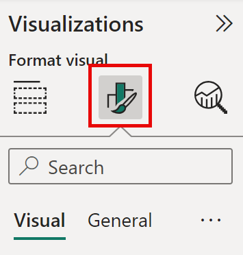
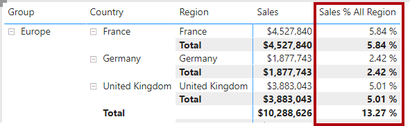
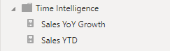

---
lab:
    title: 'Crear cálculos DAX avanzados en Power BI Desktop'
    module: 'Crear cálculos de modelo usando DAX en Power BI'
---

# Crear cálculos DAX avanzados en Power BI Desktop

## **Escenario del lab**

En este lab, crearás medidas con expresiones DAX que involucran manipulación de contexto de filtro.

En este lab aprenderás a:

- Usar la función CALCULATE() para manipular el contexto de filtro
- Usar funciones de Inteligencia de Tiempo

**Este lab debería tomar aproximadamente 45 minutos.**

## Empezar

Para completar este ejercicio, primero abre un navegador web e ingresa la siguiente URL para descargar el zip:


`https://github.com/MicrosoftLearning/PL-300-Microsoft-Power-BI-Data-Analyst/raw/Main/Allfiles/Labs/05-create-dax-calculations-in-power-bi-desktop-advanced/05-advanced-dax.zip`

Extrae la carpeta en **C:\Users\Student\Downloads\05-advanced-dax**.

Abre el archivo **05-Starter-Sales Analysis.pbix**.

> ***Nota**: Puedes omitir el inicio de sesión seleccionando **Cancelar**. Cierra cualquier ventana informativa. Selecciona **Aplicar más tarde** si se solicita.*

## Crear un visual de matriz

En esta tarea, crearás un visual de matriz para probar nuevas medidas.

1. En Power BI Desktop, vista **Report**, crea una nueva página de informe.

1. En **Page 3**, agrega un visual de matriz.

    

1. Redimensiona el visual de matriz para llenar toda la página.

1. Para configurar los campos del visual de matriz, desde el panel **Data**, arrastre la jerarquía **Region \| Regions** y suéltela dentro del visual.

    > *Los labs usan una notación abreviada para referenciar un campo o jerarquía. Se verá así: **Region \| Regions**. En este ejemplo, **Region** es el nombre de la tabla y **Regions** es el nombre de la jerarquía.*

1. Agrega también el campo **Sales \| Sales** al área **Values**.

1. Para expandir toda la jerarquía, selecciona el ícono de doble flecha bifurcada dos veces.

    

1. Para formatear el visual, en el panel **Visualizations**, seleccione el panel **Format**.

    

1. En la caja **Search**, ingresa **Layout**.

1. Establece la propiedad **Layout** en **Tabular**.

    

1. Verifica que el visual ahora tenga 4 encabezados de columna.

    

    > *En Adventure Works, las regiones se organizan en grupos, países y regiones. Todos los países excepto EE.UU. tienen una región. EE.UU. se divide en 5 regiones.*

Crearás varias medidas y las probarás en esta matriz.

## Manipular contexto de filtro

En esta tarea, crearás medidas usando CALCULATE() para modificar contexto de filtro.

> *CALCULATE() permite modificar contexto de filtro. Su primer argumento es una expresión o medida. Argumentos posteriores modifican filtros.*

1. Agrega esta medida a la tabla **Sales**:

    > **Nota**: *Puedes copiar definiciones DAX desde **C:\Users\Student\Downloads\05-advanced-dax\Snippets.txt**.*

    ```DAX
    Sales All Region =

    CALCULATE(SUM(Sales[Sales]), REMOVEFILTERS(Region))
    ```

    >
    > *REMOVEFILTERS() elimina filtros activos. Puede recibir tablas, columnas o múltiples columnas.*
    >
    > *Esta medida calcula la suma de **Sales** eliminando filtros de la tabla **Region*.

1. Agrega la medida **Sales All Region** al visual de matriz.

    

1. Observe que la medida **Sales All Region** calcula el total de ventas de todas las regiones para cada región, país (subtotal) y grupo (subtotal).

    *La nueva medida aún no entrega un resultado útil. Cuando las ventas de un grupo, país o región se dividen por este valor, producirá una proporción útil conocida como "porcentaje del total general".*

1. En el panel **Data**, asegúrese de que la medida **Sales All Region** esté seleccionada (fondo gris oscuro), luego en la barra de fórmulas reemplace el nombre y fórmula con:

    *Consejo: Para reemplazar la fórmula existente, copie el snippet. Seleccione dentro de la barra y presione **Ctrl+A** para seleccionar todo. Luego **Ctrl+V** para pegar. Presione **Enter**.*

    ```DAX
    Sales % All Region =  
    DIVIDE(  
     SUM(Sales[Sales]),  
     CALCULATE(  
     SUM(Sales[Sales]),  
     REMOVEFILTERS(Region)  
     )  
    )
    ```

    *La medida fue renombrada para reflejar la fórmula actualizada. DIVIDE() divide **Sales** (sin modificar por filtros) por **Sales** en un contexto sin filtros en **Region**.*

1. En el visual de matriz, note que la medida fue renombrada y muestra valores diferentes por grupo, país y región.

1. Formatee **Sales % All Region** como porcentaje con dos decimales.

1. En el visual de matriz, revise los valores de **Sales % All Region**.

    

1. Agregue otra medida a **Sales** con esta expresión (formato porcentaje):

    ```DAX
    Sales % Country =  
    DIVIDE(  
     SUM(Sales[Sales]),  
     CALCULATE(  
     SUM(Sales[Sales]),  
     REMOVEFILTERS(Region[Region])  
     )  
    )
    ```

1. Note que **Sales % Country** difiere ligeramente de **Sales % All Region**.

    *La diferencia: el denominador remueve filtros solo en la columna **Region**, no en toda la tabla. Esto preserva filtros de grupo/país, calculando porcentaje respecto al país.*

1. Agregue **Sales % Country** al visual de matriz.

1. Observe que solo las regiones de EE.UU. tienen valores distintos a 100%.

    

    > *Esto ocurre porque solo EE.UU. tiene múltiples regiones. Otros países tienen una sola región.*

1. Para mejorar la legibilidad de esta medida en el visual, sobrescriba la medida **Sales % Country** con esta fórmula mejorada:

    ```DAX
    Sales % Country =  
    IF(  
     ISINSCOPE(Region[Region]),  
     DIVIDE(  
     SUM(Sales[Sales]),  
     CALCULATE(  
     SUM(Sales[Sales]),  
     REMOVEFILTERS(Region[Region])  
     )  
     )  
    )
    ```

    > *La función IF() utiliza la función ISINSCOPE() para probar si la columna region es el nivel en una jerarquía de niveles. Cuando es verdadero, se evalúa la función DIVIDE(). Cuando es falso, se devuelve un valor en blanco porque la columna region no está en ámbito.*

1. Note que **Sales % Country** ahora solo muestra valores cuando una región está en contexto.

    

1. Agregue otra medida a **Sales** (formato porcentaje):

    ```DAX
    Sales % Group =  
    DIVIDE(  
     SUM(Sales[Sales]),  
     CALCULATE(  
     SUM(Sales[Sales]),  
     REMOVEFILTERS(  
     Region[Region],  
     Region[Country]  
     )  
     )  
    )
    ```

    > *Para lograr porcentaje respecto al grupo, se remueven filtros en dos columnas.*

1. Agregue **Sales % Group** al visual de matriz.

1. Para mejor legibilidad, reemplace **Sales % Group** con:

    ```DAX
    Sales % Group =  
    IF(  
     ISINSCOPE(Region[Region])  
     || ISINSCOPE(Region[Country]),  
     DIVIDE(  
     SUM(Sales[Sales]),  
     CALCULATE(  
     SUM(Sales[Sales]),  
     REMOVEFILTERS(  
     Region[Region],  
     Region[Country]
     )  
     )  
     )  
    )
    ```

1. Note que **Sales % Group** ahora solo retorna valores cuando región o país están en contexto.

1. En Model view, coloque las tres nuevas medidas en una carpeta de visualización llamada **Ratios**.

    

1. Guarde el archivo Power BI Desktop.

*Las medidas agregadas a la tabla **Sales** han modificado el contexto de filtro para lograr navegación jerárquica. Observe que el patrón para calcular subtotales requiere eliminar algunas columnas del contexto de filtro, y para totales generales, todas las columnas deben eliminarse.*

## Crear una medida YTD

En esta tarea, creará una medida de ventas año hasta la fecha (YTD) usando funciones de inteligencia de tiempo.

1. En Report view, en **Page 2**, observe el visual de matriz que muestra varias medidas con años y meses agrupados en filas.

2. Agregue una medida a la tabla **Sales** con esta expresión (formato 0 decimales):

    ```DAX
    Sales YTD =  
    TOTALYTD(SUM(Sales[Sales]), 'Date'[Date], "6-30")
    ```

    > *TOTALYTD() evalúa una expresión (en este caso SUM(Sales[Sales])) sobre una columna de fecha. La columna debe pertenecer a una tabla de fechas marcada como tal.*
    >
    > *El tercer argumento opcional representa el último día del año. Para Adventure Works es "6-30".*

3. Agregue los campos **Sales** y **Sales YTD** al visual de matriz.

4. Observe la acumulación de ventas dentro del año.

    

*TOTALYTD() manipula filtros de tiempo. Ej: para YTD de septiembre 2017 (tercer mes del año fiscal), los filtros se reemplazan por fechas desde inicio del año (1 julio 2017) hasta la fecha en contexto (30 septiembre 2017).*

*DAX ofrece muchas funciones de Time Intelligence para manipulación de filtros temporales.*

## Crear medida de crecimiento interanual

En esta tarea, creará una medida de crecimiento YoY usando variables.

> *Las variables simplifican fórmulas y mejoran eficiencia. Se declaran con nombre único y deben usarse después de RETURN. En DAX, solo son válidas dentro de la fórmula.*

1. Agregue otra medida a **Sales**:

    ```DAX
    Sales YoY Growth =  
    VAR SalesPriorYear =  
     CALCULATE(  
     SUM(Sales[Sales]),  
     PARALLELPERIOD(  
     'Date'[Date],  
     -12,  
     MONTH  
     )  
     )  
    RETURN  
     SalesPriorYear
    ```

    > *La variable SalesPriorYear calcula ventas desplazando 12 meses atrás usando PARALLELPERIOD().*

1. Agregue **Sales YoY Growth** al visual de matriz.

1. Note que la medida retorna BLANK para los primeros 12 meses (no hay datos antes de 2017).

1. Observe que **2018 Jul** en la medida equivale a **2017 Jul** en ventas.

    

    > *Ahora puede sobrescribir la medida con la fórmula final.*

1. Sobrescriba **Sales YoY Growth** con esta fórmula (formato porcentaje 2 decimales):

    ```DAX
    Sales YoY Growth =  
    VAR SalesPriorYear =  
     CALCULATE(  
     SUM(Sales[Sales]),  
     PARALLELPERIOD(  
     'Date'[Date],  
     -12,  
     MONTH  
     )  
     )  
    RETURN  
     DIVIDE(  
     (SUM(Sales[Sales]) - SalesPriorYear),  
     SalesPriorYear  
     )
    ```

1. En RETURN, note que la variable se referencia dos veces.

1. Verifique que el crecimiento YoY para **2018 Jul** es **392.83%**.

    

    > *Esto indica un aumento de casi 400% respecto al mismo período del año anterior.*

1. En Model view, coloque las dos nuevas medidas en una carpeta **Time Intelligence**.

    

## Lab completado