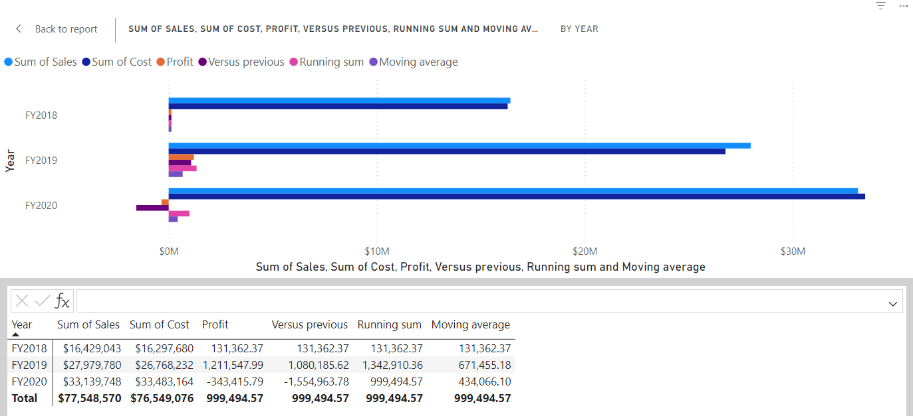
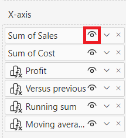

---
lab:
    title: 'Crear cálculos visuales en Power BI Desktop'
    module: 'Crear cálculos visuales en Power BI Desktop'
---

# Crear cálculos visuales en Power BI Desktop

## **Escenario del lab**

En este lab, crearás cálculos visuales usando Expresiones de Análisis de Datos (DAX).

En este lab aprenderás a:

- Crear y editar cálculos visuales
- Usar las funciones PREVIOUS(), RUNNINGSUM() y MOVINGAVERAGE() para crear métricas comparativas entre cada año fiscal
- Usar el parámetro opcional Axis al crear métricas comparativas
- Usar el parámetro opcional Reset para personalizar cálculos acumulativos en ejes multinivel

**Este lab debería tomar aproximadamente 30 minutos.**

## Empezar

Para completar este ejercicio, abre un navegador web e ingresa la siguiente URL para descargar el zip:

`https://github.com/MicrosoftLearning/PL-300-Microsoft-Power-BI-Data-Analyst/raw/Main/Allfiles/Labs/05b-create-visual-calculations-in-power-bi-desktop/05b-visual-calculations.zip`

Extrae la carpeta en **C:\Users\Student\Downloads\05b-visual-calculations**.

Abre el archivo **05b-Starter-Sales Analysis.pbix**.

> ***Nota**: Puedes omitir el inicio de sesión seleccionando **Cancelar**. Cierra cualquier ventana informativa. Selecciona **Aplicar más tarde** si se solicita.*

## Crear un gráfico de barras

En esta tarea, crearás un gráfico de barras que muestre ventas, costo total de productos y ganancias por año fiscal, con métricas comparativas en tooltips.

1. En el panel **Visualizations**, selecciona el tipo de visualización de gráfico de barras agrupadas.

   

1. En el panel **Data**, desde la tabla **Date**, arrastra el campo **Year** al área **Y-axis**.

1. Arrastra los campos **Sales** y **Cost** desde la tabla **Sales** al área **X-axis**.

> Notarás que al agregar Sales y Cost al visual, la suma de cada campo se calculó automáticamente.

1. Ordena el gráfico por **Year** ascendente usando el menú de tres puntos y seleccionando **Year** seguido de **Sort ascending**:

   

> Ahora tienes un gráfico mostrando Sum of Sales y Sum of Cost por Year ordenado cronológicamente.

### Agregar cálculos

1. Con el gráfico seleccionado, selecciona **New visual calculation** en la cinta:

   

1. Se abre el editor de cálculos visuales. En la barra de fórmulas sobre la matriz visual, ingresa esta expresión y presiona Enter:

   ```DAX
   Profit = [Sum of Sales] – [Sum of Cost]
   ```

1. Confirme que ahora ve una columna Profit en la matriz visual en la parte inferior de la pantalla:

   

1. Expanda el menú bajo **New visual calculation** y seleccione **Versus previous** de las opciones de plantilla:

> **Versus Previous** compara un valor con uno anterior, por lo que vemos Profit comparado con el valor previo para Year.

   

1. En la barra de fórmulas, reemplace el marcador `[Field]` con `[Profit]` dos veces y confirme el cálculo.

1. Seleccione **Running sum** del menú de plantillas y reemplace el marcador `[Field]` con `[Profit]`, luego confirme el cálculo.

> **Running sum** calcula la suma de valores, agregando el valor actual a los anteriores, por lo que vemos el total de años actuales y previos.

1. Seleccione **Moving average** del menú de plantillas, reemplace `[Field]` con `[Profit]` y el marcador `WindowSize` con 2. Ahora debería tener:

> **Moving average** calcula el promedio de valores en una ventana dividiendo la suma por el tamaño de la ventana. Con tamaño 2, calculamos el promedio de dos valores consecutivos. En este ejemplo, el promedio móvil para FY2019 es el promedio de ganancias de FY2018 y FY2019.

   

1. En el área **X-axis**, seleccione el ícono de visibilidad de estos campos para ocultarlos:

   - Sum of Sales
   - Sum of Cost
   - Profit

   

> Observe que los campos y cálculos ocultos ya no se muestran en el visual.

1. En el panel **Visualizations**, arrastre **Running sum** y **Moving average** al área **Tooltips**.

1. Confirme que el visual cumple los objetivos. Salga del editor de cálculos visuales al reporte:

   

> Ahora tiene un gráfico de barras con: Sum of Sales, Sum of Cost, Profit, Profit *versus previous* y tooltips para Profit *running sum* y Profit *moving average*.

## Crear un visual de matriz

En esta tarea, crearás una matriz que compara ventas por categoría contra el primer año fiscal para cada año siguiente.

1. En **Report view**, crea una nueva página de informe.

1. En **Page 2**, agrega un visual de matriz.

1. Agrega estos campos a las áreas del visual:

     - Rows: **Product \| Category**
     - Columns: **Date \| Year**
     - Values: **Sales \| Sales**

 > *Los labs usan notación abreviada: **Date \| Year**. **Date** = nombre de tabla, **Year** = nombre de campo.*

### Agregar cálculos

1. Con la matriz seleccionada, selecciona **New visual calculation** en la cinta.

1. En el editor de cálculos visuales, ingresa y guarda:

    ```DAX
    Versus first = [Sum of Sales] - FIRST([Sum of Sales])
    ```

> Observe que la matriz muestra la diferencia en el monto de ventas para cada categoría versus la primera categoría.

1. Seleccione el campo **Versus first** en el área **Values** y actualice el cálculo agregando el valor ROWS al parámetro Axis de FIRST:

    ```DAX
    Versus first = [Sum of Sales] - FIRST([Sum of Sales], ROWS)
    ```

> Observe que nada cambia ya que ROWS es el valor predeterminado para el parámetro Axis.

1. Reemplace ROWS con COLUMNS y observe que el cálculo ahora compara el monto de ventas por categoría contra el primer año fiscal:

   

> Note que la columna **Versus first** para **Total Sales** retorna cero en lugar de la diferencia contra el primer año fiscal. **Total Sales** está en un nivel jerárquico diferente a las sumas anuales, por lo que se considera la primera columna en ese nivel.

1. Salga del editor de cálculos visuales al reporte.

## Crear un gráfico de líneas

En esta tarea, creará un gráfico de líneas que muestra la suma acumulativa de ventas. Esta suma se reiniciará al inicio de cada año fiscal.

1. En **Report view**, cree una nueva página de informe.

1. En **Page 3**, agregue un visual de gráfico de líneas.

1. Agregue los siguientes campos a las áreas del visual:

     - X-axis: **Date \| Year** y **Date \| Quarter**
     - Y-axis: **Sales \| Sales**

### Agregar suma acumulativa

1. Con el gráfico seleccionado, expanda el menú bajo **New visual calculation** y seleccione **Running sum** de las opciones de plantilla.

1. Reemplace el marcador `[Field]` con `[Sum of Sales]` y confirme el cambio. El visual debería verse así:

   

### Actualizar suma acumulativa para reiniciar cada año fiscal

1. En el editor de cálculos, seleccione el campo **Running sum** bajo **Y-axis** y actualice la expresión agregando el parámetro de reinicio HIGHESTPARENT:

   ```DAX
    Running sum = RUNNINGSUM([Sum of Sales], HIGHESTPARENT)
   ```

Verifique que la suma acumulativa se reinicia efectivamente cada año fiscal:

   

## Lab completo