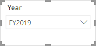
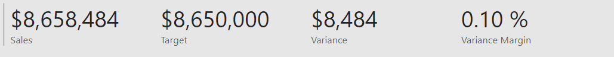

---
lab:
    title: 'Design a Report in Power BI Desktop'
    module: 'Create Reports in Power BI Desktop'
---

# Diseñar un Reporte en Power BI Desktop

## Historia del laboratorio

En este laboratorio, crearás un reporte de tres páginas. Luego lo publicarás en Power BI, donde lo abrirás e interactuarás con él.

En este laboratorio aprenderás a:

- Diseñar un reporte
- Configurar campos visuales y propiedades de formato

**Este laboratorio debería tomar aproximadamente 45 minutos.**

## Comenzar

Para completar este ejercicio, primero abre un navegador web e ingresa la siguiente URL para descargar la carpeta zip:

`https://github.com/MicrosoftLearning/PL-300-Microsoft-Power-BI-Data-Analyst/raw/Main/Allfiles/Labs/06-design-report-in-power-bi-desktop/06-design-report.zip`

Extrae la carpeta en la ubicación: **C:\Users\Student\Downloads\06-design-report**.

Abre el archivo **06-Starter-Sales Analysis.pbix**.

> ***Nota**: Puedes descartar el inicio de sesión seleccionando **Cancel**. Cierra cualquier otra ventana informativa. Selecciona **Apply Later**, si se te solicita aplicar cambios.*

## Diseñar página 1

En este ejercicio, diseñarás la primera página del reporte. Cuando completes el diseño, la página se verá así:

1. En Power BI Desktop, para renombrar la página, en la parte inferior izquierda, haz clic derecho en **Page 1**, luego **Rename** la página como **Overview**.

    > *Consejo: También puedes hacer doble clic en el nombre de la página para renombrarla.*

1. Para agregar una imagen, en la pestaña **Insert**, dentro del grupo **Elements**, selecciona **Image**.

    

1. En la ventana **Open**, navega a la carpeta **C:\Users\Student\Downloads\06-design-report**.

1. Selecciona el archivo **AdventureWorksLogo.jpg** y luego haz clic en **Open**.

1. Arrastra la imagen para posicionarla en la esquina superior izquierda y ajusta su tamaño usando los marcadores de guía.

     

1. Para agregar un segmentador, primero deselecciona la imagen haciendo clic en un área vacía del reporte, luego selecciona **Slicer** en el panel **Visualizations**.

     

1. En el panel **Data**, arrastra el campo **Date \| Year** (no el nivel **Year** de la jerarquía) al campo **Field** en el panel Visualizations.

    > *Los laboratorios usan una notación abreviada para referenciar un campo. Se verá así: **Date \| Year**. En este ejemplo, **Date** es el nombre de la tabla y **Year** es el nombre del campo.*

1. Para convertir el segmentador de una lista a un dropdown, navega a **Visualizations > Format visual > Visual > Slicer Settings > Style**, y luego selecciona **Dropdown** del menú desplegable.

    

1. Ajusta el tamaño y la posición del segmentador para que quede debajo de la imagen y tenga el mismo ancho que la imagen.

     

1. En el segmentador **Year**, abre la lista desplegable, selecciona **FY2020** y luego colapsa la lista.
    > *La página del reporte ahora está filtrada por el año **FY2020**.*

     

1. Deselecciona el segmentador haciendo clic en un área vacía del reporte.

1. Crea un segundo segmentador basado en el campo **Region \| Region** (no el nivel **Region** de la jerarquía).

1. Deja el segmentador como una lista y luego ajusta su tamaño y posición debajo del segmentador **Year**.

     

1. Deselecciona el segmentador haciendo clic en un área vacía del reporte.

1. Para agregar un gráfico a la página, en el panel **Visualizations**, selecciona el tipo de visual **Line and Stacked Column Chart**.

     

1. Ajusta el tamaño y la posición del visual para que quede a la derecha del logo y ocupe el ancho completo de la página del reporte.

     

1. Arrastra y suelta los siguientes campos en el visual:

     - **Date \| Month**
     - **Sales \| Sales**

1. En el panel de campos visuales (ubicado debajo del panel **Visualizations**), observa que los campos están asignados a los pozos/áreas **X-axis** y **Column y-axis**.

    > *Al arrastrar campos a un visual, se agregarán a pozos/áreas predeterminados. Para mayor precisión, puedes arrastrar campos directamente a los pozos/áreas, como harás a continuación.*

     

1. Desde el panel **Data**, arrastra el campo **Sales \| Profit Margin** al pozo/área **Line y-axis**.

     

1. Observa que el visual solo muestra 11 meses.

    > *El último mes del año, junio de 2020, no tiene ventas (todavía). Por defecto, el visual ha eliminado los meses con ventas BLANK. Ahora configurarás el visual para mostrar todos los meses.*

1. En el panel de campos visuales, en el pozo/área **X-axis**, para el campo **Month**, selecciona la flecha hacia abajo y luego **Show Items With No Data**.

    > *Observa que ahora aparece el mes **2020 June**.*

     

1. Deselecciona el gráfico haciendo clic en un área vacía del reporte.

1. Para agregar un gráfico a la página, en el panel **Visualizations**, selecciona el tipo de visual **Stacked Column Chart**.

     

1. Ajusta el tamaño y la posición del visual para que quede debajo del gráfico de columna/línea y ocupe la mitad del ancho del gráfico superior.

     

1. Agrega los siguientes campos a los pozos/áreas del visual:

     - X-axis: **Region \| Country**
     - Y-axis: **Sales \| Sales**
     - Legend: **Product \| Category**

1. Deselecciona el gráfico haciendo clic en un área vacía del reporte.

1. Para agregar un gráfico a la página, en el panel **Visualizations**, haz clic en el tipo de visual **Stacked Bar Chart**.

     

1. Ajusta el tamaño y la posición del visual para que ocupe el espacio restante de la página del reporte.

     

1. Agrega los siguientes campos a los pozos/áreas del visual:

     - Y-axis: **Product \| Category**
     - X-axis: **Sales \| Quantity**

1. Para formatear el visual, abre el panel **Format**.

     

1. Expande el grupo **Bars** y luego el grupo **Colors**, y configura la propiedad **Default Color** con un color adecuado (que complemente el gráfico de columna/línea).

1. Configura la propiedad **Data Labels** como **On**.

     

1. Guarda el archivo de Power BI Desktop.

*El diseño de la primera página está ahora completo.*

## Diseñar página 2

En este ejercicio, diseñarás la segunda página del reporte. Cuando completes el diseño, la página se verá así:

 

> ***Importante**: Cuando ya se hayan proporcionado instrucciones detalladas en los laboratorios, los pasos del laboratorio serán más concisos. Si necesitas las instrucciones detalladas, puedes consultar otras tareas de este laboratorio.*

1. Para crear una nueva página, en la parte inferior izquierda, selecciona el icono de más y renombra la nueva página como **Profit**.

1. Agrega un segmentador basado en el campo **Region \| Region**.

1. Usa el panel **Format** para habilitar la opción "Select All" (en el grupo **Slicer settings > Selection**).

1. Ajusta el tamaño y la posición del segmentador para que quede en el lado izquierdo de la página del reporte y tenga aproximadamente la mitad de la altura de la página.

     

1. Agrega un visual de matriz y ajusta su tamaño y posición para que ocupe el espacio restante de la página del reporte.

     

1. Agrega la jerarquía **Date \| Fiscal** al pozo/área **Rows** de la matriz.

     

1. Agrega los siguientes cinco campos de la tabla **Sales** al pozo/área **Values**:

     - **Orders** (de la carpeta **Counts**)
     - **Sales**
     - **Cost**
     - **Profit** (de la carpeta **Pricing**)
     - **Profit Margin** (de la carpeta **Pricing**)

     

1. En el panel **Filters** (ubicado a la izquierda del panel **Visualizations**), observa el pozo/área **Filter On This Page** (puede que necesites desplazarte hacia abajo).

     

1. Desde el panel **Data**, arrastra el campo **Product \| Category** al pozo/área **Filter On This Page**.

    > *Los campos agregados al panel **Filters** pueden lograr el mismo resultado que un segmentador. Una diferencia es que no ocupan espacio en la página del reporte. Otra diferencia es que pueden configurarse para lograr requisitos de filtrado más sofisticados.*

1. Dentro de la tarjeta de filtro, en la esquina superior derecha, selecciona la flecha para colapsar la tarjeta.

1. Agrega cada uno de los siguientes campos de la tabla **Product** al pozo/área **Filter On This Page**, colapsando cada uno directamente debajo de la tarjeta **Category**:

     - **Subcategory**
     - **Product**
     - **Color**

     

1. Guarda el archivo de Power BI Desktop.

*El diseño de la segunda página está ahora completo.*

## Diseñar página 3

En este ejercicio, diseñarás la tercera y última página del reporte. Cuando completes el diseño, la página se verá así:

 

1. Crea una nueva página y luego renómbrala como **My Performance**.

1. Para simular el rendimiento de los filtros de seguridad a nivel de fila, arrastra el campo **Salesperson (Performance) \| Salesperson** a los filtros de nivel de página en el panel de filtros.

     

1. Selecciona **Michael Blythe**. Los datos en la página del reporte **My Performance** ahora se filtrarán para mostrar solo los datos de Michael Blythe.

1. Agrega un segmentador dropdown basado en el campo **Date \| Year**, y luego ajusta su tamaño y posición para que quede en la esquina superior izquierda de la página.

     

1. En el segmentador, configura la página para filtrar por **FY2019**.

     

1. Agrega un visual **Multi-row Card**, y luego ajusta su tamaño y posición para que quede a la derecha del segmentador y ocupe el ancho restante de la página.

     

     

1. Agrega los siguientes cuatro campos al visual:

     - **Sales \| Sales**
     - **Targets \| Target**
     - **Targets \| Variance**
     - **Targets \| Variance Margin**

1. Formatea el visual:

     - En el grupo **Callout values**, aumenta la propiedad **Text Size** a **28pt**

     - En el grupo **General > Effects > Background**, configura el **Color** con un gris claro (como "White, 20% Darker") para dar contraste

         

1. Agrega un visual **Clustered Bar Chart**, y luego ajusta su tamaño y posición para que quede debajo del visual de tarjeta multi-fila y ocupe la altura restante de la página, y la mitad del ancho del visual de tarjeta multi-fila.

     

     

1. Agrega los siguientes campos a los pozos/áreas del visual:

     - Y-axis: **Date \| Month**
     - X-axis: **Sales \| Sales** y **Targets \| Target**

         

1. Para crear una copia del visual, presiona **Ctrl+C**, y luego presiona **Ctrl+V**.

1. Posiciona el nuevo visual a la derecha del visual original.

     

1. Para modificar el tipo de visualización, en el panel **Visualizations**, selecciona **Clustered Column Chart**.

     > *Ahora es posible ver los mismos datos expresados en dos tipos de visualización diferentes.*

     

*El diseño de la última página está completo.*

## Publicar y explorar el reporte

En este ejercicio, publicarás el reporte en el servicio Power BI y explorarás el comportamiento del reporte publicado.

> **Nota**: Puedes revisar el resto del ejercicio, incluso si no tienes acceso al servicio Power BI en línea para realizar las tareas directamente.

1. Selecciona la página **Overview**, luego guarda el archivo de Power BI Desktop.

1. En la pestaña **Home**, dentro del grupo **Share**, selecciona **Publish**.

    > *Si no has iniciado sesión en Power BI Desktop, deberás hacerlo para publicar.*

     

1. En la ventana **Publish to Power BI**, observa que **My Workspace** está seleccionado.

    > *No entraremos en detalles sobre los diferentes elementos dentro del servicio Power BI en este laboratorio.*

1. Para publicar el reporte, selecciona **Select**. Esto puede tomar unos momentos.

1. Cuando la publicación se haya completado, selecciona **Got It**.

1. Abre un navegador Microsoft Edge e inicia sesión en `https://app.powerbi.com`.

1. En la ventana del navegador Microsoft Edge, en el servicio Power BI, en el panel **Navigation** (ubicado a la izquierda, y puede estar colapsado), expande **My Workspace**.

    

1. Revisa el contenido del workspace.

    - Hay cuatro tipos de elementos que pueden existir en un workspace, y hablamos de **reports** y **semantic models**.

    - Puede que necesites actualizar tu navegador Microsoft Edge si el modelo semántico no es visible.

    - Cuando publicaste el archivo de Power BI Desktop, el modelo de datos se publicó como un modelo semántico.

1. Para explorar el reporte, selecciona el reporte **Sales Analysis**.

1. A la izquierda, en el panel **Pages**, selecciona la página **Overview**.

1. En el segmentador **Regions**, mientras presionas la tecla **Ctrl**, selecciona múltiples regiones.

1. En el gráfico de columna/línea, selecciona cualquier columna de mes para aplicar un filtro cruzado en la página.

1. Mientras presionas la tecla **Ctrl**, selecciona otro mes.

     > *Nota: Por defecto, el filtrado cruzado filtra todos los demás visuales en la página.*

1. Observa que el gráfico de barras está filtrado y resaltado, con la parte en negrita de las barras representando los meses filtrados.

1. Coloca el cursor sobre el visual del gráfico de barras, y luego en la esquina superior derecha, coloca el cursor sobre el icono de filtro.

    > *El icono de filtro te permite entender todos los filtros aplicados al visual, incluyendo segmentadores y filtros cruzados de otros visuales.*

1. Coloca el cursor sobre una barra y luego observa la información del tooltip.

1. Para deshacer el filtro cruzado, en el gráfico de columna/línea, selecciona un área vacía del visual.

1. Coloca el cursor sobre el visual del gráfico de columnas apiladas, y luego en la esquina superior derecha, selecciona el icono **Focus mode**.

    > *El modo Focus amplía el visual a tamaño completo de página.*

     

1. Coloca el cursor sobre diferentes segmentos de las barras para ver los tooltips.

1. Para volver a la página del reporte, en la esquina superior izquierda, selecciona **Back to Report**.

     

1. Coloca el cursor sobre uno de los visuales nuevamente, luego en la esquina superior derecha, selecciona los puntos suspensivos (…), y luego observa las opciones del menú. Prueba cada una de las opciones, excepto **Chat in Teams**.

     

1. A la izquierda, en el panel **Pages**, selecciona la página **Profit**.

     

1. Observa que el segmentador **Region** tiene una selección diferente al segmentador **Region** en la página **Overview**.

    > *Los segmentadores no están sincronizados. Modificarás el diseño del reporte para asegurar que se sincronicen entre páginas en el laboratorio **Enhance a Report in Power BI Desktop**.*

1. En el panel **Filters** (ubicado a la derecha), expande una tarjeta de filtro y aplica algunos filtros.

    > *El panel **Filters** te permite definir más filtros de los que podrían caber en una página como segmentadores.*

1. En el visual de matriz, usa el botón de más (+) para profundizar en la jerarquía **Fiscal**.

1. Selecciona la página **My Performance**.

     

1. En la esquina superior derecha de la barra de menú, selecciona **View**, y luego selecciona **Full Screen**.

     

1. Interactúa con la página modificando el segmentador y aplicando filtros cruzados.

1. En la parte inferior de la ventana, observa los comandos para cambiar de página, navegar hacia adelante o atrás entre páginas, o salir del modo pantalla completa.

1. Selecciona el icono derecho para salir del modo pantalla completa.

     

## Laboratorio completado
