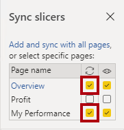
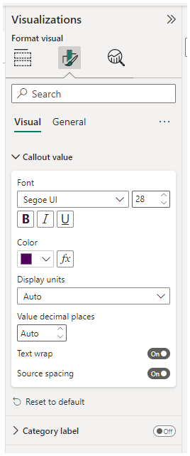
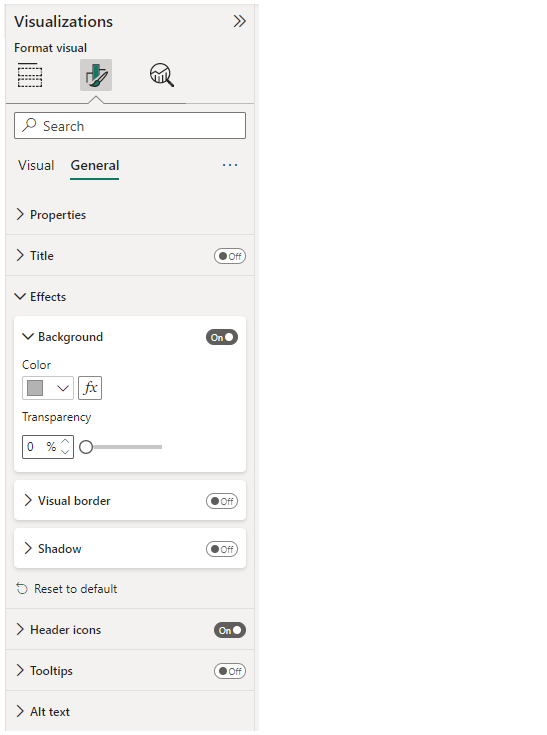
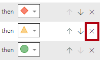
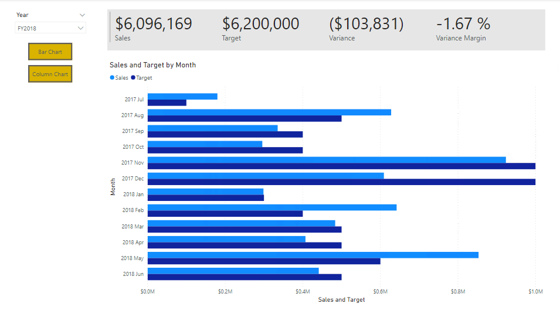
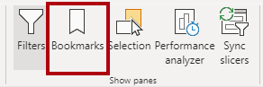
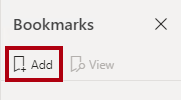
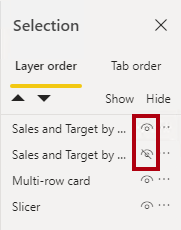
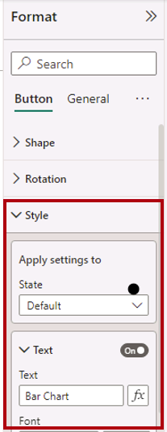
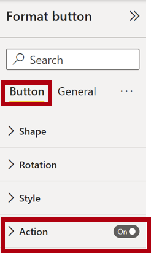

---
lab:
    title: 'Enhance a Report in Power BI Desktop'
    module: 'Create Reports in Power BI desktop'
---

# Mejorar un Reporte en Power BI Desktop

## Historia del laboratorio

En este laboratorio, mejorarás el reporte **Sales Analysis** con características de diseño avanzadas.

En este laboratorio aprenderás a:

- Sincronizar segmentadores
- Crear una página de drill through
- Aplicar formato condicional
- Crear y usar bookmarks y botones

**Este laboratorio debería tomar aproximadamente 45 minutos.**

## Comenzar

Para completar este ejercicio, primero abre un navegador web e ingresa la siguiente URL para descargar la carpeta zip:

`https://github.com/MicrosoftLearning/PL-300-Microsoft-Power-BI-Data-Analyst/raw/Main/Allfiles/Labs/07-design-report-in-power-bi-desktop-enhanced/07-enhanced-report.zip`

Extrae la carpeta en la ubicación: **C:\Users\Student\Downloads\07-enhanced-report**.

Abre el archivo **07-Starter-Sales Analysis.pbix**.

> ***Nota**: Puedes descartar el inicio de sesión seleccionando **Cancel**. Cierra cualquier otra ventana informativa. Selecciona **Apply Later**, si se te solicita aplicar cambios.*

## Sincronizar segmentadores

En esta tarea, sincronizarás los segmentadores **Year** y **Region**, continuando con el desarrollo del reporte creado en el laboratorio **Design a Report in Power BI Desktop**.

1. En Power BI Desktop, en la página **Overview**, configura el segmentador **Year** como **FY2018**.

1. Ve a la página **My Performance** y observa que el segmentador **Year** tiene un valor diferente.

    > *Cuando los segmentadores no están sincronizados, puede contribuir a la mala interpretación de los datos y frustración para los usuarios del reporte. Ahora sincronizarás los segmentadores del reporte.*

1. Regresa a la página **Overview** y selecciona el segmentador **Year**.

1. En la pestaña **View**, dentro del grupo **Show Panes**, selecciona **Sync Slicers**.

     

1. En el panel **Sync Slicers** (a la izquierda del panel **Visualizations**), en la segunda columna (que representa la sincronización), marca las casillas para las páginas **Overview** y **My Performance**.

     

1. En la página **Overview**, selecciona el segmentador **Region**.

1. Sincroniza el segmentador con las páginas **Overview** y **Profit**.

     

1. Prueba los segmentadores sincronizados seleccionando diferentes opciones de filtro y verificando que los segmentadores sincronizados filtren por la misma selección.

1. Para cerrar la página **Sync Slicer**, selecciona la opción **Sync Slicer** ubicada en la pestaña **View**.

## Configurar una página de drill through

En este ejercicio, crearás una nueva página y la configurarás como una página de drill through. Cuando completes el diseño, la página se verá así:

1. Agrega una nueva página de reporte llamada **Product Details**.

1. Haz clic derecho en la pestaña de la página **Product Details** y luego selecciona **Hide Page**.

    > *Los usuarios del reporte no podrán acceder directamente a la página de drill through. Necesitarán acceder a ella desde visuales en otras páginas. Aprenderás cómo hacer drill through a la página en el último ejercicio de este laboratorio.*

1. Debajo del panel **Visualizations**, en la sección **Drill Through**, agrega el campo **Product \| Category** al cuadro **Add Drill-Through Fields Here**.

    > *Los laboratorios usan una notación abreviada para referenciar un campo. Se verá así: **Product \| Category**. En este ejemplo, **Product** es el nombre de la tabla y **Category** es el nombre del campo.*

     

1. Para probar la página de drill through, en la tarjeta de filtro de drill through, selecciona **Bikes**.

     

1. En la esquina superior izquierda de la página del reporte, observa el botón de flecha.

    > *Un botón de flecha se agrega automáticamente cuando un campo se agrega al pozo/área de drill through. Permite a los usuarios del reporte navegar de regreso a la página desde la cual hicieron drill through.*

1. Agrega un visual **Card** a la página y luego ajusta su tamaño y posición para que quede a la derecha del botón y ocupe el ancho restante de la página.

    

    

1. Arrastra el campo **Product \| Category** al visual de tarjeta.

1. Configura las opciones de formato para el visual y luego desactiva la propiedad **Category Label**.

     

1. Configura la propiedad de color **Effects > Background** con un tono gris claro como *White, 20% darker*.

     

1. Agrega un visual **Table** a la página y luego ajusta su tamaño y posición para que quede debajo del visual de tarjeta y ocupe el espacio restante en la página.

     

     

1. Agrega los siguientes campos al visual:

     - **Product \| Subcategory**
     - **Product \| Color**
     - **Sales \| Quantity**
     - **Sales \| Sales**
     - **Sales \| Profit Margin**

1. Configura las opciones de formato para el visual y en las secciones **Values** y **Column headers**, configura la propiedad **Text Size** como **20pt**.

*El diseño de la página de drill through está casi completo. Mejorarás la página con formato condicional en el siguiente ejercicio.*

## Agregar formato condicional

En este ejercicio, mejorarás la página de drill through con formato condicional. Cuando completes el diseño, la página se verá así:

1. Selecciona el visual de tabla. En el panel de visualizaciones, selecciona la flecha hacia abajo en el valor **Profit Margin** y luego selecciona **Conditional Formatting \| Icons**.

    

1. En la ventana **Icons – Profit Margin**, en la lista desplegable **Icon Layout**, selecciona **Right of Data**.

    

1. Para eliminar la regla del medio, a la derecha del triángulo amarillo, selecciona **X**.

    

1. Configura la primera regla (diamante rojo) de la siguiente manera:

    - En el segundo control, elimina el valor
    - En el tercer control, selecciona **Number**
    - En el quinto control, ingresa **0**
    - En el sexto control, selecciona **Number**

1. Configura la segunda regla (círculo verde) de la siguiente manera, luego selecciona **OK**:

    > *Las reglas se pueden interpretar así: muestra un diamante rojo si el valor del margen de beneficio es menor que 0; de lo contrario, si el valor es mayor o igual a cero, muestra un círculo verde.*

    - En el segundo control, ingresa **0**
    - En el tercer control, selecciona **Number**
    - En el quinto control, elimina el valor
    - En el sexto control, selecciona **Number**

    

1. En el visual de tabla, verifica que se muestren los iconos correctos.

    

1. Configura el formato condicional del color de fondo para el campo **Color**.

1. En la ventana **Background Color – Color**, en la lista desplegable **Format Style**, selecciona **Field Value**.

1. En la lista desplegable **What field should we base this on?**, selecciona **Product \| Formatting \| Background Color Format**, luego **OK**.

    

1. Repite los pasos anteriores para configurar el formato condicional del color de fuente para el campo **Color**, usando el campo **Product \| Formatting \| Font Color Format**.

*Puedes recordar que los colores de fondo y fuente se obtuvieron del archivo **ColorFormats.csv** en el laboratorio **Prepare Data in Power BI Desktop**, y luego se integraron con la consulta **Product** en el laboratorio **Load Data in Power BI Desktop*.

## Agregar bookmarks y botones

En este ejercicio, mejorarás la página **My Performance** con botones, permitiendo al usuario del reporte seleccionar el tipo de visual a mostrar. Cuando completes el diseño, la página se verá así:

1. Ve a la página **My Performance**. En la pestaña **View**, dentro del grupo **Show Panes**, selecciona **Bookmarks**.

    

1. En la pestaña **View**, dentro del grupo **Show Panes**, selecciona **Selection**.

1. En el panel **Selection**, junto a uno de los elementos **Sales and Target by Month**, para ocultar el visual, selecciona el icono de ojo.

    

1. En el panel **Bookmarks**, selecciona **Add**.

    > *Para renombrar el bookmark, haz doble clic en él.*

    

1. Si el gráfico visible es el de barras, renombra el bookmark como **Bar Chart ON**, de lo contrario, renómbralo como **Column Chart ON**.

1. Para editar el bookmark, en el panel **Bookmarks**, coloca el cursor sobre el bookmark, selecciona los puntos suspensivos y luego selecciona **Data**.

    > *Desactivar la opción **Data** significa que el bookmark no usará el estado actual del filtro. Eso es importante porque, de lo contrario, el bookmark bloquearía permanentemente el filtro aplicado actualmente por el segmentador **Year**.*

     

1. Para actualizar el bookmark, selecciona los puntos suspensivos nuevamente y luego selecciona **Update**.

    > *En los siguientes pasos, crearás y configurarás un segundo bookmark para mostrar el segundo visual.*

1. En el panel **Selection**, alterna la visibilidad de los dos elementos **Sales and Target by Month**.

    > *En otras palabras, haz que el visual visible se oculte y que el visual oculto se muestre.*

     

1. Crea un segundo bookmark y nómbralo apropiadamente (ya sea **Column Chart ON** o **Bar Chart ON**).

     

1. Configura el segundo bookmark para ignorar filtros (opción **Data** desactivada) y actualiza el bookmark.

1. En el panel **Selection**, para hacer ambos visuales visibles, simplemente muestra el visual oculto.

1. Ajusta el tamaño y la posición de ambos visuales para que ocupen la página debajo del visual multi-tarjeta y se superpongan completamente.

    *Para seleccionar el visual que está cubierto, selecciónalo en el panel **Selection**.*

    

1. En el panel **Bookmarks**, selecciona cada uno de los bookmarks y observa que solo uno de los visuales es visible.

*La siguiente etapa del diseño es agregar dos botones a la página, que permitirán al usuario del reporte seleccionar los bookmarks.*

1. En la pestaña **Insert**, dentro del grupo **Elements**, selecciona **Button** y luego selecciona **Blank**.

     

1. Coloca el botón directamente debajo del segmentador **Year**.

1. Selecciona el botón y luego en el panel **Format button**, selecciona **Button**, expande la sección **Style** y activa la propiedad **Text**.

     

1. Expande la sección **Text** y luego en el cuadro **Text**, ingresa **Bar Chart**.

1. Expande la sección **Fill** y luego configura un color de relleno usando un color complementario.

1. Selecciona **Button** y activa la propiedad **Action**.

    

1. Expande la sección **Action** y luego configura la lista desplegable **Type** como **Bookmark**.

1. En la lista desplegable **Bookmark**, selecciona **Bar Chart ON**.

    

1. Crea una copia del botón usando copiar y pegar, y luego configura el nuevo botón de la siguiente manera:

    *Consejo: Los comandos abreviados para copiar y pegar son **Ctrl+C** seguido de **Ctrl+V**.*

    - Configura la propiedad **Button Text** como **Column Chart**
    - En la sección **Action**, configura la lista desplegable **Bookmark** como **Column Chart ON**

*El diseño del reporte Sales Analysis está ahora completo.*

## Publicar y explorar el reporte

En este ejercicio, publicarás el reporte en el servicio Power BI y explorarás el comportamiento del reporte publicado.

> **Nota**: Puedes revisar el resto del ejercicio, incluso si no tienes acceso al servicio Power BI en línea para realizar las tareas directamente.

1. Selecciona la página **Overview**.

1. En el segmentador **Year**, selecciona **FY2020**.

1. En el segmentador **Region**, selecciona **Select All**.

1. Guarda el archivo de Power BI Desktop.

1. En la pestaña **Home**, dentro del grupo **Share**, selecciona **Publish**.

    > *Si no has iniciado sesión en Power BI Desktop, deberás hacerlo para publicar.*

     

1. En la ventana **Publish to Power BI**, observa que **My Workspace** está seleccionado.

1. Para publicar el reporte, selecciona **Select**.
    1. Si se te solicita reemplazar el modelo semántico, selecciona **Replace**.
    1. Cuando la publicación se haya completado, selecciona **Got It**.

1. Cierra Power BI Desktop.

1. En una ventana del navegador Microsoft Edge, navega al servicio Power BI > **My Workspace**, luego selecciona el reporte **Sales Analysis**.

1. Para probar la función de drill through, navega a la página **Overview** > visual **Quantity by Category**. Luego haz clic derecho en la barra **Clothing** y selecciona **Drill Through \| Product Details**.

     

1. Observa que la página **Product Details** es para **Clothing**.

1. Para regresar a la página de origen, en la esquina superior izquierda de la página, selecciona el botón de flecha.

1. Selecciona la página **My Performance**.

     > *Selecciona cada uno de los botones y observa que se muestra un visual diferente.*

## Laboratorio completado
