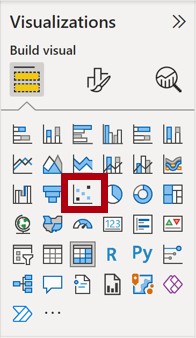

---
lab:
    title: 'Perform Advanced Analytics with AI Visuals'
    module: 'Perform Data Analysis in Power BI'
---

# Realizar Análisis de Datos en Power BI

## Historia del laboratorio

En este laboratorio, crearás el reporte **Sales Exploration**.

En este laboratorio aprenderás a:

- Crear gráficos de dispersión animados
- Usar un visual para pronosticar valores

**Este laboratorio debería tomar aproximadamente 30 minutos.**

## Comenzar

Para completar este ejercicio, primero abre un navegador web e ingresa la siguiente URL para descargar la carpeta zip:

`https://github.com/MicrosoftLearning/PL-300-Microsoft-Power-BI-Data-Analyst/raw/Main/Allfiles/Labs/08-perform-data-analysis-in-power-bi-desktop/08-perform-analysis.zip`

Extrae la carpeta en la ubicación: **C:\Users\Student\Downloads\08-perform-analysis**.

1. Abre el archivo **08-Starter-Sales Analysis.pbix**.

> ***Nota**: Puedes descartar el inicio de sesión seleccionando **Cancel**. Cierra cualquier otra ventana informativa. Selecciona **Apply Later**, si se te solicita aplicar cambios.*

## Crear un gráfico de dispersión animado

En esta tarea, crearás un gráfico de dispersión que puede ser animado.

1. Crea una nueva página y nómbrala **Scatter Chart**.

1. Agrega un visual **Scatter Chart** a la página del reporte, y luego posiciónalo y redimensiónalo para que ocupe toda la página.

	> *El gráfico puede ser animado cuando se agrega un campo al pozo/área **Play Axis**.*

	 

	 

1. Agrega los siguientes campos a los pozos/áreas del visual:

	> *Los laboratorios usan una notación abreviada para referenciar un campo. Se verá así: **Reseller** **\|** **Business Type**. En este ejemplo, **Reseller** es el nombre de la tabla y **Business Type** es el nombre del campo.*

	 - X Axis: **Sales \| Sales**
	 - Y Axis: **Sales \| Profit Margin**
	 - Legend: **Reseller \| Business Type**
	 - Size: **Sales \| Quantity**
	 - Play Axis: **Date \| Quarter**

1. En el panel **Filters**, agrega el campo **Product \| Category** al pozo/área **Filters On This Page**.

1. En la tarjeta de filtro, filtra por **Bikes**.

1. Para animar el gráfico, en la esquina inferior izquierda, selecciona **Play**.

	

1. Observa todo el ciclo de animación desde **FY2018 Q1** hasta **FY2020 Q4**.

	> *El gráfico de dispersión permite entender los valores de las medidas simultáneamente: en este caso, cantidad de pedidos, ingresos por ventas y margen de beneficio.*
    > 
	> *Cada burbuja representa un tipo de negocio de revendedor. Los cambios en el tamaño de la burbuja reflejan aumentos o disminuciones en las cantidades de pedidos. Mientras que los movimientos horizontales representan aumentos/disminuciones en los ingresos por ventas, y los movimientos verticales representan aumentos/disminuciones en la rentabilidad.*

1. Cuando la animación se detenga, selecciona una de las burbujas para revelar su seguimiento a lo largo del tiempo.

1. Coloca el cursor sobre cualquier burbuja para revelar un tooltip que describe los valores de las medidas para el tipo de revendedor en ese momento.

1. En el panel **Filters**, filtra solo por **Clothing** y observa que produce un resultado muy diferente.

1. Guarda el archivo de Power BI Desktop.

## Crear un pronóstico

En esta tarea, crearás un pronóstico para determinar posibles ingresos futuros por ventas.

1. Agrega una nueva página y luego renómbrala como **Forecast**.

1. Agrega un visual **Line Chart** a la página del reporte, y luego posiciónalo y redimensiónalo para que ocupe toda la página.

	 

	 

1. Agrega los siguientes campos a los pozos/áreas del visual:

	 - X-axis: **Date \| Date**
	 - Y-axis: **Sales \| Sales**

1. En el panel **Filters**, agrega el campo **Date \| Year** al pozo/área **Filters On This Page**.

1. En la tarjeta de filtro, filtra por dos años: **FY2019** y **FY2020**.

	> *Al pronosticar a lo largo de una línea de tiempo, necesitarás al menos dos ciclos (años) de datos para producir un pronóstico preciso y estable.*

1. Agrega también el campo **Product \| Category** al pozo/área **Filters On This Page**, y filtra por **Bikes**.

1. Para agregar un pronóstico, debajo del panel **Visualizations**, selecciona el panel **Analytics**.

	 

1. Expande la sección **Forecast**.

	> *Si la sección **Forecast** no está disponible, probablemente se deba a que el visual no se ha configurado correctamente. El pronóstico solo está disponible cuando se cumplen dos condiciones: el eje tiene un solo campo de tipo fecha, y solo hay un campo de valor.*

1. Activa la opción **Forecast** a **On**.

1. Configura las siguientes propiedades del pronóstico, luego **Apply**:

	- Units: **Months**
	- Forecast length: **1 month**
	- Seasonality: **365**
	- Confidence interval: **80%**

	

1. En el visual de línea, observa que el pronóstico se ha extendido un mes más allá de los datos históricos.

	> *El área gris representa la confianza. Cuanto más amplia sea la confianza, menos estable—y por lo tanto menos preciso—será probablemente el pronóstico.*
    >
	> *Cuando conoces la longitud del ciclo, en este caso anual, debes ingresar los puntos de estacionalidad. A veces podría ser semanal (7), o mensual (30).*

1. En el panel **Filters**, filtra solo por **Clothing** y observa que produce un resultado diferente.

## Laboratorio completado
