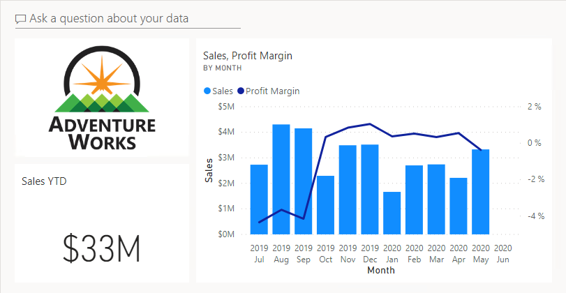

---
lab:
    title: 'Create a Power BI Dashboard'
    module: 'Create Dashboards'
---

# Crear un Dashboard en Power BI

## Historia del laboratorio

En este laboratorio, crearás el dashboard **Sales Monitoring** en el servicio Power BI utilizando un reporte existente.

En este laboratorio aprenderás a:

- Fijar visuales en un dashboard
- Usar Q&A para crear elementos del dashboard

**Este laboratorio debería tomar aproximadamente 30 minutos.**

## Comenzar

Para completar este ejercicio, primero abre un navegador web e ingresa la siguiente URL para descargar la carpeta zip:

`https://github.com/MicrosoftLearning/PL-300-Microsoft-Power-BI-Data-Analyst/raw/Main/Allfiles/Labs/09-create-power-bi-dashboard/09-create-dashboard.zip`

Extrae la carpeta en la ubicación: **C:\Users\Student\Downloads\09-create-dashboard**.

## **Publicar el reporte**

En esta tarea, configurarás el entorno para el laboratorio creando un modelo semántico.

1. En la ventana del navegador Microsoft Edge, en el servicio Power BI, navega a **My Workspace**.

1. Selecciona **Import > Report or Paginated Report > From this computer**.

1. Navega a la carpeta **C:\Users\Student\Downloads\09-create-dashboard**.

1. Selecciona el archivo **09-Starter-Sales Analysis.pbix** y luego haz clic en **Open**.

    > *Si se te solicita reemplazar el modelo semántico, selecciona **Replace it**.*

## **Crear un dashboard**

En esta tarea, crearás el dashboard **Sales Monitoring**. Fijarás un visual del reporte, agregarás un elemento basado en una URI de datos de imagen y usarás Q&A para crear otro elemento.

1. En el servicio Power BI, abre el reporte **09-Starter-Sales Analysis**.

1. En la página **Overview**, configura el segmentador **Year** como **FY2020**.

    

1. Configura el segmentador **Region** como **Select All**.

 > *Los visuales fijados conservan el contexto de filtro al momento de fijarlos. Si el visual subyacente cambia, deberás actualizar el elemento del dashboard. Para filtros basados en tiempo, es mejor usar un segmentador de fecha relativa (o Q&A con una pregunta basada en tiempo relativo).*

1. Para crear un dashboard y fijar un visual, coloca el cursor sobre el visual **Sales and Profit Margin by Month** (columna/línea) y selecciona el icono de chincheta.

    

1. En la ventana **Pin to Dashboard**, en el cuadro **Dashboard Name**, ingresa **Sales Monitoring** y luego selecciona **Pin**.

    

1. Abre **My Workspace** y abre el dashboard **Sales Monitoring**.

1. Observa que el dashboard tiene un solo elemento.

    

1. Para agregar un elemento basado en una pregunta, en la parte superior izquierda del dashboard, selecciona **Ask a Question About Your Data**.

 *Puedes usar la función Q&A para hacer una pregunta, y Power BI responderá con un visual.*

    

1. Selecciona cualquiera de las preguntas sugeridas debajo del cuadro Q&A y revisa la respuesta.

1. Elimina todo el texto del cuadro Q&A e ingresa lo siguiente: **Sales YTD**

1. Observa que la respuesta es **(Blank)**.

 > *Recordarás que agregaste la medida **Sales YTD** en el laboratorio **Create Advanced DAX Calculations in Power BI Desktop**. Esta medida es una expresión de Time Intelligence, por lo que requiere un filtro en la tabla **Date** para producir un resultado.*

    

1. Extiende la pregunta con: **in year FY2020**.

1. Observa que la respuesta ahora es **$33M**.

    

1. Para fijar la respuesta al dashboard, en la esquina superior derecha, selecciona **Pin Visual**.

    

1. Cuando se te solicite fijar el elemento al dashboard **Sales Monitoring**, selecciona **Pin**.

1. Para volver al dashboard, en la esquina superior izquierda, selecciona **Exit Q&amp;A**.

1. Para agregar el logo de la compañía, en la barra de menú, selecciona **Edit** y luego **Add a Tile**.

 > *Esta técnica para agregar un elemento de dashboard te permite mejorar tu dashboard con medios, incluyendo contenido web, imágenes, cuadros de texto con formato y video (usando enlaces de YouTube o Vimeo).*

1. En el panel **Add a Tile** (ubicado a la derecha), selecciona el elemento **Image** y luego **Next**.

1. En el panel **Add Image Tile**, en el cuadro **URL**, ingresa la URL completa encontrada en el archivo **C:\Users\Student\Downloads\09-create-dashboard\AdventureWorksLogo_DataURL.txt** y luego selecciona **Apply**.

 > *Puedes incrustar una imagen usando su URL o puedes usar una data URL, que incrusta el contenido directamente.*

1. Para redimensionar el elemento del logo, arrastra la esquina inferior derecha y ajusta el tamaño a una unidad de ancho y una unidad de alto.

 > *Los tamaños de los elementos están limitados a formas rectangulares.*

1. Organiza los elementos para que el logo aparezca en la parte superior izquierda, el elemento **Sales YTD** debajo y el elemento **Sales, Profit Margin** a la derecha.

    

## **Editar detalles de los elementos**

En esta tarea, editarás los detalles de dos elementos.

1. Coloca el cursor sobre el elemento **Sales YTD**, luego en la esquina superior derecha del elemento, selecciona los puntos suspensivos y luego **Edit Details**.

    

1. En el panel **Tile Details** (ubicado a la derecha), en el cuadro **Subtitle**, ingresa **FY2020** y luego selecciona **Apply**.

1. Observa que el elemento **Sales YTD** ahora muestra un subtítulo.

    

1. Edita los detalles del elemento **Sales, Profit Margin**.

1. En el panel **Tile Details**, en la sección **Functionality**, marca **Display Last Refresh Time** y luego selecciona **Apply**.

    

1. Observa que el elemento muestra la última hora de actualización (que se realizó al cargar el modelo de datos en Power BI Desktop).

*Actualizarás el modelo semántico en el siguiente ejercicio. Dependiendo de tus datos y reporte, puedes hacer una actualización de datos adhoc en cualquier momento o programarla. Sin embargo, las actualizaciones programadas requieren gateways que no podemos configurar para este laboratorio. Por lo tanto, desde Power BI Desktop, realizarás una actualización manual de datos y luego cargarás el archivo a tu workspace.*

## **Actualizar el modelo semántico**

En este ejercicio, primero cargarás datos de órdenes de venta para junio de 2020 en la base de datos **AdventureWorksDW2020**. Luego abrirás tu archivo de Power BI Desktop, realizarás una actualización de datos y luego cargarás el archivo a tu workspace.

> ***Nota**: Si no puedes conectarte a la base de datos, puedes usar el archivo **09-Solution-Sales-Analysis.pbix**. En lugar de actualizar la base de datos y refrescar el modelo semántico, carga el archivo de solución a **My workspace** y observa los cambios mencionados en las siguientes tareas.*

## **Actualizar la base de datos del laboratorio**

En esta tarea, ejecutarás un script de PowerShell para actualizar datos en la base de datos **AdventureWorksDW2020**.

1. En el Explorador de archivos, dentro de la carpeta **C:\Users\Student\Downloads\09-create-dashboard**, haz clic derecho en el archivo **UpdateDatabase-2-AddSales.ps1** y luego selecciona **Run with PowerShell**.

    

1. Si se te solicita cambiar la política de ejecución, presiona **A**.

1. Cuando se te solicite presionar cualquier tecla para cerrar, presiona **Enter** nuevamente.

*La base de datos **AdventureWorksDW2020** ahora incluye órdenes de venta realizadas en junio de 2020.*

## **Actualizar el archivo de Power BI Desktop**

En esta tarea, abrirás el archivo **09-Starter-Sales Analysis** de Power BI Desktop, realizarás una actualización de datos y luego cargarás el archivo a tu workspace **Sales Analysis**.

1. En el archivo de Power BI Desktop, en el panel **Data**, haz clic derecho en la tabla **Sales** y luego selecciona **Refresh Data**.

    

1. Cuando la actualización se complete, guarda el archivo de Power BI Desktop.

1. Para publicar el archivo en tu workspace, en la pestaña **Home**, dentro del grupo **Share**, selecciona **Publish** y luego **Select** para publicar.

    

1. Cuando se te solicite reemplazar el modelo semántico, selecciona **Replace**.

1. Cierra Power BI Desktop.

*El modelo semántico en el servicio Power BI ahora tiene datos de ventas de junio de 2020.*

### **Revisar el dashboard**

En esta tarea, revisarás el dashboard para observar las ventas actualizadas.

1. En la ventana del navegador Microsoft Edge, abre el servicio Power BI y revisa el dashboard **Sales Monitoring** en **My Workspace**.

2. En el elemento **Sales, Profit Margin**, junto al subtítulo, observa que los datos se **Refreshed: NOW**.

3. Observa también que ahora hay una columna para **2020 Jun**.

 > *Si no ves los datos de junio de 2020, es posible que necesites presionar **F5** para recargar el navegador web.*

    

## Laboratorio completado
