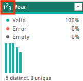

---

lab:
 title: 'Obtener datos en Power BI'
 module: 'Obtener datos en Power BI'

---

# Obtener datos en Power BI

## **Historia del laboratorio**

Este laboratorio está diseñado para introducirte en la aplicación Power BI Desktop, cómo conectarte a los datos y cómo usar técnicas de vista previa para comprender las características y calidad de los datos fuente.

En este laboratorio, aprenderás a:

* Abrir Power BI Desktop.
* Conectarte a diferentes fuentes de datos.
* Previsualizar los datos fuente con Power Query.
* Usar las funciones de perfilado de datos en Power Query.

**Este laboratorio tomará aproximadamente 30 minutos.**

## Comenzar con Power BI Desktop

Para completar este ejercicio, primero abre un navegador web e ingresa la siguiente URL para descargar la carpeta comprimida (zip):

`https://github.com/MicrosoftLearning/PL-300-Microsoft-Power-BI-Data-Analyst/raw/Main/Allfiles/Labs/01-get-data-in-power-bi/01-get-data.zip`

Extrae la carpeta en **C:\Users\Student\Downloads\01-get-data**.

Abre el archivo **01-Starter-Sales Analysis.pbix**.

* Este archivo de inicio ha sido configurado especialmente para ayudarte a completar el laboratorio. Las siguientes configuraciones a nivel de informe han sido deshabilitadas en el archivo de inicio:

  * Data Load > Import relationships from data sources on first load
  * Data Load > Autodetect new relationships after data is loaded

## Obtener datos desde SQL Server

Esta tarea te enseña cómo conectarte a una base de datos SQL Server e importar tablas, lo que crea consultas en Power Query.

1. En la pestaña **Home** del ribbon, dentro del grupo **Data**, selecciona **SQL Server**.

    

2. En la ventana **SQL Server Database**, en el cuadro **Server**, escribe **localhost** y deja **Database** en blanco. Luego selecciona **OK**.

   > ***Nota**: En este laboratorio, te conectarás a la base de datos SQL Server usando **localhost**. Aunque este enfoque funciona aquí, no se recomienda para tus propias soluciones, ya que las fuentes de datos de gateway no pueden resolver **localhost**.*

3. Si se te solicita credenciales, selecciona **Windows > Use my current credentials**, y luego **Connect**.

4. Selecciona **OK** si aparece una advertencia de que no se puede establecer una conexión cifrada.

5. En el panel **Navigator**, expande la base de datos **AdventureWorksDW2020**.

   > ***Nota**: La base de datos **AdventureWorksDW2020** está basada en el ejemplo **AdventureWorksDW2017**. Ha sido modificada para apoyar los objetivos de aprendizaje de los laboratorios del curso.*

6. Selecciona la tabla **DimEmployee** y observa la vista previa de los datos.

   

   > ***Nota**: La vista previa te permite ver las columnas y una muestra de filas.*

7. Para importar los datos de las tablas, **marca las casillas** junto a las siguientes:

   * DimEmployee
   * DimEmployeeSalesTerritory
   * DimProduct
   * DimReseller
   * DimSalesTerritory
   * FactResellerSales

8. Completa esta tarea seleccionando **Transform Data**, lo cual abrirá Power Query Editor — déjalo abierto para la siguiente tarea.

Ya te has conectado a seis tablas de una base de datos SQL Server.

## **Vista previa de datos en Power Query Editor**

Esta tarea te presenta el Power Query Editor y te permite revisar y perfilar los datos. Esto te ayuda a determinar cómo limpiar y transformar los datos después. También revisarás tablas de dimensiones (prefijo "Dim") y de hechos (prefijo "Fact").

1. En la ventana de **Power Query Editor**, a la izquierda, observa el panel **Queries**, que contiene una consulta por cada tabla que marcaste.

   

2. Selecciona la primera consulta: **DimEmployee**.

   > *La tabla **DimEmployee** en la base de datos SQL Server almacena una fila por cada empleado. Un subconjunto de estas filas representa a los vendedores, lo cual será relevante para el modelo que desarrollarás.*

3. En la barra de estado (esquina inferior izquierda), se muestran estadísticas de la tabla: tiene 33 columnas y 296 filas.

   

4. En el panel de vista previa, desplázate horizontalmente para revisar todas las columnas. Observa que las últimas cinco columnas contienen enlaces **Table** o **Value**.

   > *Estas cinco columnas representan relaciones con otras tablas en la base de datos. Se pueden usar para unir tablas. Las unirás más adelante en el laboratorio **Load Transformed Data in Power BI Desktop**.*

5. Para evaluar la calidad de las columnas, en la pestaña **View** del ribbon, dentro del grupo **Data Preview**, marca **Column Quality**.

   

6. Observa que la columna **Position** tiene 94% de filas vacías (null).

   

7. Para evaluar la distribución de columnas, en la pestaña **View**, marca **Column Distribution**.

8. Revisa nuevamente la columna **Position**: hay cuatro valores distintos y uno único.

9. Revisa la distribución de la columna **EmployeeKey** — tiene 296 valores distintos y 296 únicos.

   

   > ***Nota**: Cuando los valores distintos y únicos son iguales, significa que la columna tiene valores únicos. Estas columnas pueden ser clave en relaciones uno-a-muchos, que crearás en el laboratorio **Model Data in Power BI Desktop**.*

10. En el panel **Queries**, selecciona **DimProduct**.

    > *La tabla **DimProduct** contiene una fila por cada producto vendido por la empresa.*

11. Selecciona **DimReseller**.

    > *La tabla **DimReseller** contiene una fila por cada revendedor. Los revendedores venden, distribuyen o agregan valor a los productos de Adventure Works.*

12. Para ver los valores de columna, en la pestaña **View**, marca **Column Profile**.

13. Selecciona la columna **BusinessType** y revisa el panel de estadísticas y distribución de valores.

    > *Observa el problema de calidad: hay dos etiquetas para almacén (**Warehouse** y el error ortográfico **Ware House**).*

    

14. Pasa el cursor sobre la barra **Ware House** y observa que hay cinco filas con ese valor.

15. Selecciona **DimSalesTerritory**.

    > *Contiene una fila por cada región de ventas, incluyendo **Corporate HQ**. En el laboratorio **Model Data in Power BI Desktop**, crearás una jerarquía para análisis por región, país o grupo.*

16. Selecciona **FactResellerSales**.

    > *Contiene una fila por cada línea de orden de venta.*

17. Revisa la calidad de la columna **TotalProductCost** y observa que el 8% de las filas están vacías.

    > *La ausencia de valores en **TotalProductCost** es un problema de calidad de datos.*

## **Obtener datos desde un archivo CSV**

1. Para agregar una nueva consulta, en **Power Query Editor**, pestaña **Home**, grupo **New Query**, selecciona **New Source > Text/CSV**.

2. Navega a **Downloads > 01-get-data** y selecciona **ResellerSalesTargets.csv**. Haz clic en **Open**.

3. En la ventana de vista previa, selecciona **OK**.

4. Observa la nueva consulta **ResellerSalesTargets**.

   > *Contiene una fila por vendedor y por año, con metas mensuales de ventas en miles. El año fiscal comienza el 1 de julio.*

5. Ninguna columna contiene valores vacíos. Cuando no hay meta, se registra un guion.

6. Revisa los íconos a la izquierda de los nombres de columna: **123** es número entero, **ABC** es texto.

   

7. Repite los pasos para crear una consulta con el archivo **ColorFormats.csv**.

   > *Contiene una fila por color de producto, con códigos HEX para color de fondo y texto.*

Ahora deberías tener dos nuevas consultas: **ResellerSalesTargets** y **ColorFormats**.

---

## Laboratorio completo

---

¿Te gustaría que prepare esta versión traducida como `.md`, `.pdf` o `.docx` para descarga directa?
