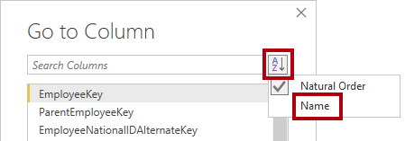
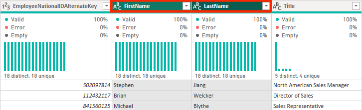
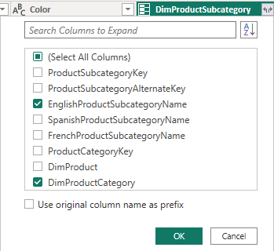
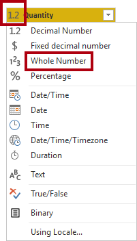
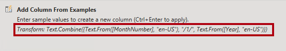

---
lab:
    title: 'Clean, transform, and load data in Power BI'
    module: 'Clean, transform, and load data in Power BI'
---

# Limpiar, transformar y cargar datos en Power BI

## Historia del laboratorio

En este laboratorio, usarás técnicas de limpieza y transformación de datos para comenzar a dar forma a tu modelo de datos. Luego aplicarás las consultas para cargar cada una como una tabla en el modelo semántico.

En este laboratorio, aprenderás cómo:

- Aplicar diversas transformaciones de datos.
- Cargar consultas al modelo semántico.

**Este laboratorio debería tomar aproximadamente 45 minutos.**

## Comenzar

Para completar este ejercicio, primero abre un navegador web e ingresa la siguiente URL para descargar la carpeta zip:

`https://github.com/MicrosoftLearning/PL-300-Microsoft-Power-BI-Data-Analyst/raw/Main/Allfiles/Labs/02-transform-data-power-bi/02-transform-data.zip`

Extrae la carpeta en la ubicación: **C:\Users\Student\Downloads\02-transform-data**.

Abre el archivo **02-Starter-Sales Analysis.pbix**.

> ***Nota**: Puedes descartar el inicio de sesión seleccionando **Cancelar**. Cierra cualquier otra ventana informativa. Selecciona **Aplicar más tarde**, si se te solicita aplicar cambios.*

## Configurar la consulta Salesperson

En esta tarea, usarás el Editor de Power Query para configurar la consulta **Salesperson**.

> ***Importante**: Cuando se te indique renombrar columnas, es importante que las renombres exactamente como se describe.*

1. Para abrir la ventana del **Editor de Power Query**, en la pestaña **Home** de la cinta, dentro del grupo **Queries**, selecciona el icono **Transform Data**.

	

1. En la ventana del **Editor de Power Query**, en el panel **Queries**, selecciona la consulta **DimEmployee**.

	

	> **Nota:** Si recibes un mensaje de advertencia pidiendo especificar cómo conectarte, selecciona **Edit Credentials**, conéctate usando las credenciales actuales y selecciona **OK** para usar una conexión no encriptada.
 
1. Para renombrar la consulta, en el panel **Query Settings** (ubicado a la derecha), en el cuadro **Name**, reemplaza el texto con **Salesperson** y luego presiona **Enter**. Luego verifica que el nombre se haya actualizado en el panel **Queries**.

	> *El nombre de la consulta determina el nombre de la tabla en el modelo. Se recomienda definir nombres concisos y fáciles de entender.*

1. Para ubicar una columna específica, en la pestaña **Home** de la cinta, dentro del grupo **Manage Columns**, selecciona la flecha hacia abajo de **Choose Columns** y luego selecciona **Go to Column**.

	> *Go to Column es una característica útil cuando hay muchas columnas. De lo contrario, puedes desplazarte horizontalmente para encontrar las columnas.*

	

1. En la ventana **Go to Column**, para ordenar la lista por nombre de columna, selecciona el botón de ordenación **AZ**, luego selecciona **Name** y **SalesPersonFlag**. Haz clic en **OK**.

	

1. Ubica la columna **SalesPersonFlag**, luego filtra la columna para seleccionar solo los vendedores (es decir, **TRUE**) y haz clic en **OK**.

1. En el panel **Query Settings**, en la lista **Applied Steps**, observa la adición del paso **Filtered Rows**.

	> *Cada transformación que creas resulta en otra lógica de paso. Es posible editar o eliminar pasos. También es posible seleccionar un paso para previsualizar los resultados de la consulta en esa etapa de la transformación.*

	

1. Para eliminar columnas, en la pestaña **Home** de la cinta, dentro del grupo **Manage Columns**, selecciona el icono **Choose Columns**.

1. En la ventana **Choose Columns**, para deseleccionar todas las columnas, desmarca el ítem **(Select All Columns)**.

1. Para incluir columnas, marca las siguientes seis columnas:

	- EmployeeKey
	- EmployeeNationalIDAlternateKey
	- FirstName
	- LastName
	- Title
	- EmailAddress

1. En la lista **Applied Steps**, observa la adición de otro paso de consulta.

	

1. Para crear una única columna de nombre, primero selecciona el encabezado de la columna **FirstName**. Mientras mantienes presionada la tecla **Ctrl**, selecciona la columna **LastName**.

	

1. Haz clic derecho en cualquiera de los encabezados de las columnas seleccionadas y luego, en el menú contextual, selecciona **Merge Columns**.

	> *Muchas transformaciones comunes se pueden aplicar haciendo clic derecho en el encabezado de la columna y luego eligiéndolas del menú contextual. Sin embargo, ten en cuenta que hay más transformaciones disponibles en la cinta.*

1. En la ventana **Merge Columns**, en la lista desplegable **Separator**, selecciona **Space**.

1. En el cuadro **New Column Name**, reemplaza el texto con **Salesperson**.

1. Para renombrar la columna **EmployeeNationalIDAlternateKey**, haz doble clic en el encabezado de la columna **EmployeeNationalIDAlternateKey** y reemplaza el texto con **EmployeeID**, luego presiona **Enter**.

1. Usa los pasos anteriores para renombrar la columna **EmailAddress** a **UPN**.

	> *UPN es un acrónimo de User Principal Name.*

**En la parte inferior izquierda, en la barra de estado, verifica que la consulta tenga 5 columnas y 18 filas.**

## Configurar la consulta SalespersonRegion

En esta tarea, configurarás la consulta **SalespersonRegion**.

1. En el panel **Queries**, selecciona la consulta **DimEmployeeSalesTerritory**.

1. En el panel **Query Settings**, renombra la consulta a **SalespersonRegion**.

1. Para eliminar las últimas dos columnas, primero selecciona el encabezado de la columna **DimEmployee**.

1. Mientras mantienes presionada la tecla **Ctrl**, selecciona el encabezado de la columna **DimSalesTerritory**.

1. Haz clic derecho en cualquiera de los encabezados de las columnas seleccionadas y luego, en el menú contextual, selecciona **Remove Columns**.

**En la barra de estado, verifica que la consulta tenga 2 columnas y 39 filas.**

## Configurar la consulta Product

En esta tarea, configurarás la consulta **Product**.

> ***Importante**: Cuando ya se han proporcionado instrucciones detalladas, los pasos del laboratorio serán más concisos. Si necesitas las instrucciones detalladas, puedes referirte a los pasos de las tareas anteriores.*

1. Selecciona la consulta **DimProduct** y renómbrala a **Product**.

1. Ubica la columna **FinishedGoodsFlag** y luego filtra la columna para recuperar productos que sean bienes terminados (es decir, TRUE).

1. Elimina todas las columnas, **excepto** las siguientes:

	- ProductKey
	- EnglishProductName
	- StandardCost
	- Color
	- DimProductSubcategory

1. Observa que la columna **DimProductSubcategory** representa una tabla relacionada (contiene enlaces **Value**).

1. En el encabezado de la columna **DimProductSubcategory**, a la derecha del nombre de la columna, selecciona el botón de expansión.

	

1. Ve la lista completa de columnas, luego desmarca la casilla **Select All Columns** para deseleccionar todas las columnas.

1. Selecciona **EnglishProductSubcategoryName** y **DimProductCategory**, y desmarca la casilla **Use Original Column Name as Prefix** antes de seleccionar **OK**.

	

	> *Al seleccionar estas dos columnas, se aplicará una transformación para unirse a la tabla **DimProductSubcategory** y luego incluir estas columnas. La columna **DimProductCategory** es, de hecho, otra tabla relacionada en el origen de datos.*

	> *Los nombres de las columnas de consulta siempre deben ser únicos. Si se deja marcada, esta casilla prefijaría cada columna con el nombre de la columna expandida (en este caso, **DimProductSubcategory**). Como se sabe que los nombres de las columnas seleccionadas no coinciden con los nombres de las columnas en la consulta **Product**, la opción se desmarca.*

1. Observa que la transformación resultó en la adición de dos columnas y que la columna **DimProductSubcategory** ha sido eliminada.

1. Expande la columna **DimProductCategory** e introduce solo la columna **EnglishProductCategoryName**.

1. Renombra las siguientes cuatro columnas:

	- **EnglishProductName** a **Product**
	- **StandardCost** a **Standard Cost** (incluye un espacio)
	- **EnglishProductSubcategoryName** a **Subcategory**
	- **EnglishProductCategoryName** a **Category**

**En la barra de estado, verifica que la consulta tenga 6 columnas y 397 filas.**

## Configurar la consulta Reseller

En esta tarea, configurarás la consulta **Reseller**.

1. Selecciona la consulta **DimReseller** y renómbrala a **Reseller**.

1. Elimina todas las columnas, **excepto** las siguientes:

	- ResellerKey
	- BusinessType
	- ResellerName
	- DimGeography

1. Expande la columna **DimGeography** para incluir **solo** las siguientes tres columnas:

	- City
	- StateProvinceName
	- EnglishCountryRegionName

1. En el encabezado de la columna **Business Type**, selecciona la flecha hacia abajo y luego revisa los valores distintos de la columna, observando los valores **Warehouse** y **Ware House**.

1. Haz clic derecho en el encabezado de la columna **Business Type** y luego selecciona **Replace Values**.

1. En la ventana **Replace Values**, configura los siguientes valores:

	- En el cuadro **Value to Find**, ingresa **Ware House**
	- En el cuadro **Replace With**, ingresa **Warehouse**

 	

1. Renombra las siguientes cuatro columnas:

	- **BusinessType** a **Business Type** (incluye un espacio)
	- **ResellerName** a **Reseller**
	- **StateProvinceName** a **State-Province**
	- **EnglishCountryRegionName** a **Country-Region**

**En la barra de estado, verifica que la consulta tenga 6 columnas y 701 filas.**

## Configurar la consulta Region

En esta tarea, configurarás la consulta **Region**.

1. Selecciona la consulta **DimSalesTerritory** y renómbrala a **Region**.

1. Aplica un filtro a la columna **SalesTerritoryAlternateKey** para eliminar el valor 0 (cero).

	> *Esto eliminará una fila.*

1. Elimina todas las columnas, **excepto** las siguientes:

	- SalesTerritoryKey
	- SalesTerritoryRegion
	- SalesTerritoryCountry
	- SalesTerritoryGroup

1. Renombra las siguientes tres columnas:

	- **SalesTerritoryRegion** a **Region**
	- **SalesTerritoryCountry** a **Country**
	- **SalesTerritoryGroup** a **Group**

**En la barra de estado, verifica que la consulta tenga 4 columnas y 10 filas.**

## Configurar la consulta Sales

En esta tarea, configurarás la consulta **Sales**.

1. Selecciona la consulta **FactResellerSales** y renómbrala a **Sales**.

1. Elimina todas las columnas, **excepto** las siguientes:

	- SalesOrderNumber
	- OrderDate
	- ProductKey
	- ResellerKey
	- EmployeeKey
	- SalesTerritoryKey
	- OrderQuantity
	- UnitPrice
	- TotalProductCost
	- SalesAmount
	- DimProduct

	> ***Nota**: Puedes recordar en el laboratorio **Prepare Data in Power BI Desktop** que un pequeño porcentaje de las filas de **FactResellerSales** tenían valores faltantes en **TotalProductCost**. La columna **DimProduct** se ha incluido para recuperar la columna de costo estándar del producto y ayudar a corregir los valores faltantes.*

1. Expande la columna **DimProduct**, desmarca todas las columnas e incluye solo la columna **StandardCost**.

1. Para crear una columna personalizada, en la pestaña **Add Column** de la cinta, dentro del grupo **General**, selecciona **Custom Column**.

	

1. En la ventana **Custom Column**, en el cuadro **New Column Name**, reemplaza el texto con **Cost**.

1. En el cuadro **Custom Column Formula**, ingresa la siguiente expresión (después del símbolo de igual) y luego guarda la nueva columna:

   ` if [TotalProductCost] = null then [OrderQuantity] * [StandardCost] else [TotalProductCost] `

	> ***Nota**: Puedes copiar la expresión del archivo **Snippets.txt** en la carpeta 02-transform-data.*

	> *Esta expresión verifica si el valor de **TotalProductCost** está faltante. Si falta, produce un valor multiplicando el valor de **OrderQuantity** por el valor de **StandardCost**; de lo contrario, usa el valor existente de **TotalProductCost**.*

1. Elimina las siguientes dos columnas:

	- TotalProductCost
	- StandardCost

1. Renombra las siguientes tres columnas:

	- **OrderQuantity** a **Quantity**
	- **UnitPrice** a **Unit Price** (incluye un espacio)
	- **SalesAmount** a **Sales**

1. Para modificar el tipo de datos de la columna, en el encabezado de la columna **Quantity**, a la izquierda del nombre de la columna, selecciona el icono **1.2** y luego selecciona **Whole Number**.

	> *Configurar el tipo de datos correcto es importante. Cuando la columna contiene valores numéricos, también es importante elegir el tipo correcto si esperas realizar cálculos matemáticos.*

	

1. Modifica los siguientes tres tipos de datos de columna a **Fixed Decimal Number**.

	> *El tipo de datos fixed decimal number permite hasta 19 dígitos y ofrece mayor precisión para evitar errores de redondeo. Es importante usar el tipo fixed decimal number para valores financieros o tasas (como tasas de cambio).*

	- Unit Price
	- Sales
	- Cost

**En la barra de estado, verifica que la consulta tenga 10 columnas y 999+ filas.** *Se cargarán un máximo de 1000 filas como datos de vista previa para cada consulta.*

## Configurar la consulta Targets

En esta tarea, configurarás la consulta **Targets**.

1. Selecciona la consulta **ResellerSalesTargets** y renómbrala a **Targets**.

	> **Nota:** Si recibes un mensaje de advertencia pidiendo especificar cómo conectarte, selecciona **Edit Credentials** y usa acceso anónimo.

1. Para desagrupar las 12 columnas de mes (**M01**-**M12**), primero selecciona múltiples encabezados de las columnas **Year** y **EmployeeID**.

1. Haz clic derecho en cualquiera de los encabezados de las columnas seleccionadas y luego, en el menú contextual, selecciona **Unpivot Other Columns**.

1. Observa que los nombres de las columnas ahora aparecen en la columna **Attribute**, y los valores aparecen en la columna **Value**.

1. Aplica un filtro a la columna **Value** para eliminar los valores de guión (-).

	> *Puedes recordar que el carácter de guión se usó en el archivo CSV de origen para representar cero (0).*

1. Renombra las siguientes dos columnas:

	- **Attribute** a **MonthNumber** (no hay espacio)
	- **Value** a **Target**

1. Para preparar los valores de la columna **MonthNumber**, haz clic derecho en el encabezado de la columna **MonthNumber** y luego selecciona **Replace Values**.

	> *Ahora aplicarás transformaciones para producir una columna de fecha. La fecha se derivará de las columnas **Year** y **MonthNumber**. Crearás la columna usando la función **Columns From Examples**.*

1. En la ventana **Replace Values**, en el cuadro **Value To Find**, ingresa **M** y deja el cuadro **Replace with** vacío.

1. Modifica el tipo de datos de la columna **MonthNumber** a **Whole Number**.

1. En la pestaña **Add Column** de la cinta, dentro del grupo **General**, selecciona el icono **Column From Examples**.

	

1. Observa que la primera fila es para el año **2017** y el número de mes **7**.

1. En la columna **Column1**, en la primera celda de la cuadrícula, comienza ingresando **7/1/2017** y luego presiona **Enter**.

	> ***Nota**: La máquina virtual usa configuraciones regionales de EE. UU., por lo que esta fecha es, de hecho, el 1 de julio de 2017. Otras configuraciones regionales pueden requerir un **0** antes de la fecha.*

1. Observa que las celdas de la cuadrícula se actualizan con valores predichos.

	> *La característica ha predicho con precisión que estás combinando valores de las columnas **Year** y **MonthNumber**.*

1. Observa también la fórmula presentada arriba de la cuadrícula de consulta.

	

1. Para renombrar la nueva columna, haz doble clic en el encabezado de la columna **Merged** y renombrala como **TargetMonth**.

1. Elimina las siguientes columnas:

	- Year
	- MonthNumber

1. Modifica los siguientes tipos de datos de columna:

	- **Target** como fixed decimal number
	- **TargetMonth** como date

1. Para multiplicar los valores de **Target** por 1000, selecciona el encabezado de la columna **Target** y luego, en la pestaña **Transform** de la cinta, dentro del grupo **Number Column**, selecciona **Standard** y luego selecciona **Multiply**.

	> *Puedes recordar que los valores objetivo se almacenaron como miles.*

	

1. En la ventana **Multiply**, en el cuadro **Value**, ingresa **1000** y selecciona **OK**.

**En la barra de estado, verifica que la consulta tenga 3 columnas y 809 filas.**

## Configurar la consulta ColorFormats

En esta tarea, configurarás la consulta **ColorFormats**.

1. Selecciona la consulta **ColorFormats** y observa que la primera fila contiene los nombres de las columnas.

1. En la pestaña **Home** de la cinta, dentro del grupo **Transform**, selecciona **Use First Row as Headers**.

	

**En la barra de estado, verifica que la consulta tenga 3 columnas y 10 filas.**

## Actualizar la consulta Product

En esta tarea, actualizarás la consulta **Product** fusionando la consulta **ColorFormats**.

1. Selecciona la consulta **Product**.

1. Para fusionar la consulta **ColorFormats**, en la pestaña **Home** de la cinta, dentro del grupo **Combine**, selecciona **Merge Queries**.

	> *Fusionar consultas permite integrar datos, en este caso de diferentes fuentes de datos (SQL Server y un archivo CSV).*

	

1. En la ventana **Merge**, en la cuadrícula de la consulta **Product**, selecciona el encabezado de la columna **Color**.

	

1. Debajo de la cuadrícula de la consulta **Product**, en la lista desplegable, selecciona la consulta **ColorFormats**.

	

1. En la cuadrícula de la consulta **ColorFormats**, selecciona el encabezado de la columna **Color**.

1. Cuando se abra la ventana **Privacy Levels**, para cada una de las dos fuentes de datos, en la lista desplegable correspondiente, selecciona **Organizational** y luego **Save**.

	> *Los niveles de privacidad se pueden configurar para las fuentes de datos para determinar si los datos se pueden compartir entre fuentes. Configurar cada fuente de datos como **Organizational** permite que compartan datos, si es necesario. Las fuentes de datos privadas nunca pueden compartirse con otras fuentes de datos. Esto no significa que los datos privados no se puedan compartir; significa que el motor de Power Query no puede compartir datos entre las fuentes.*

	

1. En la ventana **Merge**, usa el **Join Kind** predeterminado (manteniendo la selección de Left Outer) y selecciona **OK**.

1. Expande la columna **ColorFormats** para incluir las siguientes dos columnas:

	- Background Color Format
	- Font Color Format

**En la barra de estado, verifica que la consulta ahora tenga 8 columnas y 397 filas.**

## Actualizar la consulta ColorFormats

En esta tarea, actualizarás la consulta **ColorFormats** para deshabilitar su carga.

1. Selecciona la consulta **ColorFormats**.

1. En el panel **Query Settings**, selecciona el enlace **All Properties**.

	

1. En la ventana **Query Properties**, desmarca la casilla **Enable Load To Report**.

	> *Deshabilitar la carga significa que no se cargará como una tabla en el modelo de datos. Esto se hace porque la consulta se fusionó con la consulta **Product**, que está habilitada para cargarse en el modelo de datos.*

	

### Revisar el producto final

1. En el Editor de Power Query, verifica que tengas **8 consultas**, correctamente nombradas de la siguiente manera:

	- Salesperson
	- SalespersonRegion
	- Product
	- Reseller
	- Region
	- Sales
	- Targets
	- ColorFormats (que no se cargará en el modelo de datos)

1. Selecciona **Close &amp; Apply** para cargar los datos al modelo y cerrar la ventana del Editor de Power Query.

	

1. Ahora puedes ver el lienzo en Power BI Desktop, con los paneles Filters, Visualizations y Data a la derecha. En el panel Data, observa las **7 tablas** cargadas en el modelo de datos.

	

## Laboratorio completado
