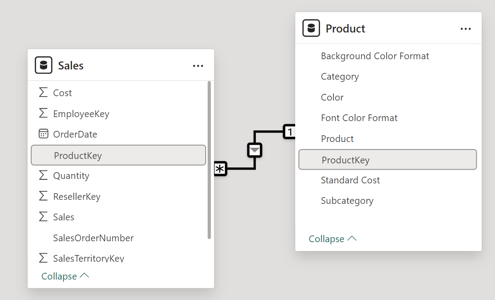
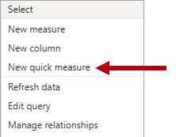
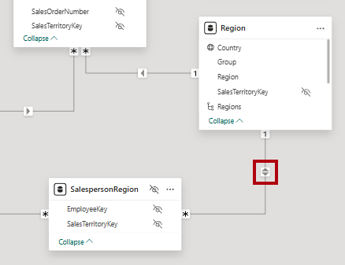

---
lab:
    title: 'Configure a semantic model in Power BI'
    module: 'Configure a semantic model in Power BI'
---

# Configurar un modelo semántico en Power BI

## Historia del laboratorio

En este laboratorio, comenzarás a desarrollar el modelo de datos. Esto implicará crear relaciones entre tablas y luego configurar propiedades de tablas y columnas para mejorar la facilidad de uso del modelo de datos. También crearás jerarquías y medidas rápidas.

En este laboratorio, aprenderás cómo:

- Crear relaciones en el modelo.
- Configurar propiedades de tablas y columnas.
- Crear jerarquías.
- Crear medidas rápidas.
- Configurar una relación de muchos a muchos.

**Este laboratorio debería tomar aproximadamente 45 minutos.**

## Comenzar

Para completar este ejercicio, primero abre un navegador web e ingresa la siguiente URL para descargar el archivo zip:

`https://github.com/MicrosoftLearning/PL-300-Microsoft-Power-BI-Data-Analyst/raw/Main/Allfiles/Labs/03-configure-semantic-model/03-model-data.zip`

Extrae el archivo en la carpeta: **C:\Users\Student\Downloads\03-model-data**.

Abre el archivo **03-Starter-Sales Analysis.pbix**.

> _**Nota**: Puedes descartar el inicio de sesión seleccionando **Cancelar**. Cierra cualquier otra ventana informativa. Selecciona **Aplicar más tarde**, si se te solicita aplicar cambios._

## Crear relaciones en el modelo

En esta tarea, crearás relaciones en el modelo. El archivo fue configurado para no identificar relaciones entre tablas, lo cual no es la configuración predeterminada, pero se recomienda para evitar trabajo adicional al crear las relaciones correctas para tu modelo.

> Los laboratorios usan una notación abreviada para referirse a un campo. Se verá así: `Product | Category`. En este ejemplo, `Product` es el nombre de la tabla y `Category` es el nombre del campo.

1. En Power BI Desktop, para ver todos los campos de las tablas, en el panel **Data**, haz clic derecho en un área vacía y luego selecciona **Expand All**.

1. Para crear un visual de tabla, en el panel **Data**, dentro de la tabla `Product`, marca el campo `Category`.

1. Para agregar otra columna a la tabla, en el panel **Data**, marca el campo `Sales | Sales`.

1. Observa que el visual de tabla lista cuatro categorías de productos y que el valor de ventas es el mismo para cada una, y el mismo para el total.

    

    > _El problema es que la tabla se basa en campos de diferentes tablas. La expectativa es que cada categoría de producto muestre las ventas para esa categoría. Sin embargo, como no hay una relación de modelo entre estas tablas, la tabla `Sales` no se filtra. Ahora agregarás una relación para propagar filtros entre las tablas._

1. Para cambiar al diseñador de modelos, a la izquierda selecciona el icono de Model view.

    

1. En la pestaña **Home**, selecciona **Manage Relationships**.

    

1. En la ventana **Manage Relationships**, observa que aún no se han definido relaciones.

1. Para crear una relación, selecciona **+ New relationship**.

1. Para configurar una relación desde la tabla `Product` a la tabla `Sales`, en la lista desplegable **From table**, selecciona la tabla `Product`, y en la lista desplegable **To table**, selecciona la tabla `Sales`.

    

1. Observa que las siguientes propiedades se configuraron automáticamente:

    - **Se seleccionaron las columnas ProductKey en cada tabla**. _Las columnas se seleccionaron porque comparten el mismo nombre y tipo de datos. En datos reales, es posible que necesites encontrar columnas coincidentes con nombres diferentes._
    - **El tipo de cardinalidad es One To Many (1:\*)**. _La cardinalidad se detectó automáticamente porque Power BI entiende que la columna `ProductKey` de la tabla `Product` contiene valores únicos. Las relaciones de uno a muchos son el tipo de cardinalidad más común, y todas las relaciones que crearás en este laboratorio serán de este tipo._
    - **El tipo de dirección de filtro cruzado es Single**. _La dirección de filtro única significa que los filtros se propagan desde el "lado uno" al "lado muchos". En este caso, significa que los filtros aplicados a la tabla `Product` se propagarán a la tabla `Sales`, pero no en la dirección opuesta._
    - **Make This Relationship Active está marcado**. _Las relaciones activas propagan filtros. Es posible marcar una relación como inactiva para que los filtros no se propaguen. Las relaciones inactivas pueden existir cuando hay múltiples rutas de relación entre tablas. En este caso, los cálculos del modelo pueden usar funciones especiales para activarlas._

    

1. Selecciona **Save**, observa en la ventana **Manage Relationships** que la nueva relación aparece listada, y luego selecciona **Close**.

1. En el diagrama del modelo, observa que ahora hay un conector entre las dos tablas (puedes reposicionar las tablas para ver la relación más claramente).

    

    > _Puedes interpretar muchas de las propiedades de la relación mirando la línea de relación en el diagrama:_
    >
    > - _La cardinalidad está representada por los indicadores **1** y **(\*)**._
    > - _La dirección del filtro está representada por la punta de flecha._
    > - _Una línea sólida representa una relación activa; una línea punteada representa una relación inactiva._
    >
    > Consejo: Si pasas el cursor sobre la relación, se resaltarán las columnas relacionadas._

1. Cambia a Report view, y luego observa que el visual de tabla se actualizó para mostrar valores diferentes para cada categoría de producto.

    > _Los filtros aplicados a la tabla `Product` ahora se propagan a la tabla `Sales`._

    

### Crear relaciones adicionales

Hay una forma más fácil de crear una relación. En el diagrama del modelo, puedes arrastrar y soltar columnas para crear una nueva relación.

1. Para crear una nueva relación usando una técnica diferente, cambia a Model view.

1. Desde la tabla `Reseller`, arrastra la columna `ResellerKey` sobre la columna `ResellerKey` de la tabla `Sales`.

    > _**Importante**: A veces una columna no se deja arrastrar. Si esto ocurre, selecciona una columna diferente, luego selecciona nuevamente la columna que deseas arrastrar e inténtalo de nuevo. Asegúrate de ver la nueva relación agregada al diagrama._

    

1. En la ventana **New relationship**, revisa la configuración y luego selecciona **Save**.

1. Usa la nueva técnica para crear las siguientes dos relaciones de modelo:

     - `Region | SalesTerritoryKey` a `Sales | SalesTerritoryKey`
     - `Salesperson | EmployeeKey` a `Sales | EmployeeKey`

1. En el diagrama, organiza las tablas de modo que la tabla `Sales` esté posicionada en el centro del diagrama y las tablas relacionadas estén dispuestas alrededor. Coloca las tablas desconectadas a un lado.

    

1. Guarda el archivo de Power BI Desktop.

## Configurar la tabla Product

En esta tarea, configurarás la tabla `Product` con una jerarquía y una carpeta de visualización.

1. Cambia a Model view.

1. En el panel **Data**, si es necesario, expande la tabla `Product` para revelar todos los campos.

1. En la tabla `Product`, haz clic derecho en la columna `Category` y luego selecciona **Create hierarchy**.

    

1. En el panel **Properties**, en el cuadro **Name**, reemplaza el valor con _Products_.

    

1. Para agregar dos niveles a la jerarquía, en la lista desplegable **Hierarchy**, selecciona **Subcategory** y luego **Product**, y luego selecciona **Apply Level Changes**.

    

1. En el panel **Data**, observa la jerarquía `Products`. Para revelar los niveles de la jerarquía, expándela.

    

1. Para organizar columnas en una carpeta de visualización, en el panel **Data**, primero selecciona la columna `Background Color Format`.

1. Mientras mantienes presionada la tecla **Ctrl**, selecciona la columna `Font Color Format`.

1. En el panel **Properties**, en el cuadro **Display Folder**, ingresa _Formatting_.

    

1. En el panel **Data**, observa que las dos columnas ahora están dentro de una carpeta.

    

    > _Las carpetas de visualización son una excelente manera de organizar tablas, especialmente para tablas con muchos campos. Son solo presentación lógica._

## Configurar la tabla Region

En esta tarea, configurarás la tabla `Region` con una jerarquía y categorías actualizadas.

1. En la tabla `Region`, crea una jerarquía llamada _Regions_, con los siguientes tres niveles:

     - `Group`
     - `Country`
     - `Region`

1. Selecciona la columna `Country` (no el nivel de jerarquía `Country`).

1. En el panel **Properties**, expande la sección **Advanced** (ubicada en la parte inferior del panel), y luego en la lista desplegable **Data Category**, selecciona **Country/Region**.

    

    > _La categorización de datos puede proporcionar pistas al diseñador de informes. En este caso, categorizar la columna como país o región proporciona información más precisa a Power BI cuando renderiza un visual de mapa._

## Configurar la tabla Reseller

En esta tarea, configurarás la tabla `Reseller` para agregar una jerarquía y actualizar categorías de datos.

1. En la tabla `Reseller`, crea una jerarquía llamada _Resellers_, con los siguientes dos niveles:

     - `Business Type`
     - `Reseller`

1. Crea una segunda jerarquía llamada _Geography_, con los siguientes cuatro niveles:

     - `Country-Region`
     - `State-Province`
     - `City`
     - `Reseller`

1. Establece la categoría de datos para las siguientes columnas (no dentro de la jerarquía):

    - `Country-Region` a **Country/Region**
    - `State-Province` a **State or Province**
    - `City` a **City**

## Configurar la tabla Sales

En esta tarea, configurarás la tabla `Sales` con descripciones actualizadas, formato y resumen.

1. En la tabla `Sales`, selecciona la columna `Cost`.

1. En el panel **Properties**, en el cuadro **Description**, ingresa: _Based on standard cost_

    > _Las descripciones se pueden aplicar a tablas, columnas, jerarquías o medidas. En el panel **Data**, el texto de la descripción se muestra en un tooltip cuando un autor de informes pasa el cursor sobre el campo._

1. Selecciona la columna `Quantity`.

1. En el panel **Properties**, dentro de la sección **Formatting**, establece la propiedad **Thousands Separator** en _Yes_.

1. Selecciona la columna `Unit Price`.

1. En el panel **Properties**, dentro de la sección **Formatting**, establece la propiedad **Decimal Places** en _2_.

1. En el grupo **Advanced** (puede que necesites desplazarte hacia abajo para ubicarlo), en la lista desplegable **Summarize By**, selecciona **Average**.

    > _Por defecto, las columnas numéricas sumarán los valores. Este comportamiento predeterminado no es adecuado para una columna como `Unit Price`, que representa una tasa. Establecer el resumen predeterminado en promedio producirá un resultado significativo._

## Actualizar propiedades en masa

En esta tarea, actualizarás múltiples columnas usando actualizaciones masivas. Usarás este enfoque para ocultar columnas y formatear valores de columnas.

1. En el panel **Data** (o diagrama del modelo), selecciona la columna `Product | ProductKey`.

1. Mientras mantienes presionada la tecla **Ctrl**, selecciona las siguientes 13 columnas (abarcando múltiples tablas):

     - `Region | SalesTerritoryKey`
     - `Reseller | ResellerKey`
     - `Sales | EmployeeKey`
     - `Sales | ProductKey`
     - `Sales | ResellerKey`
     - `Sales | SalesOrderNumber`
     - `Sales | SalesTerritoryKey`
     - `Salesperson | EmployeeID`
     - `Salesperson | EmployeeKey`
     - `Salesperson | UPN`
     - `SalespersonRegion | EmployeeKey`
     - `SalespersonRegion | SalesTerritoryKey`
     - `Targets | EmployeeID`

1. En el panel **Properties**, establece la propiedad **Is Hidden** en _Yes_.

    > _Las columnas se ocultaron porque se usan en relaciones o se usarán en configuración de seguridad a nivel de fila o lógica de cálculo._
    >
    > _Usarás la columna `SalesOrderNumber` en un cálculo en el laboratorio **Create DAX Calculations in Power BI Desktop**._

1. Selecciona múltiples las siguientes tres columnas:

     - `Product | Standard Cost`
     - `Sales | Cost`
     - `Sales | Sales`

1. En el panel **Properties**, dentro de la sección **Formatting**, establece la propiedad **Decimal Places** en _0_ (cero).

## Explorar la interfaz del modelo

En esta tarea, cambiarás a Report view, revisarás la interfaz del modelo de datos y configurarás el ajuste automático de fecha/hora.

1. Cambia a Report view.

1. En el panel **Data**, observa lo siguiente:

     - Las columnas, jerarquías y sus niveles son campos que se pueden usar para configurar visuales de informes.
     - Solo los campos relevantes para la creación de informes son visibles.
     - La tabla `SalespersonRegion` no es visible porque todos sus campos están ocultos.
     - Los campos espaciales en las tablas `Region` y `Reseller` están adornados con un icono espacial.
     - Los campos adornados con el símbolo sigma (Ć©) se resumirán por defecto.
     - Aparece un tooltip al pasar el cursor sobre el campo `Sales | Cost`.

1. Expande el campo `Sales | OrderDate`, y luego observa que revela una `Date Hierarchy`. El campo `Targets | TargetMonth` proporciona una jerarquía similar.

    

    > _**Importante**: Estas jerarquías no las creaste tú. Fueron creadas automáticamente como una configuración predeterminada. Sin embargo, hay un problema. El año fiscal de Adventure Works comienza el 1 de julio de cada año. Pero, en estas jerarquías de fecha creadas automáticamente, el año de la jerarquía comienza el 1 de enero de cada año._

1. Para desactivar el ajuste automático de fecha/hora, navega a **File > Options and Settings > Options**.

1. En la ventana **Options**, en la sección **Current File**, navega a **Data Load > Time Intelligence**, y desmarca **Auto Date/Time**.

    

1. En el panel **Data**, observa que las jerarquías de fecha ya no están disponibles.

## Crear medidas rápidas

En esta tarea, crearás dos medidas rápidas para calcular el beneficio y el margen de beneficio. Una medida rápida crea la fórmula de cálculo por ti. Son fáciles y rápidas de crear para cálculos simples y comunes.

1. En el panel **Data**, haz clic derecho en la tabla `Sales`, y luego selecciona **New Quick Measure**.

    

1. En el panel **Quick Measure**, en la lista desplegable **Select a Calculation**, dentro del grupo **Mathematical Operations**, selecciona **Subtraction**.

    

1. Desde el panel **Data**, arrastra el campo `Sales | Sales` al pozo **Base Value**.

    

1. Arrastra el campo `Sales | Cost` al cuadro **Value to Subtract**.  

    

1. Selecciona **Add**.

1. En el panel **Data**, dentro de la tabla `Sales`, observa la nueva medida.

    > _Las medidas se indican con el icono de calculadora._

    

1. Para renombrar la medida, haz clic derecho sobre ella, selecciona **Rename**, y luego renómbrala como _Profit_.

    > _Consejo: Para renombrar un campo, también puedes hacer doble clic sobre él, o seleccionarlo y presionar **F2**._

1. En la tabla `Sales`, agrega una segunda medida rápida, basada en los siguientes requisitos:

    > _**Importante**: Si la opción para crear una medida rápida no aparece en el menú contextual, usa el comando ubicado en la pestaña **Home**, dentro del grupo **Calculations**._

    - Usa la operación matemática **Division**.
    - Establece el **Numerator** en el campo `Sales | Profit`.
    - Establece el **Denominator** en el campo `Sales | Sales`.
    - Renombra la medida como _Profit Margin_.

1. Asegúrate de que la medida `Profit Margin` esté seleccionada, y luego en la pestaña contextual **Measure Tools**, establece el formato en **Percentage**, con dos decimales.

    

1. Para probar las dos medidas, primero selecciona el visual de tabla existente en la página.

1. En el panel **Data**, marca las medidas `Profit` y `Profit Margin` para agregarlas a la tabla.

    

1. Selecciona y arrastra la guía derecha para ampliar el visual de tabla.

    

1. Verifica que las medidas produzcan resultados razonables y que estén correctamente formateadas.

    

## Crear una relación de muchos a muchos

En esta tarea, crearás una relación de muchos a muchos entre la tabla `Salesperson` y la tabla `Sales`.

1. En Report view, selecciona un área en blanco de la página del informe.

1. Para crear un nuevo visual de tabla, en el panel **Data**, marca los siguientes dos campos:

     - `Salesperson | Salesperson`
     - `Sales | Sales`

    

    > _El visual de tabla muestra las ventas realizadas por cada vendedor. Sin embargo, hay otra relación entre vendedores y ventas. Algunos vendedores pertenecen a una, dos o posiblemente más regiones de ventas. Además, las regiones de ventas pueden tener múltiples vendedores asignados._
    >
    > _Desde una perspectiva de gestión del rendimiento, es necesario analizar y comparar las ventas de un vendedor (basadas en sus territorios asignados) con los objetivos de ventas. Crearás relaciones para apoyar este análisis en el siguiente ejercicio._

1. Observa que _Michael Blythe_ ha generado casi 9 millones de dólares en ventas.

1. Cambia a Model view, luego arrastra la tabla `SalespersonRegion` para posicionarla entre las tablas `Region` y `Salesperson`.

1. Usa la técnica de arrastrar y soltar para crear las siguientes dos relaciones de modelo:

    - `Salesperson | EmployeeKey` a `SalespersonRegion | EmployeeKey`
    - `Region | SalesTerritoryKey` a `SalespersonRegion | SalesTerritoryKey`

    > _La tabla `SalespersonRegion` puede considerarse una tabla puente._

1. Cambia a Report view, y luego observa que el visual no se ha actualizado: el resultado de ventas para Michael Blythe no ha cambiado.

1. Cambia de nuevo a Model view, y luego sigue las direcciones de filtro de relación (punta de flecha) desde la tabla `Salesperson`.

    > _Considera que la tabla `Salesperson` filtra la tabla `Sales`. También filtra la tabla `SalespersonRegion`, pero no continúa propagando filtros a la tabla `Region` (la punta de flecha apunta en la dirección incorrecta)._

    

1. Para editar la relación entre las tablas `Region` y `SalespersonRegion`, haz doble clic en la relación.

1. En la ventana **Edit Relationship**, en la lista desplegable **Cross Filter Direction**, selecciona _Both_.

1. Marca la casilla **Apply Security Filter in Both Directions**.

    

1. Selecciona **Save**.

1. Observa que la relación ahora tiene una punta de flecha doble.

    

1. Cambia a Report view, y luego observa que los valores de ventas aún no han cambiado.

    > _El problema ahora se relaciona con el hecho de que hay dos posibles rutas de propagación de filtros entre las tablas `Salesperson` y `Sales`. Esta ambigüedad se resuelve internamente, basándose en una evaluación de "menor número de tablas". Para ser claro, no deberías diseñar modelos con este tipo de ambigüedad. El problema se abordará en parte más adelante en este laboratorio y al completar el laboratorio **Create DAX Calculations in Power BI Desktop**._

1. Cambia a Model view.

1. Para forzar la propagación de filtros a través de la tabla puente, edita (haz doble clic) la relación entre las tablas `Salesperson` y `Sales`.

1. En la ventana **Edit Relationship**, desmarca la casilla **Make This Relationship Active**.

    

1. Selecciona **Save**.

    > _La propagación de filtros ahora seguirá la única ruta activa._

1. En el diagrama del modelo, observa que la relación inactiva está representada por una línea punteada.

    

1. Cambia a Report view, y luego observa que las ventas de Michael Blythe ahora son casi 22 millones de dólares.

1. Observa también que las ventas de cada vendedor, si se suman, excederían el total de la tabla.

     > _Es una observación común en una relación de muchos a muchos debido al doble, triple, etc. conteo de resultados de ventas regionales. Considera a Brian Welcker, el segundo vendedor en la lista. Su monto de ventas es igual al monto total de ventas. Es el resultado correcto debido a que es el Director de Ventas; sus ventas se miden por las ventas de todas las regiones._
     >
     > _Si bien la relación de muchos a muchos ahora funciona, ya no es posible analizar las ventas realizadas por un vendedor (porque la relación está inactiva). Podrás reactivar la relación cuando introduzcas una tabla calculada que permita analizar las ventas realizadas en las regiones de ventas asignadas al vendedor (para análisis de rendimiento) en el laboratorio **Create DAX Calculations in Power BI Desktop**._

1. Cambia a Model view, y luego en el diagrama del modelo, selecciona la tabla `Salesperson`.

1. En el panel **Properties**, en el cuadro **Name**, reemplaza el texto con _Salesperson (Performance)_.

    > _La tabla renombrada ahora refleja su propósito: se usa para informar y analizar el rendimiento de los vendedores basado en las ventas de sus regiones de ventas asignadas._

## Relacionar la tabla Targets

En esta tarea, crearás una relación con la tabla `Targets`.

1. Crea una relación desde la columna `Salesperson (Performance) | EmployeeID` y la columna `Targets | EmployeeID`.

1. En Report view, agrega el campo `Targets | Target` al visual de tabla.

1. Ajusta el tamaño del visual de tabla para que todas las columnas sean visibles.

    

 > _Ahora es posible visualizar ventas y objetivos, pero por ahora ten cuidado por dos razones. Primero, no hay un filtro en un período de tiempo, por lo que los objetivos también incluyen montos futuros. Segundo, los objetivos no son aditivos, por lo que el total no debería mostrarse. Se pueden desactivar formateando el visual o eliminarlos usando lógica de cálculo._

1. Guarda el archivo de Power BI Desktop.

## Laboratorio completado
