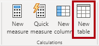
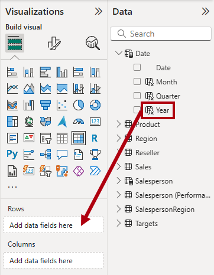
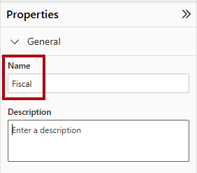
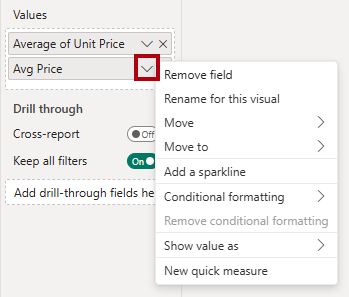

---
lab:
    title: 'Create DAX calculations in semantic models'
    module: 'Create DAX calculations in semantic models'
---

# Crear cálculos DAX en modelos semánticos

## Historia del laboratorio

En este laboratorio, crearás tablas calculadas, columnas calculadas y medidas simples utilizando Data Analysis Expressions (DAX).

En este laboratorio, aprenderás cómo:

- Crear tablas calculadas.
- Crear columnas calculadas.
- Crear medidas.

**Este laboratorio debería tomar aproximadamente 45 minutos.**

## Comenzar

Para completar este ejercicio, primero abre un navegador web e ingresa la siguiente URL para descargar el archivo zip:

`https://github.com/MicrosoftLearning/PL-300-Microsoft-Power-BI-Data-Analyst/raw/Main/Allfiles/Labs/04-create-dax-calculations\04-dax-calculations.zip`

Extrae el archivo en la carpeta: **C:\Users\Student\Downloads\04-dax-calculations**.

Abre el archivo **04-Starter-Sales Analysis.pbix**.

> _**Nota**: Puedes descartar el inicio de sesión seleccionando **Cancelar**. Cierra cualquier otra ventana informativa. Selecciona **Aplicar más tarde**, si se te solicita aplicar cambios._

## Crear la tabla calculada Salesperson

En esta tarea, crearás la tabla calculada `Salesperson` (que tendrá una relación directa con la tabla `Sales`).

Una tabla calculada se crea ingresando primero el nombre de la tabla, seguido del símbolo igual (=), seguido de una fórmula DAX que devuelve una tabla. El nombre de la tabla no puede existir previamente en el modelo de datos.

Ingresas una fórmula DAX válida en la _barra de fórmulas_. La barra de fórmulas incluye características como autocompletado, Intellisense y colores, que te permiten ingresar la fórmula de manera rápida y precisa.

1. En Power BI Desktop, en Report view, en la pestaña **Modeling**, dentro del grupo **Calculations**, selecciona **New Table**.

    

1. En la barra de fórmulas (que se abre directamente debajo de la cinta cuando creas o editas cálculos), escribe `Salesperson =`, presiona **Shift+Enter**, escribe `'Salesperson (Performance)'`, y luego presiona **Enter**.

    > _**Nota**: Para tu conveniencia, todas las definiciones DAX en este laboratorio pueden copiarse del archivo de snippets, ubicado en **04-dax-calculations\Snippets.txt**._

    

    > _Esta definición de tabla crea una copia de la tabla `Salesperson (Performance)`. Copia solo los datos, sin embargo, propiedades del modelo como visibilidad, formato y otras no se copian._

1. En el panel **Data**, observa que el icono de la nueva tabla tiene una calculadora adicional al frente (denotando una tabla calculada).

    

    > _**Nota**: Las tablas calculadas se definen usando una fórmula DAX que devuelve una tabla. Es importante entender que las tablas calculadas aumentan el tamaño del modelo de datos porque materializan y almacenan valores. Además, se recomputan cada vez que las dependencias de la fórmula se actualizan, como será el caso para este modelo de datos cuando se carguen nuevos valores de fecha (futuros) en las tablas._
    >
    > _A diferencia de las tablas de Power Query, las tablas calculadas no pueden usarse para cargar datos de fuentes externas. Solo pueden transformar datos basados en lo que ya se ha cargado en el modelo de datos._

1. Cambia a Model view, y observa que la tabla `Salesperson` está disponible.

1. Crea una relación desde la columna `Salesperson | EmployeeKey` a la columna `Sales | EmployeeKey`.

    > _Los laboratorios usan una notación abreviada para referirse a un campo. Se verá así: `Salesperson | EmployeeKey`. En este ejemplo, `Salesperson` es el nombre de la tabla y `EmployeeKey` es el nombre de la columna._

1. Haz clic derecho en la relación inactiva (línea punteada) entre las tablas `Salesperson (Performance)` y `Sales`, y luego selecciona **Delete**. Cuando se te solicite confirmar la eliminación, selecciona **Yes**.

1. En la tabla `Salesperson`, selecciona múltiples las siguientes columnas, y luego ocúltalas (establece la propiedad **Is Hidden** en _Yes_):

    - `EmployeeID`
    - `EmployeeKey`
    - `UPN`

1. En el diagrama del modelo, selecciona la tabla `Salesperson`.

1. En el panel **Properties**, en el cuadro **Description**, ingresa: _Salesperson related to sales_

    > _Puedes recordar que las descripciones aparecen como tooltips en el panel **Data** cuando el usuario pasa el cursor sobre una tabla o campo._

1. Para la tabla `Salesperson (Performance)`, establece la descripción en: _Salesperson related to region(s)_

> _El modelo de datos ahora proporciona dos alternativas al analizar vendedores. La tabla `Salesperson` permite analizar ventas realizadas por un vendedor, mientras que la tabla `Salesperson (Performance)` permite analizar ventas realizadas en las regiones de ventas asignadas al vendedor._

## Crear la tabla Date

En esta tarea, crearás la tabla `Date`.

1. Cambia a Table view. En la pestaña **Home**, dentro del grupo **Calculations**, selecciona **New Table**.

    

1. En la barra de fórmulas, ingresa el siguiente DAX:

    ```dax
    Date =  
    CALENDARAUTO(6)
    ```

    

    > _La función `CALENDARAUTO` devuelve una tabla de una sola columna que comprende valores de fecha. El comportamiento "auto" escanea todas las columnas de fecha del modelo de datos para determinar los valores de fecha más tempranos y más tardíos almacenados en el modelo. Luego crea una fila para cada fecha dentro de este rango, extendiendo el rango en cualquier dirección para asegurar que se almacenen años completos de datos._
    >
    > _Esta función puede tomar un único argumento opcional que es el último número de mes de un año. Cuando se omite, el valor es 12, lo que significa que diciembre es el último mes del año. En este caso, se ingresa 6, lo que significa que junio es el último mes del año._

1. Observa la columna de valores de fecha que podrían estar formateados usando configuraciones regionales de EE. UU. (es decir, mm/dd/aaaa).

    

1. En la esquina inferior izquierda, en la barra de estado, observa las estadísticas de la tabla, que confirman que se han generado 1826 filas de datos, lo que representa cinco años completos de datos.

    

## Crear columnas calculadas

En esta tarea, agregarás más columnas para permitir filtrar y agrupar por diferentes períodos de tiempo. También crearás una columna calculada para controlar el orden de clasificación de otras columnas.

> _**Nota**: Para tu conveniencia, todas las definiciones DAX en este laboratorio pueden copiarse del archivo **Snippets.txt**._

1. En la pestaña contextual **Table Tools**, dentro del grupo **Calculations**, selecciona **New Column**.

    > _Una columna calculada se crea ingresando primero el nombre de la columna, seguido del símbolo igual (=), seguido de una fórmula DAX que devuelve un resultado de un solo valor. El nombre de la columna no puede existir previamente en la tabla._

    

1. En la barra de fórmulas, escribe lo siguiente (o copia del archivo de snippets), y luego presiona **Enter**:

    > _La fórmula usa el valor del año de la fecha pero suma uno al valor del año cuando el mes es posterior a junio. Así se calculan los años fiscales en Adventure Works._

   ```dax
   Year =
   "FY" & YEAR('Date'[Date]) + IF(MONTH('Date'[Date]) > 6, 1)
   ```

1. Usa las definiciones del archivo de snippets para crear las siguientes dos columnas calculadas para la tabla `Date`:

    - `Quarter`
    - `Month`

1. Verifica que las nuevas columnas se hayan agregado.

    

1. Para validar los cálculos, cambia a Report view.

1. Para crear una nueva página de informe, selecciona el icono de más junto a **Page 1**.

    

1. Para agregar un visual de matriz a la nueva página de informe, en el panel **Visualizations**, selecciona el tipo de visual de matriz.

    > _Consejo: Puedes pasar el cursor sobre cada icono para revelar un tooltip que describe el tipo de visual._

    

1. En el panel **Data**, dentro de la tabla `Date`, arrastra el campo `Year` al pozo **Rows**.

    

1. Arrastra el campo `Month` al pozo **Rows**, directamente debajo del campo `Year`.

1. En la parte superior derecha del visual de matriz (o inferior, dependiendo de la ubicación del visual), selecciona el icono de doble flecha bifurcada (que expandirá todos los años un nivel hacia abajo).

    

1. Observa que los años se expanden a meses, y que los meses se ordenan alfabéticamente en lugar de cronológicamente.

    

    > _Por defecto, los valores de texto se ordenan alfabéticamente, los números de menor a mayor, y las fechas de más tempranas a más tardías._

1. Para personalizar el orden de clasificación del campo `Month`, cambia a Table view.

1. Agrega la columna `MonthKey` a la tabla `Date`.

    ```dax
    MonthKey =
    (YEAR('Date'[Date]) * 100) + MONTH('Date'[Date])
    ```

    > _Esta fórmula calcula un valor numérico para cada combinación de año/mes._

1. En Table view, verifica que la nueva columna contenga valores numéricos (por ejemplo, 201707 para julio de 2017, etc.).

    

1. Cambia de nuevo a Report view.

1. En el panel **Data**, selecciona el campo `Month`.

1. En la pestaña contextual **Column Tools**, dentro del grupo **Sort**, selecciona **Sort by Column**, y luego selecciona **MonthKey**.

    

1. En el visual de matriz, observa que los meses ahora están ordenados cronológicamente.

    

## Completar la tabla Date

En esta tarea, completarás el diseño de la tabla `Date` ocultando una columna y creando una jerarquía. Luego crearás relaciones con las tablas `Sales` y `Targets`.

1. Cambia a Model view.

1. En la tabla `Date`, oculta la columna `MonthKey` (establece **Is Hidden** en _Yes_).

1. En el panel **Data**, selecciona la tabla `Date`, haz clic derecho en la columna `Year`, y luego selecciona **Create hierarchy**.

    

1. En el panel **Properties**, en el cuadro **Name**, reemplaza el valor con _Fiscal_.

    

1. Para agregar dos niveles a la jerarquía, en la lista desplegable **Hierarchy**, selecciona **Quarter** y luego selecciona **Month**, y luego selecciona **Apply Level Changes**.

    

1. Crea las siguientes dos relaciones de modelo:

    - `Date | Date` a `Sales | OrderDate`
    - `Date | Date` a `Targets | TargetMonth`

1. Oculta las siguientes dos columnas:

    - `Sales | OrderDate`
    - `Targets | TargetMonth`

## Marcar la tabla Date

En esta tarea, marcarás la tabla `Date` como una tabla de fecha.

1. Cambia a Report view.

1. En el panel **Data**, selecciona la tabla `Date` (no el campo `Date`).

1. En la pestaña contextual **Table Tools**, dentro del grupo **Calendars**, selecciona **Mark as Date Table**.

    

1. En la ventana **Mark as a Date Table**, desliza la propiedad **Mark as a Date Table** a _Yes_.

1. En la lista desplegable **Choose a date column**, selecciona **Date**.

    

1. Selecciona **Save**.

1. Guarda el archivo de Power BI Desktop.

> _Power BI Desktop ahora entiende que esta tabla define fecha (tiempo)._
>
> _Este enfoque de diseño para una tabla de fecha es adecuado cuando no tienes una tabla de fecha en tu fuente de datos. Si tienes un almacén de datos, sería apropiado cargar datos de fecha desde su tabla de dimensión de fecha en lugar de "redefinir" la lógica de fecha en tu modelo de datos._

## Crear medidas simples

En esta tarea, crearás medidas simples. Las medidas simples agregan valores en una sola columna o cuentan filas de una tabla.

1. En Report view, en **Page 2**, desde el panel **Data**, arrastra el campo `Sales | Unit Price` al visual de matriz.

    

1. En el panel de campos del visual (ubicado en el panel **Visualizations**), en el pozo **Values**, observa que el campo `Unit Price` está configurado como **Average of Unit Price**.

    

1. Selecciona la flecha hacia abajo para **Average of Unit Price**, y luego observa las opciones de menú disponibles.

    > _Las columnas numéricas visibles permiten a los autores de informes en tiempo de diseño decidir cómo se resumirán los valores de las columnas (o no). Sin embargo, esto puede resultar en informes inapropiados._
    >
    > _Algunos modeladores de datos no les gusta dejar las cosas al azar, por lo que eligen ocultar estas columnas y en su lugar exponer la lógica de agregación definida en medidas. Es el enfoque que tomarás ahora en este laboratorio._

1. Para crear una medida, en el panel **Data**, haz clic derecho en la tabla `Sales`, y luego selecciona **New Measure**.

1. En la barra de fórmulas, agrega la siguiente definición de medida:

    ```DAX
    Avg Price =  
    AVERAGE(Sales[Unit Price])
    ```

1. Agrega la medida `Avg Price` al visual de matriz, y observa que produce el mismo resultado que la columna `Unit Price` (pero con diferente formato).

1. En el pozo **Values**, abre el menú contextual para el campo `Avg Price`, y observa que no es posible cambiar la técnica de agregación.

    

    > _No es posible modificar el comportamiento de agregación de una medida._

1. Usa las definiciones del archivo de snippets para crear las siguientes cinco medidas para la tabla `Sales`:

    - `Median Price`
    - `Min Price`
    - `Max Price`
    - `Orders`
    - `Order Lines`

    > _La función `DISTINCTCOUNT` usada en la medida `Orders` cuenta órdenes solo una vez (ignorando duplicados). La función `COUNTROWS` usada en la medida `Order Lines` opera sobre una tabla._
    >
    > _En este caso, el número de órdenes se calcula contando los valores distintos de la columna `SalesOrderNumber`, mientras que el número de líneas de órdenes es simplemente el número de filas de la tabla (cada fila es una línea de una orden)._

1. Cambia a Model view, y luego selecciona múltiples las cuatro medidas de precio: `Avg Price`, `Max Price`, `Median Price`, y `Min Price`.

1. Para la selección múltiple de medidas, configura los siguientes requisitos:

    - Establece el formato con dos decimales.
    - Asigna a una carpeta de visualización llamada _Pricing_ (usa la propiedad **Display folder** en el panel **Properties**).

    

1. Oculta la columna `Unit Price`.

    > _La columna `Unit Price` ya no está disponible para los autores de informes. Deben usar las medidas de precio que has agregado al modelo. Este enfoque de diseño asegura que los autores de informes no agreguen precios de manera inapropiada, por ejemplo, sumándolos._

1. Selecciona múltiples las medidas `Order Lines` y `Orders`, y luego configura los siguientes requisitos:

    - Establece el formato para usar el separador de miles.
    - Asigna a una carpeta de visualización llamada _Counts_.

    

1. En Report view, en el pozo **Values** del visual de matriz, para **Average of Unit Price**, selecciona **X** para eliminarlo.

    

1. Aumenta el tamaño del visual de matriz para llenar el ancho y alto de la página.

1. Agrega las siguientes cinco medidas al visual de matriz:

    - `Median Price`
    - `Min Price`
    - `Max Price`
    - `Orders`
    - `Order Lines`

1. Verifica que los resultados parezcan sensatos y estén correctamente formateados.

    

## Crear medidas adicionales

En esta tarea, crearás más medidas que usan fórmulas más complejas.

1. En Report view, selecciona **Page 1** y revisa el visual de tabla de vendedores (a la derecha), observando el total para la columna **Sum of Target**.

    

1. Selecciona el visual de tabla, y luego en el panel **Visualizations**, elimina **Sum of Target**.

1. Renombra la columna `Targets | Target` como _TargetAmount_.

    > _Consejo: Hay varias formas de renombrar la columna en Report view: En el panel **Data**, puedes hacer clic derecho en la columna, y luego seleccionar **Rename**—o, hacer doble clic en la columna, o presionar **F2**._

1. Crea la siguiente medida en la tabla `Targets`:

    ```dax
    Target =
    IF(
        HASONEVALUE('Salesperson (Performance)'[Salesperson]),
        SUM(Targets[TargetAmount])
    )
    ```

    > _La función `HASONEVALUE` prueba si se filtra un solo valor en la columna `Salesperson`. Cuando es verdadero, la expresión devuelve la suma de los montos objetivo (solo para ese vendedor). Cuando es falso, devuelve `BLANK`._

1. Formatea la medida `Target` para cero decimales.

    > _Consejo: Puedes usar la pestaña contextual **Measure Tools**._

1. Oculta la columna `TargetAmount`.

    > _Consejo: Puedes hacer clic derecho en la columna en el panel **Data**, y luego seleccionar **Hide**._

1. Observa que la tabla `Targets` ahora aparece en la parte superior de la lista.

    

    > _Las tablas que comprenden solo medidas visibles se enumeran automáticamente en la parte superior de la lista._

1. Agrega la medida `Target` al visual de tabla.

1. Observa que la columna **Target** total ahora es `BLANK`.

    

1. Usa las definiciones del archivo de snippets para crear las siguientes dos medidas para la tabla `Targets`:

    - `Variance`
    - `Variance Margin`

1. Formatea la medida `Variance` para cero decimales.

1. Formatea la medida `Variance Margin` como porcentaje con dos decimales.

1. Agrega las medidas `Variance` y `Variance Margin` al visual de tabla.

1. Ajusta el tamaño del visual de tabla para que se vean todas las columnas y filas.

    

    > _Si bien parece que todos los vendedores no están cumpliendo con el objetivo, recuerda que el visual de tabla aún no está filtrado por un período de tiempo específico. Producirás informes de rendimiento de ventas que filtran por un período de tiempo seleccionado por el usuario en el laboratorio **Design a Report in Power BI Desktop**._

1. Guarda el archivo de Power BI Desktop.

## Laboratorio completado
