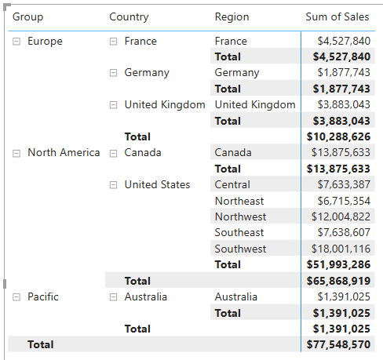

---
lab:
    title: 'Modify DAX filter context in Power BI'
    module: 'Modify DAX filter context in Power BI'
---

# Modificar el contexto de filtro DAX en Power BI

## Historia del laboratorio

En este laboratorio, crearás medidas con expresiones DAX que involucran manipulación del contexto de filtro.

Aprenderás cómo:

- Usar la función `CALCULATE` para manipular el contexto de filtro.

**Este laboratorio debería tomar aproximadamente 30 minutos.**

## Comenzar

Para completar este ejercicio, primero abre un navegador web e ingresa la siguiente URL para descargar el archivo zip:

`https://github.com/MicrosoftLearning/PL-300-Microsoft-Power-BI-Data-Analyst/raw/Main/Allfiles/Labs/05-modify-dax-filter-context/05-modify-dax-filter-context.zip`

Extrae el archivo en la carpeta: **C:\Users\Student\Downloads\05-modify-dax-filter-context**.

Abre el archivo **05-Starter-Sales Analysis.pbix**.

> _**Nota**: Puedes descartar el inicio de sesión seleccionando **Cancelar**. Cierra cualquier otra ventana informativa. Selecciona **Aplicar más tarde**, si se te solicita aplicar cambios._

## Crear un visual de matriz

En esta tarea, crearás un visual de matriz para probar tus nuevas medidas.

1. En Power BI Desktop, crea una nueva página de informe.

1. En **Page 3**, agrega un visual de matriz.

    

1. Ajusta el tamaño del visual de matriz para que llene toda la página.

1. Para configurar los campos del visual de matriz, desde el panel **Data**, arrastra la jerarquía `Region | Regions` y suéltala dentro del visual.

    > Los laboratorios usan una notación abreviada para referirse a un campo o jerarquía. Se verá así: `Region | Regions`. En este ejemplo, `Region` es el nombre de la tabla y `Regions` es el nombre de la jerarquía._

1. Agrega el campo `Sales | Sales` al pozo **Values**.

1. Para expandir toda la jerarquía, en la parte superior derecha del visual de matriz, selecciona el icono de doble flecha bifurcada dos veces.

    

1. Para formatear el visual, en el panel **Visualizations**, selecciona el panel **Format**.

    

1. En el cuadro **Search**, ingresa _Layout_.

1. Establece la propiedad **Layout** en _Tabular_.

    

1. Verifica que el visual de matriz ahora tenga 4 encabezados de columna.

    

    > _En Adventure Works, las regiones de ventas están organizadas en grupos, países y regiones. Todos los países, excepto Estados Unidos, tienen una sola región, que lleva el nombre del país. Como Estados Unidos es un territorio de ventas tan grande, se divide en cinco regiones de ventas._

Crearás varias medidas en este ejercicio y luego las probarás agregándolas al visual de matriz.

## Manipular el contexto de filtro

En esta tarea, crearás varias medidas con expresiones DAX que usan la función `CALCULATE` para manipular el contexto de filtro.

> _La función `CALCULATE` es una función poderosa que puedes usar para manipular el contexto de filtro. El primer argumento toma una expresión o una medida (una medida es solo una expresión nombrada). Los argumentos posteriores permiten modificar el contexto de filtro._

1. Agrega una medida a la tabla `Sales`, basada en la siguiente expresión:

    > _**Nota**: Para tu conveniencia, todas las definiciones DAX en este laboratorio pueden copiarse del archivo **C:\Users\Student\Downloads\05-modify-dax-filter-context\Snippets.txt**._

    ```dax
    Sales All Region =
    CALCULATE(
        SUM(Sales[Sales]),
        REMOVEFILTERS(Region)
    )
    ```

    > _La función `REMOVEFILTERS` elimina los filtros activos. Puede no tomar argumentos, o tomar una tabla, una columna o múltiples columnas como argumento._
    >
    > _En esta fórmula, la medida evalúa la suma de la columna `Sales` en un contexto de filtro modificado, que elimina cualquier filtro aplicado a las columnas de la tabla `Region`._

1. Agrega la medida `Sales All Region` al visual de matriz.

    

1. Observa que la medida calcula el total de todas las ventas de la región para cada región, país (subtotal) y grupo (subtotal).

    > _La nueva medida aún no proporciona un resultado útil. Cuando las ventas de un grupo, país o región se dividen por este valor, producirá una proporción útil conocida como "porcentaje del total general"._

1. En el panel **Data**, asegúrate de que la medida `Sales All Region` esté seleccionada (cuando está seleccionada, tendrá un fondo gris oscuro), y luego en la barra de fórmulas, reemplaza el nombre y la fórmula de la medida con la siguiente fórmula:

    > _Consejo: Para reemplazar la fórmula existente, primero copia el snippet. Luego, selecciona dentro de la barra de fórmulas y presiona **Ctrl+A** para seleccionar todo el texto. Luego, presiona **Ctrl+V** para pegar el snippet y sobrescribir el texto seleccionado. Luego presiona **Enter**._

    ```dax
    Sales % All Region =
    DIVIDE(
        SUM(Sales[Sales]),
        CALCULATE(
            SUM(Sales[Sales]),
            REMOVEFILTERS(Region)
        )
    )
    ```

    > _La medida ha sido renombrada para reflejar con precisión la fórmula actualizada. La función `DIVIDE` divide la suma de la columna `Sales` (no modificada por el contexto de filtro) por la suma de la columna `Sales` en un contexto modificado, que elimina cualquier filtro aplicado a la tabla `Region`._

1. En el visual de matriz, observa que la medida ha sido renombrada y que ahora aparece un valor diferente para cada grupo, país y región.

1. Formatea la medida `Sales % All Region` como un porcentaje con dos decimales.

1. En el visual de matriz, revisa los valores de la medida `Sales % All Region`.

    

1. Agrega otra medida a la tabla `Sales`, basada en la siguiente expresión, y formatea como porcentaje:

    ```dax
    Sales % Country =
    DIVIDE(
        SUM(Sales[Sales]),
        CALCULATE(
            SUM(Sales[Sales]),
            REMOVEFILTERS(Region[Region])
        )
    )
    ```

1. Observa que la fórmula de la medida `Sales % Country` difiere ligeramente de la fórmula de la medida `Sales % All Region`.

    > _La diferencia es que el denominador modifica el contexto de filtro eliminando los filtros en la columna `Region` de la tabla `Region`, no todas las columnas de la tabla `Region`. Esto significa que se conservan los filtros aplicados a las columnas de grupo o país. Logrará un resultado que representa las ventas como un porcentaje del país._

1. Agrega la medida `Sales % Country` al visual de matriz.

1. Observa que solo las regiones de Estados Unidos producen un valor que no es 100 por ciento.

    

    > _Puedes recordar que solo Estados Unidos tiene múltiples regiones. Todos los demás países comprenden una sola región, lo que explica por qué todos son 100 por ciento._

1. Para mejorar la legibilidad de esta medida en el visual, sobrescribe la medida `Sales % Country` con la siguiente fórmula mejorada.

    ```dax
    Sales % Country =
    IF(
        ISINSCOPE(Region[Region]),
        DIVIDE(
            SUM(Sales[Sales]),
            CALCULATE(
                SUM(Sales[Sales]),
                REMOVEFILTERS(Region[Region])
            )
        )
    )
    ```

    > _La función `IF` usa la función `ISINSCOPE` para probar si la columna de región es el nivel en una jerarquía de niveles. Cuando es verdadero, se evalúa la función `DIVIDE`. Cuando es falso, se devuelve `BLANK` porque la columna de región no está en el ámbito._

1. Observa que la medida `Sales % Country` ahora solo devuelve un valor cuando una región está en el ámbito.

    

1. Agrega otra medida a la tabla `Sales`, basada en la siguiente expresión, y formatea como porcentaje:

    ```dax
    Sales % Group =
    DIVIDE(
        SUM(Sales[Sales]),
        CALCULATE(
            SUM(Sales[Sales]),
            REMOVEFILTERS(
                Region[Region],
                Region[Country]
            )
        )
    )
    ```

    > _Para lograr las ventas como un porcentaje del grupo, se pueden aplicar dos filtros para eliminar efectivamente los filtros en dos columnas._

1. Agrega la medida `Sales % Group` al visual de matriz.

1. Para mejorar la legibilidad de esta medida en el visual, sobrescribe la medida `Sales % Group` con la siguiente fórmula.

    ```dax
    Sales % Group =
    IF(
        ISINSCOPE(Region[Region])
            || ISINSCOPE(Region[Country]),
        DIVIDE(
            SUM(Sales[Sales]),
            CALCULATE(
                SUM(Sales[Sales]),
                REMOVEFILTERS(
                    Region[Region],
                    Region[Country]
                )
            )
        )
    )
    ```

1. Observa que la medida `Sales % Group` ahora solo devuelve un valor cuando una región o país está en el ámbito.

1. En Model view, coloca las tres nuevas medidas en una carpeta de visualización llamada _Ratios_.

    

1. Guarda el archivo de Power BI Desktop.

> _Las medidas agregadas a la tabla `Sales` han modificado el contexto de filtro para lograr una navegación jerárquica. Observa que el patrón para lograr el cálculo de un subtotal requiere eliminar algunas columnas del contexto de filtro, y para llegar a un total general, se deben eliminar todas las columnas._

## Laboratorio completado
