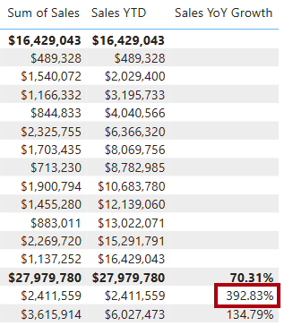

---
lab:
    title: 'Use DAX time intelligence functions in Power BI'
    module: 'Use DAX time intelligence functions in Power BI'
---

# Usar funciones de inteligencia de tiempo DAX en Power BI

## Historia del laboratorio

En este laboratorio, crearás medidas con expresiones DAX que involucran inteligencia de tiempo.

En este laboratorio, aprenderás cómo:

- Usar varias funciones de inteligencia de tiempo para manipular el contexto de filtro relacionado con fechas específicas.

**Este laboratorio debería tomar aproximadamente 15 minutos.**

## Comenzar

Para completar este ejercicio, primero abre un navegador web e ingresa la siguiente URL para descargar el archivo zip:

`https://github.com/MicrosoftLearning/PL-300-Microsoft-Power-BI-Data-Analyst/raw/Main/Allfiles/Labs/06-use-dax-time-intelligence/06-time-intelligence.zip`

Extrae el archivo en la carpeta: **C:\Users\Student\Downloads\06-time-intelligence**.

Abre el archivo **06-Starter-Sales Analysis.pbix**.

> _**Nota**: Puedes descartar el inicio de sesión seleccionando **Cancelar**. Cierra cualquier otra ventana informativa. Selecciona **Aplicar más tarde**, si se te solicita aplicar cambios._

## Crear una medida YTD

En esta tarea, crearás una medida de ventas año hasta la fecha (YTD) usando funciones de inteligencia de tiempo.

1. En Power BI Desktop, en Report view, en **Page 2**, observa el visual de matriz que muestra varias medidas con años y meses agrupados en las filas.

2. Agrega una medida a la tabla `Sales`, basada en la siguiente expresión, y formateada con cero decimales:

    ```dax
    Sales YTD =
    TOTALYTD(
        SUM(Sales[Sales]),
        'Date'[Date],
        "6-30"
    )
    ```

    > _La función `TOTALYTD` evalúa una expresión—en este caso la suma de la columna `Sales`—sobre una columna de fecha dada. La columna de fecha debe pertenecer a una tabla de fecha marcada como tal._
    >
    > _La función también puede tomar un tercer argumento opcional que representa la última fecha de un año. La ausencia de esta fecha significa que el 31 de diciembre es la última fecha del año. Para Adventure Works, junio es el último mes de su año, por lo que se usa "6-30"._

3. Agrega el campo `Sales` y la medida `Sales YTD` al visual de matriz.

4. Observa la acumulación de valores de ventas dentro del año.

    

> _La función `TOTALYTD` realiza manipulación de filtros, específicamente manipulación de filtros de tiempo. Por ejemplo, para calcular las ventas YTD para septiembre de 2017 (el tercer mes del año fiscal), todos los filtros en la tabla `Date` se eliminan y se reemplazan con un nuevo filtro de fechas que comienzan al inicio del año (1 de julio de 2017) y se extienden hasta la última fecha del período de fecha en contexto (30 de septiembre de 2017)._
>
> _Hay muchas [funciones de inteligencia de tiempo](/dax/time-intelligence-functions-dax/?azure-portal=true) disponibles en DAX para admitir manipulaciones comunes de filtros de tiempo._

## Crear una medida de crecimiento YoY

En esta tarea, crearás una medida de crecimiento interanual (YoY) de ventas usando una variable.

> Las variables te ayudan a simplificar la fórmula y son más eficientes si usas la lógica varias veces dentro de una fórmula. Las variables se declaran con un nombre único, y la expresión de la medida debe luego devolverse después de la palabra clave `RETURN`. A diferencia de algunos otros lenguajes de programación, las variables DAX solo pueden usarse dentro de la única fórmula._

1. Agrega otra medida a la tabla `Sales`, basada en la siguiente expresión:

    ```dax
    Sales YoY Growth =
    VAR SalesPriorYear =
        CALCULATE(
            SUM(Sales[Sales]),
            PARALLELPERIOD(
                'Date'[Date],
                -12,
                MONTH
            )
        )
    RETURN
        SalesPriorYear
    ```

    > _A la variable `SalesPriorYear` se le asigna una expresión que calcula la suma de la columna `Sales` en un contexto modificado. Ese contexto usa la función `PARALLELPERIOD` para retroceder 12 meses desde cada fecha en el contexto de filtro._

1. Agrega la medida `Sales YoY Growth` al visual de matriz.

1. Observa que la nueva medida devuelve `BLANK` para los primeros 12 meses (porque no se registraron ventas antes del año fiscal 2017).

1. Observa que el valor de la medida `Sales YoY Growth` para _2018 Jul_ es el valor de ventas para _2017 Jul_.

    

    > _Ahora que se ha probado la "parte difícil" de la fórmula, puedes sobrescribir la medida con la fórmula final que calcula el resultado de crecimiento._

1. Para completar la medida, sobrescribe la medida `Sales YoY Growth` con esta fórmula, formateándola como un porcentaje con dos decimales:

    ```dax
    Sales YoY Growth =
    VAR SalesPriorYear =
        CALCULATE(
            SUM(Sales[Sales]),
            PARALLELPERIOD(
                'Date'[Date],
                -12,
                MONTH
            )
        )
    RETURN
        DIVIDE(
            (SUM(Sales[Sales]) - SalesPriorYear),
            SalesPriorYear
        )
    ```

1. En la fórmula, en la cláusula `RETURN`, observa que la variable se referencia dos veces.

1. Verifica que el crecimiento YoY para _2018 Jul_ es 392.83 por ciento.

    

    > _La medida de crecimiento YoY identifica un aumento de casi 400 por ciento (o 4x) en las ventas durante el mismo período del año anterior._

1. En Model view, coloca las dos nuevas medidas en una carpeta de visualización llamada _Time intelligence_.

    

1. Guarda el archivo de Power BI Desktop.

## Laboratorio completado
