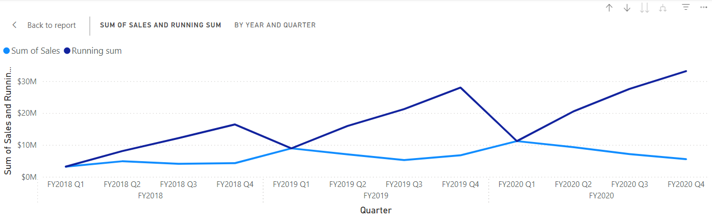

---
lab:
    title: 'Create visual calculations in Power BI Desktop'
    module: 'Create visual calculations in Power BI Desktop'
---

# Crear cálculos visuales en Power BI Desktop

## **Historia del laboratorio**

En este laboratorio, crearás cálculos visuales usando Data Analysis Expressions (DAX).

Aprenderás cómo:

- Crear y editar cálculos visuales.
- Usar las funciones PREVIOUS(), RUNNINGSUM() y MOVINGAVERAGE() para crear métricas de comparación entre cada año fiscal.
- Usar el parámetro opcional Axis al crear métricas de comparación.
- Usar el parámetro opcional Reset para personalizar cálculos acumulativos en un eje multinivel.

**Este laboratorio debería tomar aproximadamente 30 minutos.**

## Comenzar

Para completar este ejercicio, primero abre un navegador web e ingresa la siguiente URL para descargar la carpeta zip:

`https://github.com/MicrosoftLearning/PL-300-Microsoft-Power-BI-Data-Analyst/raw/Main/Allfiles/Labs/07-create-visual-calculations/07-visual-calculations.zip`

Extrae la carpeta en: **C:\Users\Student\Downloads\07-visual-calculations**.

Abre el archivo **07-Starter-Sales Analysis.pbix**.

> ***Nota**: Puedes descartar el inicio de sesión seleccionando **Cancelar**. Cierra cualquier otra ventana informativa. Selecciona **Aplicar más tarde**, si se te solicita aplicar cambios.*

## Crear un gráfico de barras

En esta tarea, crearás un gráfico de barras que muestra el monto de ventas, costo total de producto y ganancia por año fiscal, con métricas de comparación como tooltips.

1. En el panel **Visualizaciones**, selecciona el tipo de visual gráfico de barras agrupadas.

   

1. En el panel **Datos**, desde la tabla **Date**, arrastra el campo **Year** al área **Eje Y**.

1. Arrastra los campos **Sales** y **Cost** de la tabla **Sales** al área **Eje X**.

    > Observa que cuando agregaste Sales y Cost al visual, la suma de cada campo se calculó automáticamente.

1. Ordena el gráfico de barras resultante por **Year** ascendente usando el menú de tres puntos y seleccionando **Year** seguido de **Sort ascending**:

   

    > Ahora tienes un gráfico de barras que muestra la Suma de Ventas y Suma de Costos por Año ordenados cronológicamente.

### Agregar cálculos

1. Con el gráfico de barras seleccionado, selecciona **New visual calculation** en la cinta:

   

1. Se abre la ventana de edición de cálculos visuales. En la barra de fórmulas sobre la matriz visual ingresa la siguiente expresión y presiona Enter para confirmar:

    ```DAX
   Profit = [Sum of Sales] - [Sum of Cost]
    ```

1. Confirma que ahora ves una columna Profit en la matriz visual en la parte inferior de la pantalla:

   

1. Expande el menú bajo **New visual calculation** y selecciona **Versus previous** de las opciones de plantilla:

    > **Versus Previous** compara un valor con un valor precedente, por lo que vemos la Ganancia comparada con el valor anterior para el Año.

   

1. En la barra de fórmulas, reemplaza el marcador `[Field]` con `[Profit]` dos veces y confirma el cálculo.

1. Selecciona **Running sum** del menú de plantillas y reemplaza el marcador `[Field]` con `[Profit]` y confirma el cálculo.

    > **Running sum** calcula la suma de valores, añadiendo el valor actual a los valores precedentes, por lo que vemos el total de los años actuales y anteriores.

1. Selecciona **Moving average** del menú de plantillas y reemplaza el marcador `[Field]` con `[Profit]` y el marcador `WindowSize` con 2. Deberías tener ahora la siguiente configuración:

    > **Moving average** calcula un promedio de un conjunto de valores en una ventana dada dividiendo la suma de los valores por el tamaño de la ventana. Al establecer el tamaño de ventana en 2, estamos calculando el promedio de dos valores consecutivos. En este ejemplo, los valores son ganancias anuales, por lo que vemos que el promedio móvil para FY2019 es el promedio de las ganancias para FY2018 y FY2019.

   

1. Bajo el área **Eje X**, selecciona el icono de visibilidad de los siguientes campos para ocultarlos del visual:

    - Sum of Sales
    - Sum of Cost
    - Profit

   

    > Observa cómo los campos y cálculos que ocultaste ya no se muestran en el visual.

1. En el panel **Visualizaciones**, arrastra **Running sum** y **Moving average** al área **Tooltips**.  

1. Confirma que el visual ahora cumple con los objetivos. Sal de la pantalla de edición de cálculos visuales a tu informe:

   

    > Ahora tienes un gráfico de barras con los siguientes valores: Suma de Ventas, Suma de Costos, Ganancia, y Ganancia *versus previous* con tooltips para Ganancia *running sum* y Ganancia *moving average*.

## Crear un visual de matriz

En esta tarea, crearás un visual de matriz que compara el monto de ventas por categoría contra el primer año fiscal para cada uno de los años siguientes.

1. En **Vista de informe**, crea una nueva página de informe.

1. En **Página 2**, añade un visual de matriz.

1. Añade los siguientes campos a las áreas del visual:

    - Filas: **Product \| Category**
    - Columnas: **Date \| Year**
    - Valores: **Sales \| Sales**

    > *Los laboratorios usan una notación abreviada para referirse a un campo. Se verá así: **Date \| Year**. En este ejemplo, **Date** es el nombre de la tabla y **Year** es el nombre del campo.*

### Agregar cálculos

1. Con la matriz seleccionada, selecciona **New visual calculation** en la cinta.

1. En la ventana de edición de cálculos visuales, escribe y guarda el siguiente cálculo:

    ```DAX
   Versus first = [Sum of Sales] - FIRST([Sum of Sales])
    ```

    > Observa cómo la matriz muestra la diferencia en el monto de ventas para cada categoría versus la primera categoría.

1. Selecciona el campo **Versus first** en el área **Values** y actualiza tu cálculo añadiendo el valor ROWS para el parámetro Axis a FIRST:

    ```DAX
   Versus first = [Sum of Sales] - FIRST([Sum of Sales], ROWS)
    ```

    > Observa cómo nada cambia ya que ROWS es el valor predeterminado para el parámetro Axis.

1. Reemplaza ROWS con COLUMNS y observa que el cálculo ahora compara el monto de ventas por categoría contra el primer año fiscal:

   

    > Observa cómo la columna **Versus first** para **Total Sales** retorna cero en lugar de la diferencia contra el primer año fiscal. **Total Sales** está en un nivel jerárquico diferente a las sumas anuales, y por lo tanto, se considera la primera columna en ese nivel.

1. Sal de la pantalla de edición de cálculos visuales a tu informe.

## Crear un gráfico de líneas

En esta tarea, crearás un gráfico de líneas que muestra la suma acumulada para ventas. Esta suma se reiniciará al comienzo de cada año fiscal.

1. En **Vista de informe**, crea una nueva página de informe.

1. En **Página 3**, añade un visual de gráfico de líneas.

1. Añade los siguientes campos a las áreas del visual:

    - Eje X: **Date \| Year** y **Date \| Quarter**
    - Eje Y: **Sales \| Sales**

### Agregar suma acumulada

1. Con el gráfico de líneas seleccionado, expande el menú bajo **New visual calculation** y selecciona **Running sum** de las opciones de plantilla.

1. Reemplaza el marcador `[Field]` con `[Sum of Sales]` y confirma el cambio. El visual debería verse así:

   

### Actualizar suma acumulada para reiniciar cada nuevo año fiscal

1. Mientras aún estás en la ventana de edición de cálculos visuales, selecciona el campo **Running sum** bajo **Y-axis** y actualiza la expresión para este cálculo añadiendo el parámetro de reinicio HIGHESTPARENT y confirma los cambios:

    ```DAX
   Running sum = RUNNINGSUM([Sum of Sales], HIGHESTPARENT)
    ```

Verifica que la suma acumulada efectivamente se reinicia para cada nuevo año fiscal:

   

## Laboratorio completado
