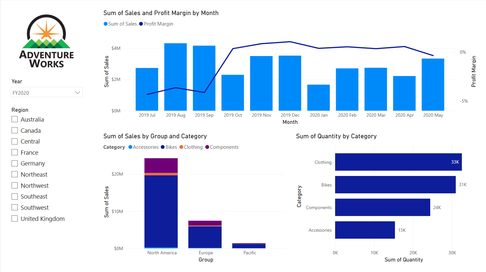
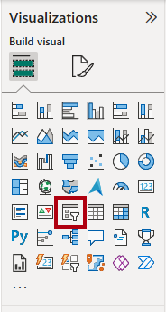
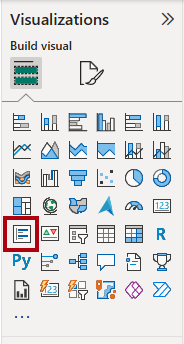
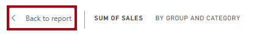

---
lab:
    title: 'Design Power BI reports'
    module: 'Design Power BI reports'
---

# Diseño de informes en Power BI  

## Historia del laboratorio

En este laboratorio, crearás un informe de tres páginas. Luego, lo publicarás en el servicio Power BI, donde podrás abrirlo e interactuar con él.  

En este laboratorio, aprenderás a:

- Diseñar un informe.  
- Configurar campos visuales y propiedades de formato.  
- Sincronizar slicers.  
- Publicar el informe en el servicio Power BI.  
- Interactuar con un informe y sus visualizaciones.  

**Este laboratorio debería tomar aproximadamente 45 minutos.**  

## Comenzar

Para completar este ejercicio, primero abre un navegador web e ingresa la siguiente URL para descargar un archivo zip:  

`https://github.com/MicrosoftLearning/PL-300-Microsoft-Power-BI-Data-Analyst/raw/Main/Allfiles/Labs/08-design-power-bi-reports/08-design-report.zip`  

Extrae el archivo en la carpeta **C:\Users\Student\Downloads\08-design-report**.  

Abre el archivo **08-Starter-Sales Analysis.pbix**.  

> _**Nota**: Puedes omitir el inicio de sesión seleccionando **Cancelar**. Cierra cualquier otra ventana informativa. Selecciona **Apply Later** si se te solicita aplicar cambios._  

## Diseñar la página 1

En este ejercicio, diseñarás la primera página del informe. Cuando completes el diseño, la página se verá así:  

  

1. En Power BI Desktop, para renombrar la página, en la parte inferior izquierda, haz clic derecho en **Page 1** y selecciona **Rename**. Cambia el nombre a _Overview_.  

    > _**Consejo**: También puedes hacer doble clic en el nombre de la página para cambiarlo._  

1. Para agregar una imagen, en la pestaña **Insert**, dentro del grupo **Elements**, selecciona **Image**.  

      

1. En la ventana **Open**, navega hasta la carpeta **C:\Users\Student\Downloads\08-design-report**.  

1. Selecciona el archivo **AdventureWorksLogo.jpg** y haz clic en **Open**.  

1. Arrastra la imagen para posicionarla en la esquina superior izquierda y ajusta su tamaño usando los marcadores de guía.  

      

1. Para agregar un slicer, primero deselecciona la imagen haciendo clic en un área vacía del informe. Luego, selecciona **Slicer** en el panel **Visualizations**.  

      

1. En el panel **Data**, arrastra el campo `Date | Year` (no el nivel `Year` de la jerarquía) al área **Field** del slicer en el panel **Visualizations**.  

    > _Los laboratorios usan una notación abreviada para referirse a un campo. Se verá así: `Date | Year`. En este ejemplo, `Date` es el nombre de la tabla y `Year` es el nombre del campo._  

1. Para convertir el slicer de una lista a un dropdown, en el panel **Visualizations**, selecciona **Format your visual**. Expande **Slicer settings** y cambia el dropdown **Style** a **Dropdown**.  

      

1. Ajusta el tamaño y la posición del slicer para que quede debajo de la imagen y tenga el mismo ancho.  

      

1. En el slicer **Year**, abre la lista desplegable, selecciona **FY2020** y ciérrala.  

    > _La página del informe ahora está filtrada por el año **FY2020**._  

      

1. Deselecciona el slicer haciendo clic en un área vacía del informe.  

1. Crea un segundo slicer basado en el campo `Region | Region` (no el nivel `Region` de la jerarquía).  

1. Deja el slicer como una lista y ajusta su tamaño y posición para que quede debajo del slicer **Year**.  

      

1. Deselecciona el slicer haciendo clic en un área vacía del informe.  

1. Para agregar un gráfico a la página, en el panel **Visualizations**, selecciona el tipo de visualización **Line and Stacked Column Chart**.  

      

1. Ajusta el tamaño y la posición del gráfico para que quede a la derecha del logo y ocupe el ancho total de la página.  

      

1. Arrastra y suelta los siguientes campos en el gráfico:

     - `Date | Month`  
     - `Sales | Sales`  

2. En el panel de campos del gráfico (ubicado en el panel **Visualizations**), observa que los campos se asignan a los wells **X-axis** y **Column y-axis**.  

    > _Al arrastrar campos a una visualización, se agregan a los wells predeterminados. Para mayor precisión, puedes arrastrar campos directamente a los wells, como harás a continuación._  

      

3. Desde el panel **Data**, arrastra el campo `Sales | Profit Margin` al well **Line y-axis**.  

      

4. Observa que el gráfico solo muestra 11 meses.  

    > _El último mes del año, 2020 June, aún no tiene ventas. Por defecto, la visualización elimina los meses con ventas `BLANK`. Ahora configurarás la visualización para mostrar todos los meses._  

5. En el panel de campos del gráfico, en el well **X-axis**, haz clic en la flecha hacia abajo junto al campo **Month** y selecciona **Show items with no data**.  

      

    > _Observa que ahora aparece el mes **2020 June**._  

6. Deselecciona el gráfico haciendo clic en un área vacía del informe.  

7. Para agregar otro gráfico a la página, en el panel **Visualizations**, selecciona el tipo de visualización **Stacked Column Chart**.  

      

8. Ajusta el tamaño y la posición del gráfico para que quede debajo del gráfico combinado y ocupe la mitad del ancho de este.  

      

9.  Agrega los siguientes campos a los wells del gráfico:

     - X-axis: `Region | Group`  
     - Y-axis: `Sales | Sales`  
     - Legend: `Product | Category`  

10. Deselecciona el gráfico haciendo clic en un área vacía del informe.  

11. Para agregar otro gráfico a la página, en el panel **Visualizations**, selecciona el tipo de visualización **Stacked Bar Chart**.  

      

12. Ajusta el tamaño y la posición del gráfico para que ocupe el espacio restante de la página.  

      

13. Agrega los siguientes campos a los wells del gráfico:

     - Y-axis: `Product | Category`  
     - X-axis: `Sales | Quantity`  

14. Para formatear la visualización, abre el panel **Format**.  

      

15. Expande la sección **Bars** y, en el grupo **Color**, establece la propiedad **Color** en un tono que combine con el gráfico combinado.  

16. Activa la sección **Data Labels**.  

      

17. Guarda el archivo de Power BI Desktop.  

    > _El diseño de la primera página está completo._  

## Diseñar la página 2

En este ejercicio, diseñarás la segunda página del informe. Cuando completes el diseño, la página se verá así:  

  

> _**Importante**: Cuando las instrucciones detalladas ya se han proporcionado en los laboratorios, los pasos serán más concisos. Si necesitas instrucciones detalladas, puedes consultar otras tareas de este laboratorio._  

1. Para crear una nueva página, en la parte inferior izquierda, selecciona el icono **+**. Cuando se agregue la página, cámbiale el nombre a _Profit_.  

1. Agrega un slicer basado en el campo `Region | Region`.  

1. Usa el panel **Format** para mostrar la opción _Select all_ (ubicada en **Slicer settings > Selection**).  

1. Ajusta el tamaño y la posición del slicer para que quede en el lado izquierdo de la página y ocupe aproximadamente la mitad de la altura.  

      

1. Agrega una visualización de matriz y ajusta su tamaño y posición para que ocupe el espacio restante de la página.  

      

1. Agrega la jerarquía `Date | Fiscal` al well **Rows** de la matriz.  

      

1. Agrega los siguientes cinco campos de la tabla `Sales` al well **Values**:

     - `Orders` (de la carpeta `Counts`)  
     - `Sales`  
     - `Cost`  
     - `Profit` (de la carpeta `Pricing`)  
     - `Profit Margin` (de la carpeta `Pricing`)  

      

2. En el panel **Filters** (ubicado a la izquierda del panel **Visualizations**), observa la sección **Filters on this page** (puede que necesites expandir el panel y desplazarte hacia abajo).  

      

3. Desde el panel **Data**, arrastra el campo `Product | Category` al well **Filters on this page**.  

    > _Los campos agregados al panel **Filters** pueden lograr el mismo resultado que un slicer. Una diferencia es que no ocupan espacio en la página del informe. Otra diferencia es que pueden configurarse para lograr filtrados más sofisticados._  

4. Dentro de la tarjeta de filtro, en la esquina superior derecha, selecciona la flecha para colapsarla.  

5. Agrega cada uno de los siguientes campos de la tabla `Product` al well **Filters on this page**, colapsándolos debajo del campo `Category`:

     - `Subcategory`  
     - `Product`  
     - `Color`  

      

6. Guarda el archivo de Power BI Desktop.  

    > _El diseño de la segunda página está completo._  

## Diseñar la página 3

En este ejercicio, diseñarás la tercera y última página del informe. Cuando completes el diseño, la página se verá así:  

  

1. Crea una nueva página y cámbiale el nombre a _My Performance_.  

1. Para simular el efecto de los filtros de seguridad a nivel de fila (RLS), arrastra el campo `Salesperson (Performance) | Salesperson` a los filtros de nivel de página en el panel de filtros.  

      

1. En la tarjeta de filtro, selecciona **Michael Blythe**.  

    > _Los datos en la página del informe ahora se filtrarán para mostrar solo los datos de Michael Blythe._  

1. Agrega un slicer dropdown basado en el campo `Date | Year` y ajusta su tamaño y posición para que quede en la esquina superior izquierda de la página.  

      

1. En el slicer, establece el filtro de la página en **FY2019**.  

      

1. Agrega una visualización **Multi-row Card** a la página y ajusta su tamaño y posición para que quede a la derecha del slicer y ocupe el ancho restante de la página.  

    

      

1. Agrega los siguientes cuatro campos a la visualización:

     - `Sales | Sales`  
     - `Targets | Target`  
     - `Targets | Variance`  
     - `Targets | Variance Margin`  

2. Formatea la visualización:

     - En la sección **Callout values**, aumenta el tamaño de fuente a **28pt**.  
     - En la pestaña **General**, en la sección **Effects**, establece el color de fondo en un tono gris claro (como _White, 10% Darker_) para crear contraste.  

          

3. Agrega una visualización **Clustered Bar Chart** a la página y ajusta su tamaño y posición para que quede debajo de la tarjeta de múltiples filas y ocupe la altura restante de la página, así como la mitad del ancho de la tarjeta.  

    

      

4. Agrega los siguientes campos a los wells del gráfico:

     - Y-axis: `Date | Month`  
     - X-axis: `Sales | Sales` y `Targets | Target`  

          

5. Para copiar la visualización, presiona **Ctrl+C** y luego **Ctrl+V**.  

6. Coloca la nueva visualización a la derecha de la original.  

      

7. Para modificar el tipo de visualización, en el panel **Visualizations**, selecciona **Clustered Column Chart**.  

      

     > _Ahora es posible ver los mismos datos expresados en dos tipos de visualización diferentes. El diseño de la última página está completo._  

## Sincronizar slicers

En esta tarea, sincronizarás los slicers _Year_ y _Region_.  

1. En la página _Overview_, establece el slicer _Year_ en **FY2018**.  

1. Ve a la página _My Performance_ y observa que el slicer _Year_ tiene un valor diferente.  

    > _Cuando los slicers no están sincronizados, puede generar confusión en los datos y frustración para los usuarios. Ahora sincronizarás los slicers del informe._  

1. Regresa a la página _Overview_ y selecciona el slicer _Year_.  

1. En la pestaña **View**, dentro del grupo **Show Panes**, selecciona **Sync Slicers**.  

      

1. En el panel **Sync Slicers** (a la izquierda del panel **Visualizations**), en la segunda columna (que representa la sincronización), marca las casillas para las páginas _Overview_ y _My Performance_.  

      

1. En la página _Overview_, selecciona el slicer _Region_.  

1. Sincroniza el slicer con las páginas _Overview_ y _Profit_.  

      

1. Prueba los slicers sincronizados seleccionando diferentes opciones de filtro y verificando que los slicers sincronizados filtren con la misma selección.  

1. Para cerrar el panel **Sync Slicer**, selecciona la opción **Sync Slicer** en la pestaña **View**.  

## Publicar y explorar el informe

En este ejercicio, publicarás el informe en el servicio Power BI. Luego, explorarás el comportamiento del informe publicado.  

> _**Nota**: Puedes revisar el resto del ejercicio, incluso si no tienes acceso al servicio Power BI para realizar las tareas directamente._  

1. Selecciona la página _Overview_ y guarda el archivo de Power BI Desktop.  

1. En la pestaña **Home**, dentro del grupo **Share**, selecciona **Publish**.  

    > _Si no has iniciado sesión en Power BI Desktop, deberás hacerlo antes de publicar el informe._  

      

1. En la ventana **Publish to Power BI**, observa que está seleccionado _My workspace_.  

    > _Este laboratorio no entra en detalle sobre los diferentes elementos dentro del servicio Power BI._  

1. Para publicar el informe, selecciona **Select**. Espera hasta que se complete la publicación.  

1. Cuando la publicación sea exitosa, selecciona **Got It**.  

1. Abre el navegador Microsoft Edge e inicia sesión en `https://app.powerbi.com`.  

1. En la ventana del navegador, en el servicio Power BI, en el panel **Navigation** (ubicado a la izquierda y puede estar colapsado), expande **My Workspace**.  

      

1. Revisa el contenido del workspace.  

    - Hay diferentes tipos de elementos que pueden existir en un workspace, pero los relevantes para este laboratorio son los modelos semánticos y los informes.  
    - Es posible que necesites actualizar el navegador si el modelo semántico no es visible.  
    - Cuando publicaste el informe, el modelo de datos se publicó como un modelo semántico.  

1. Para explorar el informe, selecciona el informe _08-Starter-Sales Analysis_.  

1. A la izquierda, en el panel **Pages**, observa que la página **Overview** está seleccionada.  

1. En el slicer _Region_, mientras presionas la tecla **Ctrl**, selecciona múltiples regiones.  

1. En el gráfico combinado, selecciona cualquier columna de mes para aplicar un filtro cruzado en la página.  

1. Mientras presionas la tecla **Ctrl**, selecciona otro mes.  

     > _Por defecto, el filtrado cruzado afecta a todas las visualizaciones de la página._  

1. Observa que el gráfico de barras se filtra y resalta, mostrando en negrita las porciones correspondientes a los meses filtrados.  

1. Pasa el cursor sobre el gráfico de barras y, en la esquina superior derecha, pasa el cursor sobre el icono **Filter**.  

      

    > _El icono de filtro permite a los usuarios ver todos los filtros aplicados a la visualización, incluidos los slicers y los filtros cruzados de otras visualizaciones._  

1. Pasa el cursor sobre una barra y observa la información del tooltip.  

1. Para deshacer el filtro cruzado, en el gráfico combinado, selecciona un área vacía.  

1. Pasa el cursor sobre el gráfico de columnas apiladas y, en la esquina superior derecha, selecciona el icono **Focus mode**.  

    > _El modo Focus amplía la visualización a pantalla completa._  

      

1. Pasa el cursor sobre diferentes segmentos de las barras para ver los tooltips.  

1. Para volver a la página del informe, en la esquina superior izquierda, selecciona **Back to Report**.  

      

1. Pasa el cursor sobre una visualización nuevamente, luego selecciona los puntos suspensivos (…) en la esquina superior derecha y observa las opciones del menú. Prueba cada una de las opciones, excepto las de **Share**.  

      

1. A la izquierda, en el panel **Pages**, selecciona la página **Profit**.  

      

1. Observa que el slicer _Region_ tiene la misma selección que en la página _Overview_, gracias a los slicers sincronizados.  

1. En el panel **Filters** (ubicado a la derecha), expande una tarjeta de filtro y aplica algunos filtros.  

    > _El panel **Filters** te permite definir más filtros de los que podrían caber en la página como slicers._  

1. En la matriz, usa el botón **+** para explorar la jerarquía `Fiscal`.  

1. Selecciona la página **My Performance**.  

      

1. En la barra de menú superior derecha, selecciona **View** y luego **Full Screen**.  

      

1. Interactúa con la página modificando el slicer y aplicando filtros cruzados.  

1. En la parte inferior de la ventana, observa los comandos para cambiar de página, navegar hacia adelante o atrás entre páginas, o salir del modo pantalla completa.  

1. Selecciona el icono de la derecha para salir del modo pantalla completa.  

      

## Laboratorio completado
