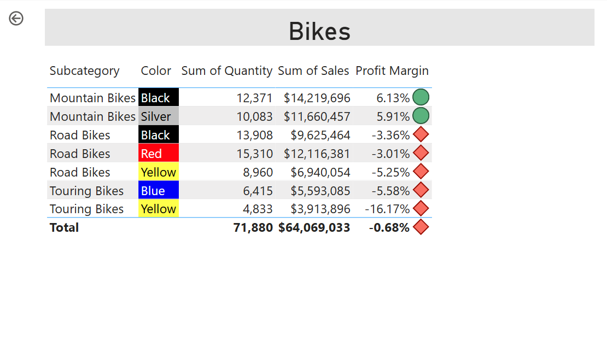
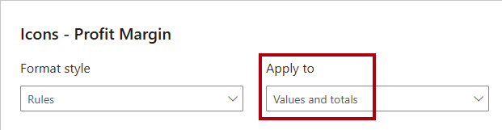

---
lab:
    title: 'Enhance Power BI report designs'
    module: 'Enhance Power BI report designs for the user experience'
---

# Mejorar el diseño de informes de Power BI

## Historia del laboratorio

En este laboratorio, mejorarás el informe _Sales Analysis_ con características avanzadas de diseño.

En este laboratorio, aprenderás a:

- Crear una página de drill through.
- Aplicar formato condicional.
- Crear y usar bookmarks y botones.

**Este laboratorio debería tomar aproximadamente 45 minutos.**

## Comenzar

Para completar este ejercicio, primero abre un navegador web e ingresa la siguiente URL para descargar el archivo zip:

`https://github.com/MicrosoftLearning/PL-300-Microsoft-Power-BI-Data-Analyst/raw/Main/Allfiles/Labs/09-enhance-power-bi-reports/09-enhanced-report.zip`

Extrae el archivo en la carpeta **C:\Users\Student\Downloads\09-enhanced-report**.

Abre el archivo **09-Starter-Sales Analysis.pbix**.

> _**Nota**: Puedes cancelar el inicio de sesión seleccionando **Cancelar**. Cierra cualquier otra ventana informativa. Selecciona **Apply Later** si se te solicita aplicar cambios._

## Configurar una página de drillthrough

En este ejercicio, crearás una nueva página y la configurarás como una página de drillthrough. Cuando completes el diseño, la página se verá así:

1. Crea una nueva página y renómbrala como _Product Details_.

1. Haz clic derecho en la pestaña de la página **Product Details** y luego selecciona **Hide Page**.

    > _Los usuarios del informe no podrán acceder directamente a la página de drillthrough. En su lugar, accederán a ella desde visuales en otras páginas. Aprenderás cómo hacer drill through a la página en el ejercicio final de este laboratorio._

1. Debajo del panel **Visualizations**, en la sección **Drill Through**, agrega el campo `Product | Category` al cuadro **Add drill-through fields here**.

    > _Los laboratorios usan una notación abreviada para referenciar un campo. Se verá así: `Product | Category`. En este ejemplo, `Product` es el nombre de la tabla y `Category` es el nombre del campo._

    

1. Para probar la página de drill through, en la tarjeta de filtro de drill through, selecciona _Bikes_.

    

1. En la parte superior izquierda de la página del informe, observa el botón de flecha.

    > _El diseñador de informes agrega automáticamente un botón de flecha cuando se agrega un campo al área de drill through. Permite a los usuarios del informe navegar de regreso a la página desde la que hicieron drill through._

1. Agrega un visual **Card** a la página, y luego redimensiona y posiciona para que quede a la derecha del botón y ocupe el ancho restante de la página.

    

    

1. Arrastra el campo `Product | Category` al visual de tarjeta.

1. Configura las opciones de formato para el visual para desactivar la propiedad **Category Label**.

    

1. En la pestaña **General**, en la sección **Effects**, establece la propiedad de color de fondo a un color gris claro (como _White, 10% Darker_) para proporcionar contraste.

    

1. Agrega un visual **Table** a la página, y luego redimensiona y posiciona para que quede debajo del visual de tarjeta y ocupe el espacio restante en la página.

    

    

1. Agrega los siguientes campos al visual:

    - `Product | Subcategory`
    - `Product | Color`
    - `Sales | Quantity`
    - `Sales | Sales`
    - `Sales | Profit Margin`

1. Para configurar las opciones de formato para el visual, en la sección **Grid**, establece la propiedad **Global font size** a **20pt**.

    > _El diseño de la página de drillthrough está casi completo. Mejorarás la página con formato condicional en el siguiente ejercicio._

## Agregar formato condicional

En este ejercicio, mejorarás la página de drillthrough con formato condicional. Cuando completes el diseño, la página se verá así:

1. Selecciona el visual de tabla. En el panel **Columns**, selecciona la flecha hacia abajo en el campo **Profit Margin**, y luego selecciona **Conditional formatting > Icons**.

    

1. En la ventana **Icons – Profit Margin**, en la lista desplegable **Apply to**, selecciona **Values and totals**.

    

1. En la ventana **Icons – Profit Margin**, en la lista desplegable **Icon Layout**, selecciona **Right of Data**.

    

1. Para eliminar la regla del medio, a la derecha del triángulo amarillo, selecciona **X**.

    

1. Configura la primera regla (diamante rojo) de la siguiente manera:

    - En el segundo control, elimina el valor
    - En el tercer control, selecciona **Number**
    - En el quinto control, ingresa **0**
    - En el sexto control, selecciona **Number**

1. Configura la segunda regla (círculo verde) de la siguiente manera:

    - En el segundo control, ingresa **0**
    - En el tercer control, selecciona **Number**
    - En el quinto control, elimina el valor
    - En el sexto control, selecciona **Number**

    

    > _Las reglas se pueden interpretar de la siguiente manera: muestra un diamante rojo si el valor del margen de beneficio es menor que 0; de lo contrario, si el valor es mayor o igual a cero, muestra un círculo verde._

1. Selecciona **OK**.

1. En el visual de tabla, verifica que se muestren los iconos correctos.

    

1. Configura el formato condicional de color de fondo para el campo **Color**.

1. En la ventana **Background Color – Color**, en la lista desplegable **Format Style**, selecciona **Field Value**.

    

1. En la lista desplegable **What field should we base this on?**, en el grupo _All data_, selecciona el campo `Product | Formatting | Background Color Format`.

    

1. Repite los pasos anteriores para configurar el formato condicional de color de fuente para el campo **Color** usando el campo `Product | Formatting | Font Color Format`.

 > _Puedes recordar que los colores de fondo y fuente se obtuvieron del archivo **ColorFormats.csv** en el laboratorio **Prepare Data in Power BI Desktop**, y luego se integraron con la consulta **Product** en el laboratorio **Load Data in Power BI Desktop**._

## Agregar bookmarks y botones

En este ejercicio, mejorarás la página _My Performance_ con botones, permitiendo al usuario del informe seleccionar el tipo de visual a mostrar. Cuando completes el diseño, la página se verá así:

1. Ve a la página _My Performance_.

1. En la pestaña **View**, dentro del grupo **Show Panes**, selecciona **Bookmarks**.

    

1. En la pestaña **View**, dentro del grupo **Show panes**, selecciona **Selection**.

    

1. En el panel **Selection**, junto a uno de los elementos _Sales and Target by Month_, para ocultar el visual, selecciona el icono de ojo.

    

1. En el panel **Bookmarks**, selecciona **Add**.

    

    > _Consejo: Para renombrar el bookmark, haz doble clic en él._

1. Si el gráfico visible es el gráfico de barras, renombra el bookmark como _Bar Chart ON_, de lo contrario, renómbralo como _Column Chart ON_.

1. Para editar el bookmark, en el panel **Bookmarks**, pasa el cursor sobre el bookmark, selecciona los puntos suspensivos, y luego selecciona **Data**.

    > _Desactivar la opción **Data** significa que el bookmark no usará el estado actual del filtro. Esto es importante porque, de lo contrario, el bookmark bloquearía permanentemente el filtro aplicado actualmente por el slicer Year._

    

1. Para actualizar el bookmark, selecciona los puntos suspensivos nuevamente, y luego selecciona **Update**.

    > _En los siguientes pasos, crearás y configurarás un segundo bookmark para mostrar el segundo visual._

1. En el panel **Selection**, alterna la visibilidad de los dos elementos _Sales and Target by Month_.

    > _Es decir, haz que el visual visible se oculte, y que el visual oculto se muestre._

    

1. Crea un segundo bookmark, y nómbralo apropiadamente (ya sea _Column Chart ON_ o _Bar Chart ON_).

    

1. Configura el segundo bookmark para ignorar filtros (opción **Data** desactivada), y actualiza el bookmark.

1. En el panel **Selection**, para hacer ambos visuales visibles, simplemente muestra el visual oculto.

1. Redimensiona y reposiciona ambos visuales para que llenen la página debajo del visual multi-tarjeta, y se superpongan completamente.

    > _Para seleccionar el visual que está cubierto, selecciónalo en el panel **Selection**._

    

1. En el panel **Bookmarks**, selecciona cada uno de los bookmarks, y observa que solo uno de los visuales es visible.

    > _La siguiente etapa del diseño es agregar dos botones a la página. Estos botones permitirán al usuario del informe seleccionar los bookmarks._

1. En la pestaña **Insert**, dentro del grupo **Elements**, selecciona **Button**, y luego selecciona **Blank**.

    

1. Posiciona el botón directamente debajo del slicer _Year_.

1. Selecciona el botón, y luego en el panel **Format button**, expande la sección **Style**, y luego activa la sección **Text**.

    

1. En la sección **Text**, en el cuadro **Text**, ingresa _Bar Chart_.

1. Activa la sección **Fill**, y luego establece un color usando un color complementario.

1. Activa la sección **Action**, y luego establece la propiedad **Type** a **Bookmark**.

1. Selecciona **Button** y activa la propiedad **Action**.

1. Expande la sección **Action**, y luego establece la lista desplegable **Type** a **Bookmark**.

1. En la lista desplegable **Bookmark**, selecciona **Bar Chart ON**.

    

1. Crea una copia del botón usando copiar y pegar, y luego configura el nuevo botón de la siguiente manera:

    > _Consejo: Los comandos rápidos para copiar y pegar son **Ctrl+C** seguido de **Ctrl+V**._

    - Establece el texto del botón a _Column Chart_.
    - Establece el bookmark de acción a **Column Chart ON**.

    > _El diseño del informe Sales Analysis ahora está completo._

## Publicar y explorar el informe

En este ejercicio, publicarás el informe en el servicio Power BI y explorarás el comportamiento del informe publicado.

> _**Nota**: Puedes revisar el resto del ejercicio, incluso si no tienes acceso al servicio Power BI para realizar las tareas directamente._

1. Selecciona la página _Overview_.

1. En el slicer _Year_, selecciona **FY2020**.

1. En el slicer _Region_, asegúrate de que no haya regiones seleccionadas.

1. Guarda el archivo de Power BI Desktop.

1. En la pestaña **Home**, dentro del grupo **Share**, selecciona **Publish**.

    > _Si no has iniciado sesión en Power BI Desktop, deberás hacerlo antes de publicar el informe._

    

1. En la ventana **Publish to Power BI**, observa que _My workspace_ está seleccionado.

1. Para publicar el informe, selecciona **Select**. Espera hasta que se complete la publicación.

1. Cuando la publicación sea exitosa, selecciona **Got It**.

1. Cierra Power BI Desktop.

1. Abre el navegador Microsoft Edge, luego inicia sesión en `https://app.powerbi.com` (o usa una sesión existente del navegador).

1. En la ventana del navegador, en el servicio Power BI, en el panel **Navigation** (ubicado a la izquierda, y podría estar colapsado), selecciona **My Workspace**.

1. Para explorar el informe, selecciona el informe _07-Starter-Sales Analysis_.

1. Para probar la función de drill through, en la página _Overview_, en el visual _Sum of Quantity by Category_, haz clic derecho en la barra _Clothing_, y luego selecciona **Drill Through > Product Details**.

    

1. Observa que la página _Product Details_ filtra los visuales para _Clothing_.

1. Para regresar a la página de origen, en la esquina superior izquierda de la página, selecciona el botón de flecha.

1. Ve a la página _My Performance_.

1. Selecciona cada uno de los botones, y luego observa que se muestra un visual diferente.

## Laboratorio completado
