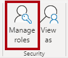

---
lab:
    title: 'Secure data access in Power BI'
    module: 'Secure data access in Power BI'
---

# Seguridad de acceso a datos en Power BI

## Historia del laboratorio

En este laboratorio, aplicarás seguridad a nivel de fila (row-level security) para garantizar que un vendedor solo pueda analizar datos de ventas de su(s) región(es) asignada(s).

En este laboratorio, aprenderás a:

- Aplicar seguridad a nivel de fila.
- Elegir entre métodos dinámicos y estáticos.

**Este laboratorio debería tomar aproximadamente 20 minutos.**

## Comenzar

Para completar este ejercicio, primero abre un navegador web e ingresa la siguiente URL para descargar la carpeta zip:

`https://github.com/MicrosoftLearning/PL-300-Microsoft-Power-BI-Data-Analyst/raw/Main/Allfiles/Labs/11-secure-data-access/11-secure-data.zip`

Extrae la carpeta en **C:\Users\Student\Downloads\11-secure-data**.

Abre el archivo **11-Starter-Sales Analysis.pbix**.

> _**Nota**: Puedes cancelar el inicio de sesión seleccionando **Cancelar**. Cierra cualquier otra ventana informativa. Selecciona **Apply Later** si se te solicita aplicar cambios._

## Aplicar seguridad a nivel de fila

En esta tarea, aplicarás seguridad a nivel de fila para garantizar que un vendedor solo vea las ventas realizadas en su(s) región(es) asignada(s).

1. Cambia a la vista Table.

   

1. En el panel **Data**, selecciona la tabla **Salesperson (Performance)**.

1. Revisa los datos, notando que Michael Blythe (EmployeeKey 281) tiene un valor UPN de: **`michael-blythe@adventureworks.com`**
    
    > _Puedes recordar que Michael Blythe está asignado a tres regiones de ventas: US Northeast, US Central y US Southeast._

1. En la pestaña **Home**, dentro del grupo **Security**, selecciona **Manage Roles**.

    

1. En la ventana **Manage security roles**, en la sección **Roles**, selecciona **New**.

1. En el cuadro, reemplaza el texto seleccionado con el nombre del rol: **Salespeople**, y luego presiona **Enter**.

   

1. Para asignar un filtro, selecciona la tabla **Salesperson (Performance)**, y luego selecciona **Switch to DAX editor** en la sección **Filter data**.

   

1. En el cuadro del editor DAX, ingresa la siguiente expresión:

    ```DAX
    [UPN] = USERPRINCIPALNAME()
    ```

   

    > _USERPRINCIPALNAME() es una función de Data Analysis Expressions (DAX) que devuelve el nombre del usuario autenticado. Significa que la tabla **Salesperson (Performance)** se filtrará por el User Principal Name (UPN) del usuario que consulta el modelo._

1. Selecciona **Save** y **Close**.

1. Para probar el rol de seguridad, en la pestaña **Home**, dentro del grupo **Security**, selecciona **View As**.

   

1. En la ventana **View as Roles**, marca el ítem **Other User**, y luego en el cuadro correspondiente, ingresa: **`michael-blythe@adventureworks.com`**

1. Marca el rol **Salespeople**, y luego **OK**.

    > _Esta configuración resulta en usar el rol **Salespeople** e impersonar al usuario con el nombre de Michael Blythe._

   

1. Observa el banner amarillo sobre la página del informe, que describe el contexto de seguridad de prueba.

   

1. En el visual de tabla, nota que solo se lista el vendedor **Michael Blythe**.

   

1. Para detener la prueba, en el lado derecho del banner amarillo, selecciona **Stop Viewing**.

   

1. Para eliminar el rol **Salespeople**, en la pestaña **Home**, dentro del grupo **Security**, selecciona **Manage Roles**.

   

1. En la ventana **Manage security roles**, selecciona los puntos suspensivos (...) en el rol **Salespeople**, y selecciona **Delete**. Cuando se te solicite confirmar la eliminación, selecciona **Yes, Delete**.

   

_Nota: Cuando el archivo de Power BI Desktop se publique en el servicio Power BI, deberás completar una tarea posterior a la publicación para mapear entidades de seguridad al rol **Salespeople**. No harás eso en este laboratorio._

## Laboratorio completado
